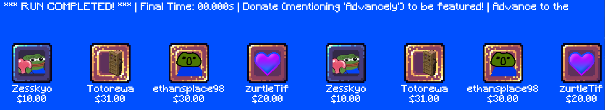
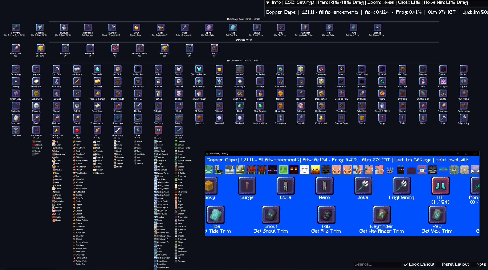
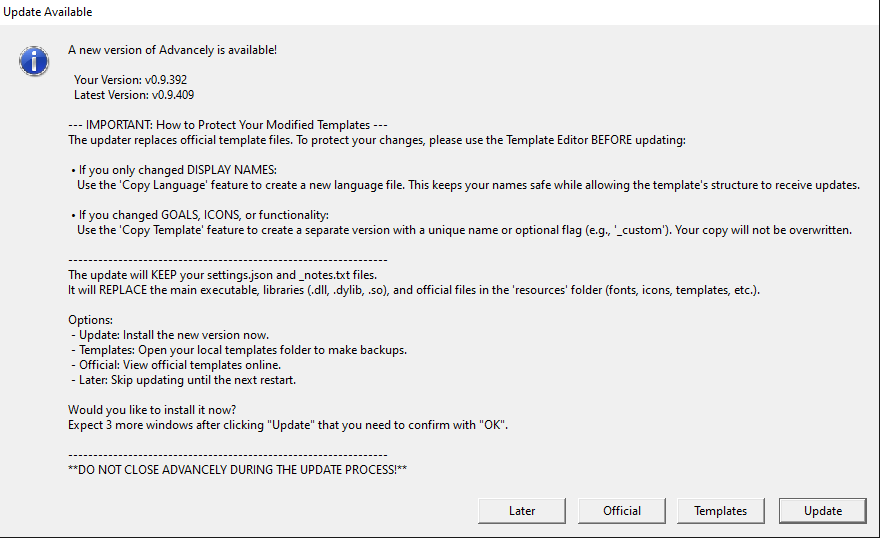
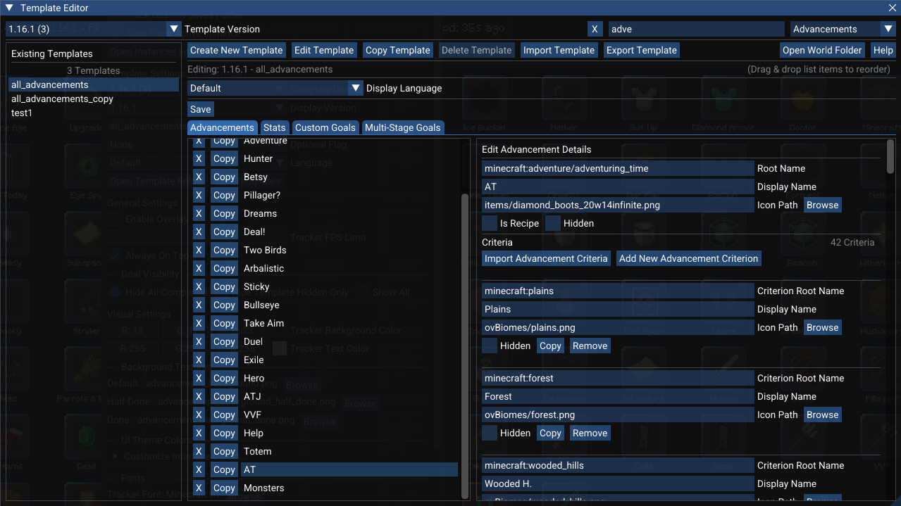
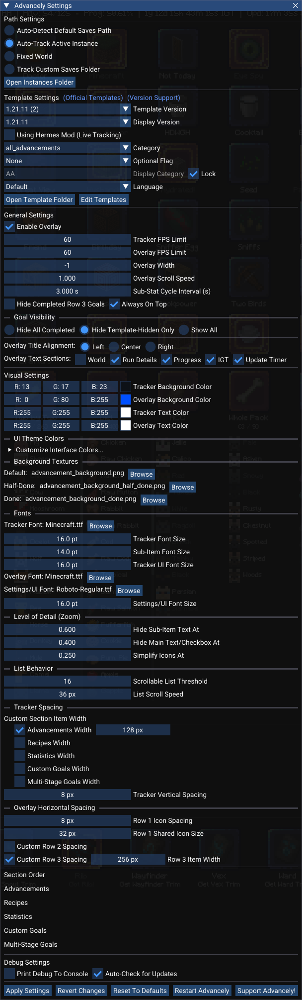

<p align="center">
  
</p>

# [⬇️ **DOWNLOAD ADVANCELY NOW\! (Windows, Linux & macOS)** ⬇️](#getting-started)

***

# A highly customizable and interactive tool to track Minecraft progress beyond just Advancements.

<p align="center">
  
  <br>
  <em>This animation here is compressed. When you use the tracker the framerate will be higher and the resolution perfectly sharp.</em>
</p>

***

## This tracker supports an arbitrary number of advancements, recipes, custom statistics, unlocks, multi-stage goals, manual goals, and custom counters for over 100 Minecraft versions.

## Advancely is fully speedrun legal based on the [Minecraft Speedrunning rules (A.3.10.a, A.11.1)](https://www.minecraftspeedrunning.com/public-resources/rules) by only reading from within the 'advancements', 'stats' and 'unlocks' (25w14craftmine) folders of a world that update when the game saves. With the **[Hermes Mod](https://github.com/DuncanRuns/Hermes)** tracker updates are instant and don't require pausing, **STILL AWAITING VERIFICATION** by the [Minecraft Speedrunning rules (A.8.14 and A.8.15)](https://www.minecraftspeedrunning.com/public-resources/rules).

### Built for flexibility, Advancely supports everything from vanilla speedruns to modded adventures and datapacks through the creation of custom templates with a built-in template editor. It automatically detects changes in your latest singleplayer world, providing real-time progress updates.

<p align="center">
  
</p>

# [Watch the full tutorial video here!](https://www.youtube.com/watch?v=Rxd1RJqg2WQ)

***

## Table of Contents

- [Become a Supporter!](#become-a-supporter)
- [Socials](#socials)
- [What is Advancely?](#what-is-advancely)
- [Core Features](#core-features)
- [Performance & Optimization](#performance--optimization)
- [Getting Started](#getting-started)
- [Download Once, Update Forever](#download-once-update-forever)
- [The Tracker Window](#the-tracker-window)
- [The Stream Overlay](#the-stream-overlay)
- [The Template Editor](#the-template-editor-esc--edit-templates)
- [The Settings Window](#the-settings-window-esc)
- [Extensive Version Support](#extensive-version-support)
- [Officially Added Templates](#officially-added-templates)
- [Known Limitations](#known-limitations)
- [You have a feature idea?](#you-have-a-feature-idea)
- [Running into Issues?](#running-into-issues)
- [Command Line Arguments](#command-line-arguments)
- [Beta Testers](#beta-testers)
- [Contributors](#contributors)
- [License](#license)
- [Credits](#credits)

***

## Become a Supporter!

> 📺 **Video Guide:** [Jump to Support Section (33:53)](https://youtu.be/Rxd1RJqg2WQ?t=33m53s)

Love using Advancely? You can have your name immortalized in the tracker!

<p align="center">
  
</p>

**Supporters:**

* Totorewa: $31
* ethansplace98: $30
* zurtleTif: $20
* Zesskyo: $10

Simply [**donate here**](https://streamlabs.com/lnxseus/tip) and include the word "**Advancely**" in your donation
message. **With the next release** your name will be added to the official supporter showcase that appears on the stream
overlay when anyone completes a run.

Thank you for supporting the project!

***

## Socials

**Put `#Advancely` in your content to support the project!**

* [Support Advancely (be featured on the overlay by mentioning
  `Advancely` in your donation message)](https://streamlabs.com/lnxseus/tip)
* [(Affiliate Link) Amazon](https://amzn.to/4scdytw)
* [My YouTube](https://www.youtube.com/@lnxs?sub_confirmation=1)
* [My Twitch](https://www.twitch.tv/lnxseus)
* [My Twitch Archive + Advancely Devlogs](https://www.youtube.com/@lnxsarchive/playlists?view=1&sort=lad&flow=grid&sub_confirmation=1)
* [Official Advancely Discord w/ **Unofficial Releases**!](https://discord.gg/TyNgXDz)
* [Tiktok](https://www.tiktok.com/@lnxseus)
* [Instagram](https://www.instagram.com/lnxseus/)
* [X/Twitter](https://x.com/lieinuxxseus)
* [My GitHub](https://github.com/LNXSeus)

***

## What is Advancely?

> 📺 **Video Guide:** [Intro (0:00)](https://youtu.be/Rxd1RJqg2WQ?t=0m00s) • [The Basics (1:50)](https://youtu.be/Rxd1RJqg2WQ?t=1m50s)

<p align="center">
  
  <br>
  <em>This screenshot has the <code>Tracker Font Size</code> set to <code>24</code>.</em>
</p>

Advancely is a sophisticated, data-driven progress tracker (just like [AATool](https://github.com/DarwinBaker/AATool)) -
that works on Windows, Linux and macOS - designed for Minecraft speedrunners, completionists, and
content creators. Unlike other tools that only track vanilla advancements (e.g., AATool by Darwin Baker), Advancely can
be configured to monitor virtually any goal imaginable. It operates in real-time by watching your singleplayer save
files for changes, meaning your progress is always up-to-date without any manual intervention.

The tracker's true power lies in its `.json` template system, which allows you to define exactly what you want to track
for any version, mod, or playstyle. A template isn't just a list of advancements; it's a complete ruleset that can
include custom stats, multi-stage goals, manual counters, and more.

### The Advancely Template Editor

You don't need to be a developer to customize Advancely. The built-in **Template Editor** gives you full control to
import, create, copy, and modify any template directly within Advancely.

<details>
<summary><strong>Read more about Editor Features</strong></summary>
<br>

* **Import from Your World:** The fastest way to get started is by importing directly from an existing game save. The
  editor can automatically scan your player data and pull in all advancements/achievements, recipes, statistics, or
  unlocks to build a new template for you.
* **Full Customization:** Edit any goal's name, icon, or properties. Create complex multi-stage goals with several
  sequential steps, or add manual counters with hotkeys for objectives that can't be tracked automatically.
* **Easy Translation:** Every template has separate language files, allowing you to easily edit display names or provide
  translations without altering the core template logic.
* **Share Your Templates:** You can export any template—including all its language files—into a single `.zip` file to
  share with the Advancely community. Likewise, you can import (`.zip`) templates created by others.

This powerful and flexible system makes Advancely the ultimate tool for any Minecraft challenge, from a vanilla "All
Advancements" run to a heavily modded playthrough with hundreds of custom milestones.
</details>

***

## Core Features

<details>
<summary><strong>View All Core Features</strong></summary>
<br>

* **Automatic Instance Tracking** *(default)*: Advancely automatically detects which Minecraft instance you
  are actively playing and tracks it, even if multiple instances are open at once. This is the default
  path detection mode. It works with **Prism Launcher**, **MultiMC**, and similar launchers. Find out
  more [here](#the-settings-window-esc).
* **Fixed World Mode**: Lock the tracker to one specific world folder. Unlike the default mode which always
  follows your most recently played world, Fixed World Mode keeps the tracker focused on a single chosen world
  regardless of which world you open next. Useful for long-form playthroughs, modded runs, or setups where
  you want the tracker to stay on a specific save. Configure it in Settings by selecting **"Fixed World"** and
  browsing to the world folder.
* **Hermes Mod Live Tracking (STILL AWAITING VERIFICATION)**: When the [Hermes mod](https://github.com/DuncanRuns/Hermes) is installed,
  Advancely can read its encrypted `play.log.enc` in real-time, updating stats and advancements as they happen
  rather than waiting for the game to save. Enable this in Settings under **"Using Hermes Mod (Live Tracking)"**.
  The update timer in the info bar and overlay changes from `Upd:` to `Synced:` when Hermes is active, indicating
  the last full disk sync rather than the last live event. All values self-correct on every normal game save.
  Compatible ultimately with all Fabric versions. Stat and advancement/achievement changes are applied instantly; the
  game files remain the authoritative source of truth.
* **Interactive Map View**: The main tracker window is an interactive map where you can pan by holding `Right-Click` or
  `Middle-Click`, zoom with the `Mouse Wheel`, and lock the layout in place by pressing `SPACE`.
* **Scrollable Lists**: Goals containing large numbers of sub-items (like "All Animals Bred" or complex stats) are
  automatically converted into scrollable lists to save screen space.
* **Comprehensive Real-Time Tracking**: Advancely operates in real-time by watching your singleplayer save files for
  changes. It can monitor a wide range of data types, including:
    * **Advancements & Recipes**: Tracks completion status and individual criteria for any advancement or recipe from
      vanilla, mods, or datapacks.
    * **Statistics**: Monitors any in-game statistic (e.g., blocks mined, distance flown) against a target value.
      Supports nested "sub-stats" under a single category and allows for manual completion overrides via an in-app
      checkbox.
    * **Unlocks**: Fully tracks the unique "unlocks" progression system from the `25w14craftmine` snapshot.
* **Advanced Goal Types**:
    * **Custom Counters & Manual Goals**: For objectives that can't be automatically tracked (like counting structures
      visited), you can create manual checklist goals or counters with target values. All progress is saved
      automatically into `settings.json`. _Switching templates will thus ERASE the progress of these custom goals._
        * **Hotkeys**: Use configurable hotkeys to increment or decrement your custom counters. Up to 32 hotkeys are
          supported. Hotkeys only work when the tracker window is in focus.
    * **Multi-Stage Goals**: Create long-term objectives that combine several smaller steps. A single goal can require
      you to first complete a stat, then an unlock, then a specific **advancement criterion** (e.g., visiting a specific
      biome), and finally an entire advancement in sequence. You can assign **unique icons to each stage** to visualize
      progression.
* **Section Completion Counters**: Each section header displays dynamic counters showing completed items versus the
  total visible items for that section, respecting both the current Goal Visibility setting and any active search
  filter.
    * **Format**:
        * Sections with sub-items (Advancements/Recipes with criteria, Statistics with sub-stats, Multi-Stage Goals)
          show counts for both main items and sub-items.
        * Sections without sub-items (Unlocks, Custom Goals, simple Statistics) show counts for main items only.


* **Powerful In-App Template Editor**: You don't need to manually edit files. The built-in editor allows you to create,
  copy, and modify any template. You can instantly build a new template by importing advancements, stats, and unlocks
  directly from your world save. Find more information [here](https://github.com/LNXSeus/Advancely#The-Template-Editor).
* **Customizable Stream Overlay**: An animated overlay is available to show your progress to viewers. You can customize
  its scroll speed, font, colors, FPS, if the 3rd row remains visible and which information is displayed. Find more
  information [here](https://github.com/LNXSeus/Advancely#The-Stream-Overlay).
* **Full Mod & Datapack Support**: The tracker is designed to be data-driven. It correctly parses items, stats, and
  advancements from any mod or data pack (e.g., `conquest:`, `blazeandcave:`) without being limited to the vanilla
  `minecraft:` namespace.
* **Extensive Version Support**: Advancely is built to work with over 100 Minecraft versions, from 1.0 to 1.21.9+ and
  beyond, including all April Fool's snapshots.
* **Automatic Updates**: The tracker automatically checks for new versions on startup and will prompt you to download
  and install them, ensuring you're always up-to-date.

</details>

***

## Performance & Optimization

<p align="center">
  
</p>

Advancely tries to be as lightweight as possible when it comes to system resources despite allowing for 1000+ goals
being displayed at once.

<details>
<summary><strong>View Technical Details (SDL3, ImGui, Culling & LOD)</strong></summary>
<br>

* **Efficient Tech Stack**: The application is built on [**SDL3**](https://github.com/libsdl-org/SDL), a
  high-performance, low-level media library.
    * **Tracker Window**: Utilizes **Dear ImGui** for a responsive, interactive, and highly customizable interface.
    * **Stream Overlay**: Bypasses UI libraries entirely to use **raw SDL3 hardware acceleration**. This ensures
      perfectly smooth 60fps+ animations with virtually zero overhead.
* **Virtual Scrollable Lists**: Templates with thousands of criteria (e.g. "All Items") are automatically converted into
  virtualized scrollable lists. This keeps the layout compact and ensures rendering remains performant regardless of
  list size.
* **Smart Culling**: The tracker features a robust culling system. It only processes and renders items that are
  currently visible within the window. You can have a template with thousands of goals, but if you are zoomed in on just
  ten of them, only those ten are drawn.
* **Level of Detail (LOD)**: To maintain clarity and performance when viewing the entire map:
    * **Text Hiding**: As you zoom out, sub-text (progress) and then main titles fade away to declutter the screen.
    * **Icon Simplification**: At the furthest zoom levels, complex item icons are replaced by simple, colored squares.
    * *Note: These thresholds are fully customizable in
      the [Settings](https://github.com/LNXSeus/Advancely#the-settings-window-esc) window.*

</details>

***

## Getting Started

> 📺 **Video Guide:** [How to Download (1:23)](https://youtu.be/Rxd1RJqg2WQ?t=1m23s)

### 1. Downloading the Correct Version

Go to the [**releases page**](https://github.com/LNXSeus/Advancely/releases) and download the `.zip` file that matches
your operating system. The `vX.X.X` is the Advancely version, that is also displayed in the title of the main window.

* **Windows:** `Advancely-vX.X.X-Windows.zip`
* **Linux (Portable):** `Advancely-vX.X.X-Linux.zip` — The standalone executable (no installation required).
* **Linux (Debian/Ubuntu):** `advancely-vX.X.X-Linux.deb` — The native installer for Ubuntu 25+ (or systems with SDL3
  installed).
* **Linux (Fedora/RHEL):** `advancely-vX.X.X-Linux.rpm` — The native installer for Fedora/RedHat systems.
* **macOS:** `Advancely-vX.X.X-macOS-Universal.zip` — For both Intel (down to macOS 13 Ventura) and Silicon Macs.

### 2. Installation & First-Time Run

#### For supported Linux distros

* **Arch Linux (AUR):**

Three packages are available on the AUR — pick whichever suits you:

| Package                                                           | Description                                                  |
|-------------------------------------------------------------------|--------------------------------------------------------------|
| [advancely](https://aur.archlinux.org/packages/advancely)         | Compiles from the latest release                             |
| [advancely-bin](https://aur.archlinux.org/packages/advancely-bin) | Precompiled binary from the latest release (fastest install) |
| [advancely-git](https://aur.archlinux.org/packages/advancely-git) | Compiles from the latest commit                              |

Use your favorite AUR helper, e.g.:

  ```
  paru -S advancely-bin
  ```

_Massive thanks to [R0dn3yS](https://github.com/R0dn3yS) for the AUR packages!_

* **NixOS:**

Advancely is available via [mcsr-nixos](https://git.uku3lig.net/uku/mcsr-nixos), a collection of NixOS packages for Minecraft speedrunning.

Add the following to your `flake.nix` inputs:
```nix
  inputs.mcsr-nixos = {
    url = "https://git.uku3lig.net/uku/mcsr-nixos/archive/main.tar.gz";
    inputs.nixpkgs.follows = "nixpkgs";
  };
```

Then add it to your system configuration:
```nix
  { pkgs, mcsr-nixos, ... }:
  let
    mcsrPkgs = mcsr-nixos.packages.${pkgs.stdenv.hostPlatform.system};
  in
  {
    environment.systemPackages = [
      mcsrPkgs.advancely
    ];
  }
```

_Massive thanks to [uku3lig](https://git.uku3lig.net/uku) for the NixOS package!_

#### For all other installations

To ensure the application works correctly, please follow the instructions for your operating system.

> **✔️ Important: Use English-Only (ASCII) File Paths**
>
> To prevent errors, please make sure the **entire folder path** to your Advancely application contains **only standard
English (ASCII) characters**.

<details>
<summary><strong>🍎 macOS Instructions</strong></summary>
<br>

Due to macOS security (Gatekeeper), you cannot run the app directly from the Downloads folder.

> **⚠️ CRITICAL: Fix for "App Translocation" / Permission Errors**
>
> If you try to run Advancely directly from your **Downloads** folder, macOS will isolate it in a read-only temporary
> location (App Translocation).
>
> **You MUST move the app to fix this:**
> 1. Drag `Advancely.app` AND the `resources` folder from Downloads to your **Applications** folder or **Desktop**.
> 2. Run it from the new location.

**Authorizing the App (First Run):**

✔️ **Method 1: Terminal Authorization**
If you still encounter issues, you can strip the quarantine tags manually:

1. Open the **Terminal** app.
2. Type `xattr -cr ` (note the space at the end).
3. Drag the `Advancely.app` file from Finder onto the Terminal window.
4. Press **Enter**.

✔️ **Method 2: The Right-Click Trick**

1. After moving the app to your Applications folder or Desktop...
2. **Right-click** (or Control-click) `Advancely.app` and select **Open** from the menu.
3. A warning will appear. Click **Open**. macOS will now remember that you trust this application.

✔️ **Method 3: System Settings (If Method 1 and 2 fail)**
If the app still refuses to open:

1. Open **System Settings** -> **Privacy & Security**.
2. Scroll down to the **Security** section.
3. Look for a message stating "Advancely was blocked...".
4. Click **Open Anyway** and confirm with your password.

</details>

<details>
<summary><strong>🪟 Windows & 🐧 Linux Instructions</strong></summary>
<br>

Your application folder contains the main executable, required library files, and the `resources` folder. The executable
must always stay in the same folder as its supporting files.

✔️ **Correct Way to Run:**

* To run Advancely from another location like your Desktop, please create a shortcut to the main executable.
    * **Windows:** Right-click `Advancely.exe` → "Create shortcut".
    * **Linux:** Right-click the `Advancely` file → "Create Link".
* You can then move this new shortcut or link anywhere you like.
* **Do not** move or copy the original executable file by itself, as it will fail to start or find its resources.

</details>

### 3. Your First Launch

Launch Advancely by running the executable (or the shortcut you created). On its first run, it will default to finding
your most recently played world from the standard Minecraft installation. To begin customizing, press the `ESC` key to
open the settings window, where you can switch to `Auto-Track Active Instance` if you use Prism Launcher, MultiMC or
some other custom launcher.

***

## Download Once, Update Forever

> 📺 **Video Guide:** [Auto-Updates Explained (33:01)](https://youtu.be/Rxd1RJqg2WQ?t=33m01s)

Advancely is designed to be easy to maintain. By default, **the tracker will automatically check for new versions on
startup**. When an update is available, you will be notified with a prompt offering to download and install it for you.
This process is designed to be as safe as possible for your custom files.

<p align="center">
  
</p>

<details>
<summary><strong>How the Automatic Update Works</strong></summary>
<br>

The updater is smart about which files it replaces to ensure your personal configurations are preserved.

* ✅ **Files that are SAFE and WILL NOT be replaced:**
    * Your main `settings.json` file.
    * Your `_notes.txt` files for each template.
    * Any custom templates or user-created files in the `resources` folder.

* ⚠️ **Files that WILL BE REPLACED:**
    * The main application executable (`Advancely.exe`, `Advancely.app`, etc.).
    * Core library files (`.dll`, `.so`).
    * Official templates, fonts, icons, reference_files, and GUI assets included with the release.

### Protecting Your Modified Official Templates

To prevent losing your work during an automatic update, it's highly recommended to **avoid editing official template
files directly**. Instead, use the **Template Editor** to create your own safe-to-edit versions. The correct method
depends on the types of changes you want to make.

**If you only want to change display names:**

The best approach is to create a new **language file** for the official template. This keeps your custom names separate
while still allowing the underlying template structure (the goals, criteria, icons, etc.) to receive official updates.

1. Open the **Template Editor** and select the official template you wish to customize.
2. In the "Languages" section, select the "Default" language and click **Copy Language**.
3. Give your new language a unique flag (e.g., `custom` or `mypack`).
4. You can now select your custom language in the main settings, and your display names will be safe from updates.

**If you have changed goals, criteria, or icons (core functionality):**

The best approach is to create a complete **copy of the template**. This makes your version fully independent and
protects it from being overwritten.

1. Open the **Template Editor** and select the official template you want to use as a base.
2. Click the **Copy Template** button.
3. Give your new version a unique name, typically by adding an **Optional Flag** (e.g., `_custom`).
4. You can now safely edit your new, independent template in any way you wish.

Your custom template will appear separately in the template list and will not be touched by the auto-updater.
</details>

***

## The Tracker Window

> 📺 **Video Guide:** [Main Tracker Overview (18:23)](https://youtu.be/Rxd1RJqg2WQ?t=18m23s) • [Controls & Navigation (6:22)](https://youtu.be/Rxd1RJqg2WQ?t=6m22s)

<p align="center">
  
</p>

The main window is an interactive canvas where all your tracked goals are displayed. You can freely zoom in and out to
rearrange the items in view to suit your needs, making it easy to focus on what matters most for your current run. The
order of the sections (advancements, recipes, multi-stage goals, ...) can be configured in
the [settings window](#the-settings-window-esc).

<details>
<summary><strong>Controls & Features (Pan, Zoom, Search, Notes)</strong></summary>
<br>

### Navigating the Map

You can manipulate the view using several intuitive controls:

* **Pan**: Hold `Right-Click` or `Middle-Click` and drag to move the entire map of goals.
* **Zoom**: Use the `Mouse Wheel` to zoom in and out, allowing you to see an overview or focus on specific details.
* **Scroll Lists**: When hovering over a goal with many sub-items, the `Mouse Wheel` will scroll the list contents
  instead of zooming the map. You can also left-click and drag the scrollbar.
* **Lock Layout**: Press the `SPACE` key to lock the grid layout. This prevents goals from rearranging when you resize
  the window, giving you precise control over how many items appear in each row.
* **Reset Layout**: Click the "Reset Layout" button in the bottom-right corner to instantly reset the pan and zoom to
  their default positions.

### Searching & Filtering

To quickly find a specific goal, press `Ctrl+F` (or `Cmd+F` on macOS) to focus the search box in the bottom-right
corner. The filter is case-insensitive and intelligently searches across different goal types. Using the search filter
also dynamically updates the completion counters in the section headers.

* **Advancements, Recipes & Statistics**: Shows a category if its main title or any of its sub-criteria/sub-stats match
  the search term. If only a sub-item matches, it will be the only one shown under its parent.
* **Unlocks & Custom Goals**: Shows the goal if its name matches the search term.
* **Multi-Stage Goals**: Shows the goal if its main title or the text of its *currently active stage* matches the search
  term.

### Section Completion Counters

Each section header (e.g., "Advancements", "Statistics") now displays dynamic counters reflecting the completion status
based on the currently visible items. These counters respect both the "Goal Visibility" setting and any active search
filter.

**Format:**

* Sections with sub-items (Advancements/Recipes with criteria, Statistics with sub-stats, Multi-Stage Goals) show:
  `(Completed Main / Total Main - Completed Sub / Total Sub)`
* Sections without sub-items (Unlocks, Custom Goals, simple Statistics) show: `(Completed Main / Total Main)`

**How Goal Visibility Affects Counters:**

* **Hide All Completed**: Since only incomplete items are shown, the counters display only the **total number of
  remaining
  items** (e.g., `(Remaining Main - Remaining Sub)` or `(Remaining Main)`).
* **Hide Template-Hidden Only**: Counts show **completed vs. total** for all items not marked as hidden in the
  template (
  e.g., `(Completed Main / Total Main)`).
* **Show All**: Counts show completed vs. total for every single item defined in the template for that section,
  including hidden ones (e.g., `(Completed Main / Total Main)`).

### The Info Bar

A transparent info bar at the top of the window provides a live summary of your run. It includes:

* **World**: The name of the world currently being tracked.
* **Run Details**: The Minecraft version, template category, and optional flag you have selected.
* **Progress**: The main advancement/achievement counter and the overall completion percentage, which includes every
  single sub-task from all categories (recipes, criteria, stats, etc.).
* **IGT**: The total in-game time for the current world, read directly from the stats file.
* **Update Timer**: A timer showing how long it has been since the game last saved its files.

### The Notes Window

A powerful notes editor can be toggled via the "Notes" button in the bottom-right corner. All text is saved instantly as
you type. The notes system has two distinct modes, which can be changed from within the notes window:

* **Per-World Mode (Default)**: Notes are saved for each world individually. This is perfect for keeping track of
  world-specific information like coordinates or To-Do lists. The tracker automatically remembers the notes for your
  last 32 played worlds.
* **Per-Template Mode**: Notes are tied directly to the loaded template. This is useful for storing general strategies
  or information that applies to every run using that specific template.

The notes window also supports live-reloading (if you edit the `.txt` file externally, the window updates instantly) and
allows you to switch to the UI font for improved readability.
</details>

***

## The Stream Overlay

> 📺 **Video Guide:** [Overlay Setup & Customization (18:45)](https://youtu.be/Rxd1RJqg2WQ?t=18m45s) • [Overlay Progress (14:10)](https://youtu.be/Rxd1RJqg2WQ?t=14m10s)

<p align="center">
  
  <br>
  <em>This animation here is compressed. When you use the overlay the framerate will be higher and the resolution perfectly sharp.</em>
</p>

Advancely includes a dedicated, customizable window perfect for showing your progress to viewers. It's an animated,
real-time display that you can easily add to your stream layout.

<details>
<summary><strong>Setup in OBS & Customization Guide</strong></summary>
<br>

### Setup in OBS (or other streaming software)

1. **Enable the Overlay**: In Advancely's settings (`ESC`), check the `Enable Overlay` box and click `Apply Settings` or
   hit `ENTER`. A new `Advancely Overlay` window will appear.
2. **Add a Source**: In your streaming software (like OBS), add a new `Game Capture` source on Windows or Linux and a
   `Window Capture` source on macOS.
3. **Select the Window**: Choose the `[Advancely.exe]: Advancely Overlay` window from the list.
4. **Add a Color Key Filter**: Right-click the new source, go to "Filters", and add a "Color Key" filter.
5. **Set the Color**: Use the color picker to select the overlay's background color. You can copy the exact HEX code
   from the Advancely's `Overlay Background Color` setting to ensure a perfect match.
6. **Adjust Settings**: For a clean, transparent background, it's recommended to set the **Similarity** to `1` and *
   *Smoothness** to around `210`.

> **Important for Streamers:** Applying any changes in Advancely's settings will restart the overlay window. You may
> need to re-select the window in your capture source properties afterward.

### Overlay Layout Explained

The overlay is organized into three horizontally scrolling rows, each dedicated to different types of goals:

* **Row 1 (Top)**: This row displays the icons of the smallest sub-tasks. It shows the individual criteria for
  advancements/recipes and the sub-stats for complex stat goals.
* **Row 2 (Middle)**: This row shows the main parent goals, such as primary advancements, recipes, and unlocks. **It can
  also include Stats, Custom Goals, and Multi-Stage Goals if forced via the Template Editor.** Items in this row always
  hide when completed.
* **Row 3 (Bottom)**: This row is the standard location for all other goal types, including statistics, custom goals,
  and multi-stage goals.

### Customization

Nearly every aspect of the overlay can be tailored to your liking from the settings window:

* **Speed & Direction**: Adjust the `Overlay Scroll Speed`. A positive value scrolls left-to-right, while a negative
  value scrolls right-to-left. A value of 0 makes the items static.
* **Animation**: Set the `Overlay FPS Limit` and toggle the `Speed Up Animation` option. You can also temporarily speed
  up the animation by holding `SPACE` while the overlay window is focused.
* **Stat Cycling**: For multi-stat goals, you can set the `Sub-Stat Cycle Interval` to control how frequently the
  overlay cycles through displaying each sub-stat. **Note:** Sub-stats marked as "Hidden" in the template will be
  skipped during this cycle.
* **Visibility**: Choose whether to hide completed goals from Row 3 (items in Row 1 & 2 always hide), and toggle the
  visibility of each section of the
  top info bar (`World`, `Run Details`, `Progress`, `IGT`, `Update Timer`).
* **Alignment**: The main progress text at the top of the overlay can be aligned to the `Left`, `Center`, or `Right`.
* **Spacing**: You can fully adjust the `spacing` between each row to either be dynamic based on the longest text width
  within that row or be fully fixed. When two items within the first row share the same texture (based on hashing) their
  parent icon will be overlaid to distinguish them further. The `size` of this overlaid icon can also be configured.

</details>

***

## The Template Editor (`ESC` ▶ Edit Templates)

<details>
<summary>📺 <strong>Video Guide: Template Editor Chapters (Click to View)</strong></summary>

* [**6. Template Editor Overview** (19:58)](https://youtu.be/Rxd1RJqg2WQ?t=19m58s)
* [6.1 Interface](https://youtu.be/Rxd1RJqg2WQ?t=20m14s)
* [6.2 Creating Templates](https://youtu.be/Rxd1RJqg2WQ?t=20m56s)
    * [6.2.1 New Template](https://youtu.be/Rxd1RJqg2WQ?t=21m06s)
    * [6.2.2 Advancements](https://youtu.be/Rxd1RJqg2WQ?t=21m51s)
    * [6.2.3 Stats](https://youtu.be/Rxd1RJqg2WQ?t=25m22s)
    * [6.2.4 Custom Goals](https://youtu.be/Rxd1RJqg2WQ?t=27m03s)
    * [6.2.5 Multi-Stage Goals](https://youtu.be/Rxd1RJqg2WQ?t=27m45s)
    * [6.2.6 Unlocks](https://youtu.be/Rxd1RJqg2WQ?t=28m56s)
* [6.3 Buttons](https://youtu.be/Rxd1RJqg2WQ?t=29m05s)
* [6.4 Languages](https://youtu.be/Rxd1RJqg2WQ?t=29m53s)
* [6.5 Search Bar](https://youtu.be/Rxd1RJqg2WQ?t=30m46s)
* [6.6 Legacy Versions](https://youtu.be/Rxd1RJqg2WQ?t=31m23s)
* [6.7 Testing](https://youtu.be/Rxd1RJqg2WQ?t=32m42s)

</details>

This is the heart of Advancely's customization. The in-app editor gives you complete control to define, modify, and
share the rulesets or `templates` that the tracker uses. You can access it by opening the settings (`ESC`) and clicking
the `Edit Templates` button.

<p align="center">
  
</p>

<details>
<summary><strong>Detailed Editor Usage (Management, Languages, Importing)</strong></summary>
<br>

### Template Management

From the main editor view, you can manage entire template packages:

* **Create New Template**: Builds a new, empty template from scratch for the selected version. You provide a unique
  `Category Name` and an `Optional Flag`.
* **Copy Template**: Duplicates an existing template, including all its language files. This is the perfect starting
  point for creating a variation of a complex template.
* **Delete Template**: Permanently removes a template and all of its associated language **and notes files**.
* **Import Template**: Imports a full template package from a `.zip` file. You can confirm or change the version,
  category, and flag before the files are added. If the zip contains bundled icon files, an **Import bundled icon
  files** checkbox will appear and enabling it extracts those icons directly into your `resources/icons/` folder so
  they resolve automatically with no further setup required (icons get put into the same folder structure as the template).
* **Export Template**: Packages the selected template and all its language files into a single `.zip` file, perfect for
  sharing with others on the [Official Advancely Discord](https://discord.gg/TyNgXDz). Clicking the button opens a
  small confirmation popup where you can optionally enable **Bundle icon files** before confirming and this copies all
  icon files referenced by the template into an `icons/` folder inside the zip. This is strictly a **copy** operation and
  your local `resources/icons/` folder is never modified or deleted. Recommended whenever your template uses custom
  icons not included with a standard Advancely install, so recipients get everything they need in a single file.

### Language File Management

Each template can have multiple language files for localization. The editor allows you to manage these for any selected
template:

* **Create Language**: Creates a new, blank language file. Display names will initially default to their internal root
  names.
* **Copy Language**: Duplicates an existing language file to a new one, preserving all translations.
* **Delete Language**: Removes a specific language file (you cannot delete the default `_lang.json`).
* **Import/Export Language**: Import a single `.json` language file from an external source or open the folder
  containing the selected language file to export it.

### Editing a Template

Opening a template reveals a tabbed interface where you can define every goal.

> **Important**: For GIFs to work correctly, they must be unoptimized with all frame data intact. You can prepare any
> GIF by uploading it to [**ezgif.com/maker**](https://ezgif.com/maker), selecting the **"Don't Stack Frames"** option,
> and exporting the result.

* **Sorting & Reordering**: You can easily rearrange any goals, categories, criteria, or stages. Click the small badge next to an item to assign it a sequential sort order. Once you've numbered the items you want to move, click the **Sort** button to instantly reorder them, or use **Reset Order** to clear your selections. Combine the search feature with the badge sorting for efficient template creation!
* **Advancements & Recipes**: List all achievements or advancements you want to track. Each entry has a `Root Name` (the
  in-game ID, e.g., `minecraft:story/mine_stone`), a `Display Name`, and an `Icon Path`. You can also import or add
  `Criteria` to track sub-tasks, and a checkbox designates an entry as a `Recipe` to sort it into its own section and
  move it to the percentage progress calculation instead.
* **Statistics**: Track any in-game statistic.
    * **Simple Stats**: A single goal with a `Target` value (e.g., track "Blocks Mined" until a goal of 10,000 is
      reached).
    * **Multi-Stat Categories**: Group related stats under one parent icon. Each `Sub-Stat` has its own name, icon, and
      target, and will cycle on the stream overlay.
    * **Row 2 Toggle**: You can check the "Row 2" box to force a stat category to appear in the middle row of the
      overlay instead of the bottom row.
* **Unlocks**: For the `25w14craftmine` snapshot, this tab allows you to track the completion of player unlocks like
  `minecraft:exploration`.
* **Custom Goals & Counters**: Create goals for things that can't be automatically tracked. The "Target Goal" value
  defines its behavior:
    * `0`: A simple on/off toggle (manual checklist item).
    * `>0`: A progress-based counter that completes when the target is reached.
    * `-1`: An infinite counter with no completion state.
    * **Row 2 Toggle**: You can check the "Row 2" box to force a custom goal to appear in the middle row of the overlay.
* **Multi-Stage Goals**: Design complex, sequential objectives. Each goal has a parent name and icon, and a list of
  `Stages`. You can toggle **Per-Stage Icons** to assign a specific image to every individual step. Each stage is a
  smaller goal that must be completed in order. A stage's `Type` determines its trigger:
    * **Stat/Achievement**: Triggers when a specific stat reaches its target or an achievement is earned (read from the
      `stats` folder).
    * **Advancement**: Triggers when a specific advancement or recipe is earned (read from the `advancements` folder).
    * **Criterion**: Triggers when a specific *sub-criterion* of a parent advancement is met (e.g., visiting a single
      biome for "Adventuring Time").
    * **Unlock**: Triggers when a specific player unlock is obtained (read from the `unlocks` folder).
    * **Final**: The mandatory last stage that completes the entire multi-stage goal.
    * **Row 2 Toggle**: You can check the "Row 2" box to force a multi-stage goal to appear in the middle row of the
      overlay.

### Importing from Game Files

To save you from manually typing hundreds of root names, nearly every editor tab has an **"Import..."** button. This
powerful feature allows you to:

1. Click the button (e.g., "Import Advancements").
2. Select a player data file (`.json` or `.dat`) from one of your world saves.
3. A popup will appear with a searchable list of every single advancement, stat, or unlock present in that file.
4. Simply check the boxes for the items you want to add to your template and confirm. They will be instantly added,
   ready for you to assign icons and display names.

### The Help Button

If you need help finding the correct root name for an item or want to see examples, click the "Help" button in the
editor. This will open the `resources/reference_files` folder, which contains guides, examples, and version-specific
lists of game data to assist you in building the perfect template.
</details>

***

## The Settings Window (`ESC`)

<details>
<summary>📺 <strong>Video Guide: Settings Chapters (Click to View)</strong></summary>

* [**3. Settings Overview** (7:36)](https://youtu.be/Rxd1RJqg2WQ?t=7m36s)
* [3.1 Paths](https://youtu.be/Rxd1RJqg2WQ?t=8m21s) | [3.2 Templates](https://youtu.be/Rxd1RJqg2WQ?t=8m29s) | [3.3 General](https://youtu.be/Rxd1RJqg2WQ?t=12m03s)
* [3.4 Goal Visibility](https://youtu.be/Rxd1RJqg2WQ?t=13m48s) | [3.5 Overlay Progress](https://youtu.be/Rxd1RJqg2WQ?t=14m10s)
* [3.6 Visuals](https://youtu.be/Rxd1RJqg2WQ?t=14m27s) | [3.7 Colors](https://youtu.be/Rxd1RJqg2WQ?t=14m33s) | [3.8 Textures](https://youtu.be/Rxd1RJqg2WQ?t=15m10s)
* [3.9 Fonts](https://youtu.be/Rxd1RJqg2WQ?t=15m18s) | [3.10 Level of Detail](https://youtu.be/Rxd1RJqg2WQ?t=15m53s)
* [3.11 List Behavior](https://youtu.be/Rxd1RJqg2WQ?t=16m20s) | [3.12 Tracker Spacing](https://youtu.be/Rxd1RJqg2WQ?t=16m36s)
* [3.13 Overlay Spacing](https://youtu.be/Rxd1RJqg2WQ?t=16m57s) | [3.14 Section Order](https://youtu.be/Rxd1RJqg2WQ?t=17m25s)
* [3.15 Debugging](https://youtu.be/Rxd1RJqg2WQ?t=17m32s) | [3.16 Hotkeys](https://youtu.be/Rxd1RJqg2WQ?t=18m16s)

</details>

The true power of Advancely lies in its deep customization. Every feature can be configured in real-time from the
settings window, which can be opened at any time by pressing the `ESC` key.

_All the settings are then saved to `resources/config/settings.json`, meaning you can easily backup the `settings.json`
file as it requires that exact naming, but make sure Advancely IS CLOSED while renaming the `settings.json` file. The
settings file also saves the status on manual overrides of stats and custom goals, which get erased when switching
templates._

<p align="center">
  
</p>

<details>
<summary><strong>View Full Settings List</strong></summary>
<br>

| Setting Group                  | Options & Features                                                                                                                                                                                                                                                                                                                                                                                                                                                                                                                                                                                                                                  |
|:-------------------------------|:----------------------------------------------------------------------------------------------------------------------------------------------------------------------------------------------------------------------------------------------------------------------------------------------------------------------------------------------------------------------------------------------------------------------------------------------------------------------------------------------------------------------------------------------------------------------------------------------------------------------------------------------------|
| **Path Settings**              | Choose how Advancely finds your saves. `Auto-Detect` finds the default Minecraft path. `Track Custom Saves Folder` lets you specify a manual path. `Auto-Track Active Instance` automatically finds and follows the instance you are playing from **Prism Launcher**, **MultiMC** etc.. You may also track a `Fixed World` path and the `Open Instances Folder` button helps you quickly navigate to your launcher's instance directory.                                                                                                                                                                                                            |
| **Template Settings**          | Select the `Template Version` (functional version), `Display Version` (visual-only), enable `Using StatsPerWorld Mod` compatibility for legacy Minecraft versions (1.0 - 1.6.4) as well as `Using Hermes Mod` for real-time updates, Category`, `Optional Flag`, `Display Category` (visual-only), and `Language`. Changing the `Template Version`, `Category`, or `Optional Flag` will automatically pre-fill the `Display Category` text, which you can then customize. **You can check the `Lock` box next to the display name to prevent this auto-update behavior.** You can also use the `Open Template Folder` button for quick access.      |
| **General Settings**           | Toggle the stream `Overlay`, set the `Tracker FPS Limit` and keep the tracker `Always On Top`.                                                                                                                                                                                                                                                                                                                                                                                                                                                                                                                                                      |
| **Goal Visibility**            | Fine-tune which completed goals are displayed on the tracker with three modes: `Hide All Completed` (strictest), `Hide Template-Hidden Only`, or `Show All`. This setting also affects which items are counted in the section completion counters.                                                                                                                                                                                                                                                                                                                                                                                                  |
| **Visual Settings**            | Full RGBA color customization for the tracker `background` and `text`, as well as the overlay `background` and `text`. You can also adjust the `Overlay Width` with a pixel-perfect slider.                                                                                                                                                                                                                                                                                                                                                                                                                                                         |
| **UI Theme Colors**            | Customize the appearance of the interface (Settings, Editor, Notes windows). Adjust colors for `UI Text`, `Window Background`, `Frame Background` (and its hovered/active states), `Active Title Bar`, `Button` (and states), `Header` (collapsible sections), and `Check Mark`. _Note: Requires an application restart. _                                                                                                                                                                                                                                                                                                                          |
| **Background Textures**        | Customize the `Default`, `Half-Done`, and `Done` background textures by selecting `.png` or `.gif` files from the `resources/gui` folder. Square textures are recommended, and using the same texture for multiple states will make completion harder to distinguish.                                                                                                                                                                                                                                                                                                                                                                               |
| **Font Settings**              | Independently set the font for the **Tracker** (split into `Main` (includes notes window), `Sub` (Criteria/Sub-Goals) & `UI` (Progress Window & Bottom Controls)), **Overlay**, and **UI (Settings/Notes)**. Both `.ttf` and `.otf` font files are supported. _Note: Changes to Tracker and UI fonts/sizes may require an application restart. Modifying the `settings.json` file directly allows for higher font sizes, but may cause overlaps._                                                                                                                                                                                                   |
| **Overlay Settings**           | Set the `Overlay FPS Limit` independently from the tracker. Configure the `Overlay Scroll Speed` (negative values reverse the direction) and set the `Sub-Stat Cycle Interval` for multi-stat animations. You can also align the top progress text (`Left`, `Center`, or `Right`) and toggle visibility for each section of the info bar (`World`, `Run Details`, `Progress`, `IGT`, `Update Timer`). You can also choose to `Hide Completed Row 3 Goals` (Stats/Custom/Multi-Stage), though items forced to Row 2 will always hide when done.                                                                                                      |
| **Level of Detail (Zoom)**     | Adjust the zoom thresholds at which elements disappear to declutter the view and improve performance. You can independently configure when to `Hide Sub-Item Text` (criteria names, progress text), `Hide Main Text/Checkbox` (category names, manual checkboxes), and `Simplify Icons` (turning sub-item icons into simple colored squares). Higher values mean you must be zoomed in further to see the details.                                                                                                                                                                                                                                  |
| **List Behavior**              | Control how long lists of criteria/sub-stats are handled. Set the `Scrollable List Threshold` to determine when a list becomes a scrollable box (saving vertical space), and adjust the `List Scroll Speed` for mouse wheel navigation.                                                                                                                                                                                                                                                                                                                                                                                                             |
| **Tracker Spacing**            | Adjust the `Tracker Vertical Spacing` (in pixels) between rows of items. You can also enable `Custom Section Item Width` to adjust the horizontal width (in pixels) for *each item* within a specific section (e.g., set "Advancements" to 150px, "Stats" to 200px), overriding the dynamic width calculation. _Warning: Small values may cause text to overlap._                                                                                                                                                                                                                                                                                   |
| **Overlay Horizontal Spacing** | Configure the horizontal spacing (in pixels) for overlay items. You can set the gap for `Row 1 Icon Spacing`, adjust the `Row 1 Shared Icon Size`, or enable `Custom Row 2 Spacing` / `Custom Row 3 Spacing` to set a fixed, uniform item width for those rows.                                                                                                                                                                                                                                                                                                                                                                                     |
| **Section Order**              | Drag and drop the section names (`Advancements`, `Stats`, `Unlocks`, etc.) to reorder how they appear in the main tracker window.                                                                                                                                                                                                                                                                                                                                                                                                                                                                                                                   |
| **Debug Settings**             | Toggle `Print Debug To Console` for detailed status updates in your terminal or `advancely_log.txt` and `advancely_overlay_log.txt` for the overlay, `Auto-Check for Updates` on startup or `Restart Advancely` to perform a full automatic restart of Advancely, which is needed for some font settings to take effect.                                                                                                                                                                                                                                                                                                                            |
| **Hotkey Settings**            | This section appears if your template contains custom counters. Assign keyboard hotkeys to increment or decrement any counter (hotkeys only work when the tracker window is focused).                                                                                                                                                                                                                                                                                                                                                                                                                                                               |
| **Action Buttons**             | `Apply Settings` (Enter): Saves changes and triggers necessary reloads (like the overlay). `Revert Changes` (Ctrl/Cmd+Z): Discards unsaved modifications. `Reset To Defaults`: Resets most settings to their original values (preserves window geometry & hotkeys). `Restart Advancely`: Saves settings and performs a full application restart (required for ui/font/size changes). Default settings can also be found in the `resources/reference_files/` folder. Lastly the `Support Advancely!` button leads you straight to the Advancely [donation page](https://streamlabs.com/lnxseus/tip) (Important: Mention `Advancely` in tip message). |                                                                                                        

> You can find the default settings in the `resources/reference_files` folder as `settings.json` and
`Default_Settings.png`. The [Help](https://github.com/LNXSeus/Advancely#the-help-button) button within
> the [template editor](https://github.com/LNXSeus/Advancely#the-template-editor-esc--edit-templates) opens this folder.
</details>

***

## Extensive Version Support

Advancely supports over 100 Minecraft versions **(1.0 - 1.21.9+)**, including every full release from 1.0 upwards and
all April Fool's snapshots.

* **Playtime Tracking**: The tracker reads total playtime directly from the world's stats file, which is measured in
  in-game ticks (20 ticks per second).

<details>
<summary><strong>View Era-Specific Logic (1.0 - 26.1+)</strong></summary>
<br>

* **1.0 – 1.6.4 (Legacy)**: Advancely supports two modes for these versions:
    * **Default (Snapshot Mode)**: For vanilla play, it reads the global stats file. When you load a new world, it
      takes a "snapshot" of your progress and tracks all new stats and achievements against that baseline,
      effectively simulating per-world stats.
    * **StatsPerWorld Mod Support**: If you are using [Legacy Fabric](https://legacyfabric.net) with
      the [StatsPerWorld Mod](https://github.com/RedLime/StatsPerWorld/releases), Advancely can be configured to
      read local `.dat` stat files directly, just like in modern versions. Playtime is tracked via the ID: `1100`.
* **1.7.2 – 1.11.2 (Mid-Era)**: Reads achievements and stats from the per-world stats JSON file. Playtime is tracked
  via `stat.playOneMinute`.
* **1.12 – 1.12.2 (Hybrid)**: Reads from separate, per-world modern advancements and mid-era stats files. Playtime
  is tracked via
  `stat.playOneMinute` as it's still the mid-era flat stats format.
* **1.13 – 1.16.5 (Modern)**: Reads from separate, per-world advancements and stats files. Playtime is tracked via
  `minecraft:play_one_minute`.
* **1.17-1.21.11**: Same as above, but playtime is tracked via the renamed `minecraft:play_time` statistic.
* **25w14craftmine**: Fully supports the unique advancements, stats, and unlocks files from this snapshot.
* **26.1+**: Players' advancements and statistic files are now within the `players/advancements` and `players/stats`
  folders instead of `advancements` and `stats`.

</details>

***

## Officially Added Templates

> **These will get replaced through auto updates!**

The versions mentioned below are the functional `Template Versions` that the templates were created for. You may still
choose a different `Display Version` within the same version range (e.g., `1.21.6` and `1.21.10` for `all_advancements`)
to make it clear to your viewers (on the overlay and the progress texts) what exact subversion you're playing.
This way templates don't need to be copied for each subversion.

<details>
<summary><strong>View Template List</strong></summary>
<br>

| Category           | Template Version(s)                         | Optional Flag(s) | Languages           |
|--------------------|---------------------------------------------|------------------|---------------------|
| `any%`             | 25w14craftmine                              |                  | Default             |
| `AMI`              | 25w14craftmine                              |                  | Default             |
| `all_achievements` | 1.0, 1.1, 1.2.5, 1.3.1, 1.4.7, 1.5.2, 1.6.4 |                  | Default, ger        |
| `all_achievements` | 1.11                                        |                  | Default             |
| `all_advancements` | 1.12, 1.13, 25w14craftmine                  |                  | Default             |
| `all_advancements` | 1.16.1, 1.21.3, 1.21.6, 1.21.11, 26.1       |                  | Default, ger, zh_cn |
| `all_advancements` | 1.21.3, 1.21.6, 1.21.11, 26.1               | `_optimized`     | Default, ger, zh_cn |
| `miku%`            | 1.21                                        |                  | Default             |
| `all_trims`        | 1.21                                        |                  | Default             |
| `test`             | 1.0, 1.6.4, 1.11.2, 1.16.1, 25w14craftmine  | `1`              | Default             |

_The `test1` templates are for you to learn and understand how templates work. These test templates include all the core
functionalities of all goal types. The `Default` language is the standard english template (`_lang.json`). Any
non-default languages are appended after `lang_`._

Credits to creators of templates):

- @towardstars and @yumekotism on dc: `zh_cn` translations for `all_advancements` templates. _Make sure you use
  the `SourceHanSansCN-Normal.otf` font in all places (tracker, overlay and UI)._
- [MoreTrident](https://www.twitch.tv/moretrident): `all_trims` template.

_(Submit your template through the [official discord](https://discord.gg/TyNgXDz)._
</details>

***

## Known Limitations

* **Symbolic Links**: On Windows and macOS, the real-time file watcher may not function correctly if your
  `.minecraft/saves` folder is a symbolic link. For best results, please provide a direct path to your saves folder in
  the settings if you use a custom location.
* **Font Support**: The default `Minecraft.ttf` font doesn't support many more characters beyond the standard english
  language. Simply import your own `.ttf` or `.otf` file if needed (has to be within the `resources/fonts` folder).
* **UI Language Support**: The UI language is hardcoded to english only the language files of display names can be
  changed.
* **No Coop/Server Support**: Unfortunately this tracker doesn't fully support coop speedruns as it always updates based
  on the
  player file that has most recently been modified. This means Advancely doesn't `combine` progress of multiple
  players. (e.g., each player completes different advancements). If you're playing on a server then the required player
  files are not saved locally so Advancely can't read them.
* **Overlay Recording**: Especially on a Windows machine and OBS you must use Gamecapture to capture the overlay. A
  window capture can cause weird issues.
* **PNG Image Compatibility**: On Linux and macOS, custom icons must be standard **8-bit per channel (32-bit RGBA)**
  PNG files. Files with 16-bit depth, interlacing, or complex color profiles may fail to load (showing as pink squares
  on the overlay within the first row or being invisible on the tracker). Checking the `advancely_log.txt` or
  `advancely_overlay_log.txt` file will tell you about incompatible images.
  To fix this, re-save the images in a standard format or use ImageMagick:
  `magick mogrify -define png:format=png32 -interlace none -strip -depth 8 *.png`.

***

## You have a feature idea?

Suggest it in the [Official Advancely Discord](https://discord.gg/TyNgXDz) within the `📊│advancely-tracker` channel or
[create a new issue](https://github.com/LNXSeus/Advancely/issues/new) on GitHub\!

***

## Running into Issues?

<details>
<summary><strong>View Troubleshooting Steps</strong></summary>
<br>

* **Is Windows Defender blocking the application?**: I've contacted Microsoft so windows defender does not falsely
  detect Advancely.exe as a virus. So make sure your Windows Defender version is up to date. Get the latest
  version [here](https://docs.microsoft.com/microsoft-365/security/defender-endpoint/manage-updates-baselines-microsoft-defender-antivirus).
  Also **don't** open Advancely using **Jingle**.
* **Is the tracker in a path with special characters?**: Ensure the full folder path to `Advancely.exe` (e.g.,
  `C:\Users\Jörg\...`) contains only standard English letters and numbers. Special characters can cause errors when
  loading files.
* **Multiple Advancely Windows**: If for whatever reason you have Advancely open multiple times the Overlay will most
  likely glitch out as it's a separate process and it then doesn't know from which main Advancely process to read
  from. So make sure to only ever have `ONE Advancely window` open at all times.
* **Check log file**: First, look into the `advancely_log.txt` file to see if there are any errors that were caused by
  wrong usage of the application. With the `Print Debug To Console` setting enabled, the log file will also contain
  detailed progress updates, not just errors.
* **Report an Issue**: If you have any issues that aren't caused by incorrect usage, please contact me
  on [Discord @lnxseus](https://discord.gg/TyNgXDz)
  or [create a new issue](https://github.com/LNXSeus/Advancely/issues/new) on GitHub\!

</details>

***

## Command Line Arguments

<details>
<summary><strong>View Command Line Arguments</strong></summary>
<br>

Advancely supports several command-line arguments to customize its behavior. These are particularly useful for package
maintainers or advanced users who want to override default behaviors.

| Argument                 | Description                                                                                                                                                                          |
|:-------------------------|:-------------------------------------------------------------------------------------------------------------------------------------------------------------------------------------|
| `--settings-file <path>` | Specifies a custom absolute or relative path for the `settings.json` configuration file. Useful for system-wide installations where config should reside in `~/.config/` or similar. |
| `--disable-updater`      | Disables the automatic update check on startup. **Recommended for package maintainers** (e.g., AUR, RPM, DEB) to prevent the app from modifying itself.                              |
| `--use-home-dir`         | **Linux ONLY:** So Advancely uses the users home directory for applicable files that need to be user-writable such as templates, notes and config. Used within the package manager.  |
| `--version`              | Prints the current version of Advancely to the console and exits.                                                                                                                    |
| `--overlay`              | Launches the application in "Overlay Mode". **Note:** This is primarily used internally by the main process to spawn the overlay window.                                             |
| `--test-mode`            | Enables test mode for debugging and development purposes. This is mainly used by the github action runners to assure functionality and forcing termination after 5 seconds.          |
| `--updated`              | **Internal Flag:** Signals to the application that it has just been updated, triggering the release notes popup.                                                                     |

</details>

***

## Beta Testers

<details>
<summary><strong>View Beta Testers</strong></summary>
<br>

Massive thanks to all the beta testers who tested Advancely before its full release.

* Windows: ethansplace98, Yumeko, zurtletif, 3emis, MoreTrident, PhoenixAUS_, metal_silver1234, 36_Official,
  TheDogmaster28, Fangfang, Zesskyo, xiaojiangshi (Dilu)
* macOS: Slackow, TheDogmaster28, ethansplace98, DesktopFolder, Zesskyo
* Linux: DesktopFolder, ShadowFlower64, me_nx, TheDogmaster28

</details>

***

## Contributors

<details>
<summary><strong>View Contributors</strong></summary>
<br>

Massive thanks to all people involved in improving and shaping Advancely:

* **Oskar33**: Initial inspiration to even start work on Advancely.
* **ethansplace98**: Early interest in Advancely. Helped bringing ideas for early development. Advancely supporter.
* **Yumeko**: Many feature suggestions, also mainly responsible for chinese translations of templates.
* **zurtleTif**: Has used my tracker more than anyone else. Suggested features, provided background textures and is Advancelys first supporter.
* **[TowardStars](https://github.com/towardstars)**: Helped with Chinese translations.
* **[InFectDilu](https://github.com/InFectDilu)**: Feature suggestions along with help on chinese translations, also
  provided custom background textures.
* **[Slackow](https://github.com/Slackow)**: Massive help with optimizing the macOS implementation and making the
  automatic instance detection possible.
* **[DesktopFolder](https://github.com/DesktopFolder)**: Crucial macOS tester.
* **[Zesskyo](https://github.com/zesskyo)**: Advancely supporter. Many feature suggestions. Important macOS tester.
* **me_nx**: Help with Linux implementation.
* **[amathew4538](https://github.com/amathew4538)**: Important contribution to fixing macOS imports and building.
* **[R0dn3yS](https://github.com/R0dn3yS)**: Helped fixing renaming issue for 1.16 all_advancements templates and crash
  on Linux w/ nikander100.
* **[nikander100](https://github.com/nikander100)**: Helped fixing Segmentation fault on Linux.
* **[uku](https://git.uku3lig.net/uku)**: NixOS package via mcsr-nixos.

</details>

***

## License

Copyright (c) 2026 LNXSeus. All Rights Reserved.

This project is proprietary software. You are granted a license to use the software as-is. You may not copy, distribute,
modify, reverse-engineer, or use this software or its source code in any way without the express written permission of
the copyright holder.

***

## Credits

<details>
<summary><strong>View Credits</strong></summary>
<br>

*This project uses [dmon](https://github.com/septag/dmon) by Sepehr Taghdisian, licensed under the BSD 2-Clause
License.*
*This project's user interface is powered by the excellent [Dear ImGui](https://github.com/ocornut/imgui) library.*
*This project also uses the [SDL3](https://github.com/libsdl-org/SDL) library suite
and [cJSON](https://github.com/DaveGamble/cJSON).
*This project uses [curl/libcurl](https://curl.se/libcurl) to download the latest update from github.*
*This project uses the [miniz](https://github.com/mongoose-os-libs/miniz) compression library to unzip the downloaded
files.*
*This project uses [tiny file dialogs](https://sourceforge.net/projects/tinyfiledialogs) to open file dialogs.*
*More information can be found in the LICENSES.txt file.*

*Lots of assistance was provided by Gemini 2.5/3 Pro and Claude Sonnet 4.6.*
*Massive thanks to Jannox78 for allowing me to use his MacBook Pro for testing.*
*Minecraft item .png files downloaded from [Minecraft Asset Cloud](https://mcasset.cloud/1.0/) and block renders from
the [Minecraft Wiki](https://www.minecraft.wiki) (downloaded by [Dogmaster](https://www.twitch.tv/thedogmaster28))*
*Shoutout to [Oskar](https://github.com/Oskar3141) for providing me his project files (kAAmel) and Darwin Baker for
creating [AATool](https://github.com/DarwinBaker/AATool), which served as inspiration\!*
</details>