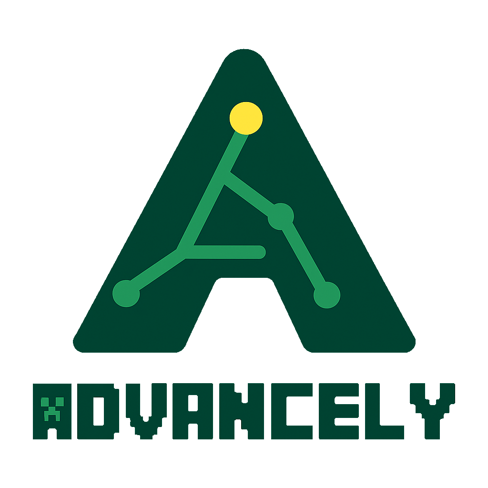
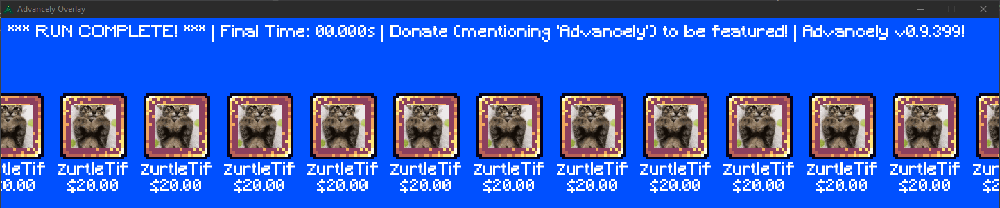
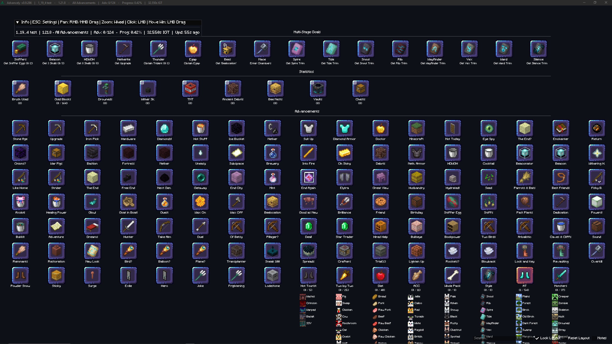
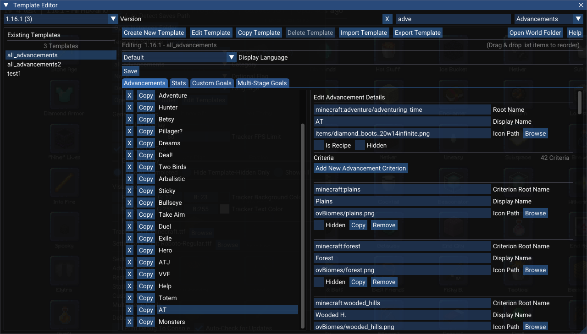
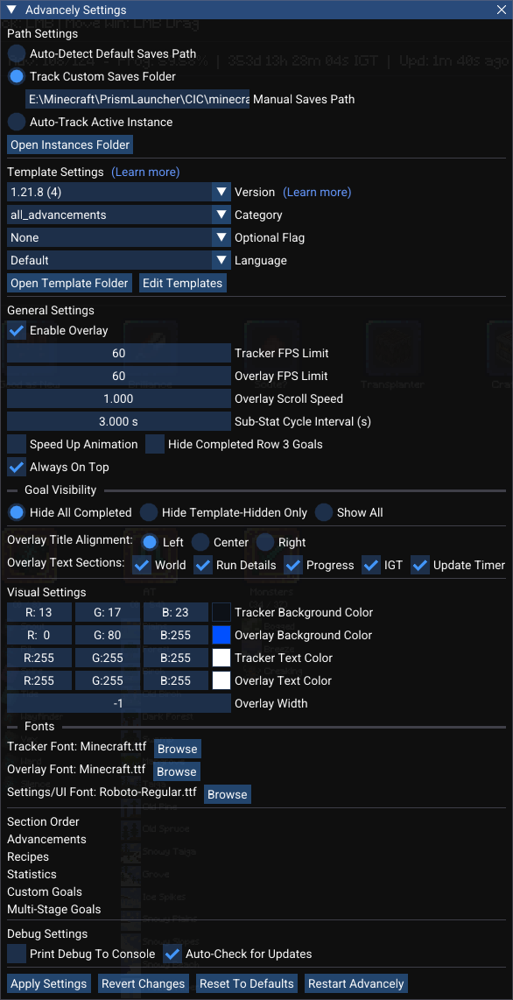

# [**DOWNLOAD ADVANCELY NOW\! (Windows, Linux & macOS)**](https://github.com/LNXSeus/Advancely/releases)

***

# A highly customizable and interactive tool to track Minecraft progress beyond just Advancements.

## This tracker supports an arbitrary number of advancements, recipes, custom statistics, unlocks, multi-stage goals, manual goals, and custom counters for over 100 Minecraft versions.

### Built for flexibility, Advancely supports everything from vanilla speedruns to modded adventures and datapacks through the creation of custom templates with a built-in template editor. It automatically detects changes in your latest singleplayer world, providing real-time progress updates.

***

## Become a Supporter!

Love using Advancely? You can have your name immortalized in the tracker!

**Supporters:**

* zurtleTif: $20

Simply [**donate here**](https://streamlabs.com/lnxseus/tip) and include the word "**Advancely**" in your donation
message. Your name will be added to the official supporter showcase that appears on the stream overlay when anyone
completes a run.

Thank you for supporting the project!

***

## Socials

**Put `#Advancely` in your content to support the project!**

* [Support Advancely (be featured on the overlay by mentioning
  `Advancely` in your donation message)](https://streamlabs.com/lnxseus/tip)
* [My YouTube](https://www.youtube.com/@lnxs?sub_confirmation=1)
* [My Twitch](https://www.twitch.tv/lnxseus)
* [My Twitch Archive + Advancely Devlogs](https://www.youtube.com/@lnxsarchive/playlists?view=1&sort=lad&flow=grid&sub_confirmation=1)
* [Official Advancely Discord w/ **Unofficial Releases**!](https://discord.gg/TyNgXDz)
* [My GitHub](https://github.com/LNXSeus)

***

## What is Advancely?

Advancely is a sophisticated, data-driven progress tracker designed for Minecraft speedrunners, completionists, and
content creators. Unlike other tools that only track vanilla advancements (e.g., AATool by Darwin Baker), Advancely can
be configured to monitor virtually any goal imaginable. It operates in real-time by watching your singleplayer save
files for changes, meaning your progress is always up-to-date without any manual intervention.

The tracker's true power lies in its `.json` template system, which allows you to define exactly what you want to track
for any version, mod, or playstyle. A template isn't just a list of advancements; it's a complete ruleset that can
include custom stats, multi-stage goals, manual counters, and more.

### The Advancely Template Editor

You don't need to be a developer to customize Advancely. The built-in **Template Editor** gives you full control to
import, create, copy, and modify any template directly within Advancely.

* **Import from Your World:** The fastest way to get started is by importing directly from an existing game save. The
  editor can automatically scan your player data and pull in all advancements/achievements, recipes, statistics, or
  unlocks to build a new template for you.
* **Full Customization:** Edit any goal's name, icon, or properties. Create complex multi-stage goals with several
  sequential steps, or add manual counters with hotkeys for objectives that can't be tracked automatically.
* **Easy Translation:** Every template has separate language files, allowing you to easily edit display names or provide
  translations without altering the core template logic.
* **Share Your Templates:** You can export any template—including all its language files—into a single `.zip` file to
  share with the Advancely community. Likewise, you can import (`.zip`) templates created by others.

This powerful and flexible system makes Advancely the ultimate tool for any Minecraft challenge, from a vanilla "All
Advancements" run to a heavily modded playthrough with hundreds of custom milestones.

_This animation here is compressed. When you use the tracker the framerate will be higher and the resolution perfectly
sharp._

***

## Core Features

* **Automatic Instance Tracking**: For users of a custom launcher like **Prism Launcher**, **MultiMC** etc., Advancely
  can automatically detect which instance you are actively playing and track it even if multiple instances are open at
  once. It intelligently
  selects the instance you last interacted with. Find out
  more [here](https://github.com/LNXSeus/Advancely#the-settings-window-esc).
* **Interactive Map View**: The main tracker window is an interactive map where you can pan by holding `Right-Click` or
  `Middle-Click`, zoom with the `Mouse Wheel`, and lock the layout in place by pressing `SPACE`.
* **Comprehensive Real-Time Tracking**: Advancely operates in real-time by watching your singleplayer save files for
  changes. It can monitor a wide range of data types, including:
    * **Advancements & Recipes**: Tracks completion status and individual criteria for any advancement or recipe from
      vanilla, mods, or datapacks.
    * **Statistics**: Monitors any in-game statistic (e.g., blocks mined, distance flown) against a target value.
      Supports nested "sub-stats" under a single category and allows for manual completion overrides via an in-app
      checkbox.
    * **Unlocks**: Fully tracks the unique "unlocks" progression system from the `25w14craftmine` snapshot.
* **Advanced Goal Types**:
    * **Custom Counters & Manual Goals**: For objectives that can't be automatically tracked (like counting structures
      visited), you can create manual checklist goals or counters with target values. All progress is saved
      automatically into `settings.json`. _Switching templates will thus ERASE the progress of these custom goals._
        * **Hotkeys**: Use configurable hotkeys to increment or decrement your custom counters. Up to 32 hotkeys are
          supported. Hotkeys only work when the tracker window is in focus.
    * **Multi-Stage Goals**: Create long-term objectives that combine several smaller steps. A single goal can require
      you to first complete a stat, then an unlock, then a specific **advancement criterion** (e.g., visiting a specific
      biome), and finally an entire advancement in sequence.
* **Section Completion Counters**: Each section header displays dynamic counters showing completed items versus the
  total visible items for that section, respecting both the current Goal Visibility setting and any active search
  filter.
    * **Format**:
        * Sections with sub-items (Advancements/Recipes with criteria, Statistics with sub-stats, Multi-Stage Goals)
          show counts for both main items and sub-items.
        * Sections without sub-items (Unlocks, Custom Goals, simple Statistics) show counts for main items only.

* **Powerful In-App Template Editor**: You don't need to manually edit files. The built-in editor allows you to create,
  copy, and modify any template. You can instantly build a new template by importing advancements, stats, and unlocks
  directly from your world save. Find more information [here](https://github.com/LNXSeus/Advancely#The-Template-Editor).
* **Customizable Stream Overlay**: An animated overlay is available to show your progress to viewers. You can customize
  its scroll speed, font, colors, FPS, if the 3rd row remains visible and which information is displayed. Find more
  information [here](https://github.com/LNXSeus/Advancely#The-Stream-Overlay).
* **Full Mod & Datapack Support**: The tracker is designed to be data-driven. It correctly parses items, stats, and
  advancements from any mod or data pack (e.g., `conquest:`, `blazeandcave:`) without being limited to the vanilla
  `minecraft:` namespace.
* **Extensive Version Support**: Advancely is built to work with over 100 Minecraft versions, from 1.0 to 1.21.9+ and
  beyond, including all April Fool's snapshots.
* **Automatic Updates**: The tracker automatically checks for new versions on startup and will prompt you to download
  and install them, ensuring you're always up-to-date.

***

## Getting Started

### 1. Downloading the Correct Version

Go to the [**releases page**](https://github.com/LNXSeus/Advancely/releases) and download the `.zip` file that matches
your operating system. The `vX.X.X` is the Advancely version, that is also displayed in the title of the main window.

* **Windows:** `Advancely-vX.X.X-Windows.zip`
* **Linux:** `Advancely-vX.X.X-Linux.zip`
* **macOS:** `Advancely-vX.X.X-macOS-Universal.zip` for both Intel and Silicon Macs.

### 2. Installation & First-Time Run

To ensure the application works correctly, please follow the instructions for your operating system.

> **✔️ Important: Use English-Only (ASCII) File Paths**
>
> To prevent errors, please make sure the **entire folder path** to your Advancely application contains **only standard
English (ASCII) characters**.
>
> Special characters, accents (like `é`, `ü`, `ñ`), or symbols in the file path can cause the tracker to fail when
> loading templates or watching your save files.
>
> * **❌ Bad Path:** `C:\Users\Jörg\Desktop\Spiele\Advancely\`
> * **✅ Good Path:** `C:\Users\Joerg\Desktop\Games\Advancely\`

Your download contains the Advancely application (`.exe` on Windows, `.app` on macOS, or a binary file on Linux) and a
`resources` folder. **Both must be kept in the same directory for Advancely to work**.

**macOS Instructions**

Due to macOS security (Gatekeeper), you will need to perform a one-time bypass to authorize the application after
downloading it.

✔️ **First-Time Run Steps (Easy Method):**

1. After downloading and unzipping, try to open `Advancely.app`. You will likely see an error saying Apple cannot check
   it for malicious software. Click **OK**.
2. Now, **right-click** (or Control-click) the `Advancely.app` file and select **Open** from the menu.
3. A different warning will appear, but this time you will have an **Open** button. Click it.
4. macOS will now remember that you trust this application. You only need to do this once and can open it normally by
   double-clicking from now on.

✔️ **Alternative Method (Terminal Authorization):**

1. Open the **Terminal** app.
2. Type `xattr -cr ` (note the space at the end) but **do not** press Enter yet.
3. Drag the `Advancely.app` file from Finder and drop it directly onto the Terminal window.
4. The command should now look similar to this: `xattr -cr /path/to/your/Advancely.app`.
5. Press **Enter**.
6. You can now open `Advancely.app` normally. This command only needs to be run once.

✔️ **Running from the Terminal (for Debugging):**

If you are having trouble opening the app or want to see live debug messages, you can run it directly from the Terminal.

1. Open the **Terminal** app.
2. Type `cd ` (with a space at the end).
3. Drag the **folder** that contains `Advancely.app` and the `resources` folder onto the Terminal window, then press *
   *Enter**.
4. Run the executable with this command: `./Advancely.app/Contents/MacOS/Advancely`
5. Any errors or log messages will now appear directly in your Terminal window.

✔️ **Recommended Installation:**

* For the best experience, move **both** `Advancely.app` and the `resources` folder into your main `/Applications`
  folder.
* You can then drag `Advancely.app` from the Applications folder to your Dock to create a shortcut.

**Windows & Linux Instructions**

Your application folder contains the main executable, required library files (like `.dll` files on Windows and `.so`
files on Linux), and the `resources` folder. The executable must always stay in the same folder as its supporting files.

✔️ **Correct Way to Run:**

* To run Advancely from another location like your Desktop, please create a shortcut to the main executable.
    * **Windows:** Right-click `Advancely.exe` → "Create shortcut".
    * **Linux:** Right-click the `Advancely` file → "Create Link".
* You can then move this new shortcut or link anywhere you like.
* **Do not** move or copy the original executable file by itself, as it will fail to start or find its resources.

### 3. Your First Launch

Launch Advancely by running the executable (or the shortcut you created). On its first run, it will default to finding
your most recently played world from the standard Minecraft installation. To begin customizing, press the `ESC` key to
open the settings window, where you can switch to `Auto-Track Active Instance` if you use Prism Launcher, MultiMC or
some other custom launcher.

***

## Download Once, Update Forever

Advancely is designed to be easy to maintain. By default, **the tracker will automatically check for new versions on
startup**. When an update is available, you will be notified with a prompt offering to download and install it for you.
This process is designed to be as safe as possible for your custom files.

### How the Automatic Update Works

The updater is smart about which files it replaces to ensure your personal configurations are preserved.

* ✅ **Files that are SAFE and WILL NOT be replaced:**
    * Your main `settings.json` file.
    * Your `_notes.txt` files for each template.
    * Any custom templates or user-created files in the `resources` folder.

* ⚠️ **Files that WILL BE REPLACED:**
    * The main application executable (`Advancely.exe`, `Advancely.app`, etc.).
    * Core library files (`.dll`, `.so`).
    * Official templates, fonts, icons, and GUI assets included with the release.

### Protecting Your Modified Official Templates

To prevent losing your work during an automatic update, it's highly recommended to **avoid editing official template
files directly**. Instead, use the **Template Editor** to create your own safe-to-edit versions. The correct method
depends on the types of changes you want to make.

**If you only want to change display names:**

The best approach is to create a new **language file** for the official template. This keeps your custom names separate
while still allowing the underlying template structure (the goals, criteria, icons, etc.) to receive official updates.

1. Open the **Template Editor** and select the official template you wish to customize.
2. In the "Languages" section, select the "Default" language and click **Copy Language**.
3. Give your new language a unique flag (e.g., `custom` or `mypack`).
4. You can now select your custom language in the main settings, and your display names will be safe from updates.

**If you have changed goals, criteria, or icons (core functionality):**

The best approach is to create a complete **copy of the template**. This makes your version fully independent and
protects it from being overwritten.

1. Open the **Template Editor** and select the official template you want to use as a base.
2. Click the **Copy Template** button.
3. Give your new version a unique name, typically by adding an **Optional Flag** (e.g., `_custom`).
4. You can now safely edit your new, independent template in any way you wish.

Your custom template will appear separately in the template list and will not be touched by the auto-updater.

***

## The Tracker Window

The main window is an interactive canvas where all your tracked goals are displayed. You can freely zoom in and out to
rearrange the items in view to suit your needs, making it easy to focus on what matters most for your current run. The
order of the sections (advancements, recipes, multi-stage goals, ...) can be configured in
the [settings window](https://github.com/LNXSeus/Advancely#The-Settings-Window).

### Navigating the Map

You can manipulate the view using several intuitive controls:

* **Pan**: Hold `Right-Click` or `Middle-Click` and drag to move the entire map of goals.
* **Zoom**: Use the `Mouse Wheel` to zoom in and out, allowing you to see an overview or focus on specific details.
* **Lock Layout**: Press the `SPACE` key to lock the grid layout. This prevents goals from rearranging when you resize
  the window, giving you precise control over how many items appear in each row.
* **Reset Layout**: Click the "Reset Layout" button in the bottom-right corner to instantly reset the pan and zoom to
  their default positions.

### Searching & Filtering

To quickly find a specific goal, press `Ctrl+F` (or `Cmd+F` on macOS) to focus the search box in the bottom-right
corner. The filter is case-insensitive and intelligently searches across different goal types. Using the search filter
also dynamically updates the completion counters in the section headers.

* **Advancements, Recipes & Statistics**: Shows a category if its main title or any of its sub-criteria/sub-stats match
  the search term. If only a sub-item matches, it will be the only one shown under its parent.
* **Unlocks & Custom Goals**: Shows the goal if its name matches the search term.
* **Multi-Stage Goals**: Shows the goal if its main title or the text of its *currently active stage* matches the search
  term.

### Section Completion Counters

Each section header (e.g., "Advancements", "Statistics") now displays dynamic counters reflecting the completion status
based on the currently visible items. These counters respect both the "Goal Visibility" setting and any active search
filter.

**Format:**

* Sections with sub-items (Advancements/Recipes with criteria, Statistics with sub-stats, Multi-Stage Goals) show:
  `(Completed Main / Total Main - Completed Sub / Total Sub)`
* Sections without sub-items (Unlocks, Custom Goals, simple Statistics) show: `(Completed Main / Total Main)`

**How Goal Visibility Affects Counters:**

* **Hide All Completed**: Since only incomplete items are shown, the counters display only the **total number of
  remaining
  items** (e.g., `(Remaining Main - Remaining Sub)` or `(Remaining Main)`).
* **Hide Template-Hidden Only**: Counts show **completed vs. total** for all items not marked as hidden in the
  template (
  e.g., `(Completed Main / Total Main)`).
* **Show All**: Counts show completed vs. total for every single item defined in the template for that section,
  including hidden ones (e.g., `(Completed Main / Total Main)`).

### The Info Bar

A transparent info bar at the top of the window provides a live summary of your run. It includes:

* **World**: The name of the world currently being tracked.
* **Run Details**: The Minecraft version, template category, and optional flag you have selected.
* **Progress**: The main advancement/achievement counter and the overall completion percentage, which includes every
  single sub-task from all categories (recipes, criteria, stats, etc.).
* **IGT**: The total in-game time for the current world, read directly from the stats file.
* **Update Timer**: A timer showing how long it has been since the game last saved its files.

### The Notes Window

A powerful notes editor can be toggled via the "Notes" button in the bottom-right corner. All text is saved instantly as
you type. The notes system has two distinct modes, which can be changed from within the notes window:

* **Per-World Mode (Default)**: Notes are saved for each world individually. This is perfect for keeping track of
  world-specific information like coordinates or To-Do lists. The tracker automatically remembers the notes for your
  last 32 played worlds.
* **Per-Template Mode**: Notes are tied directly to the loaded template. This is useful for storing general strategies
  or information that applies to every run using that specific template.

The notes window also supports live-reloading (if you edit the `.txt` file externally, the window updates instantly) and
allows you to switch to the UI font for improved readability.

***

## The Stream Overlay

_This animation here is compressed. When you use the overlay the framerate will be higher and the resolution perfectly
sharp._

Advancely includes a dedicated, customizable window perfect for showing your progress to viewers. It's an animated,
real-time display that you can easily add to your stream layout.

### Setup in OBS (or other streaming software)

1. **Enable the Overlay**: In Advancely's settings (`ESC`), check the `Enable Overlay` box and click `Apply Settings` or
   hit `ENTER`. A new `Advancely Overlay` window will appear.
2. **Add a Source**: In your streaming software (like OBS), add a new `Game Capture` source on Windows or Linux and a
   `Window Capture` source on macOS.
3. **Select the Window**: Choose the `[Advancely.exe]: Advancely Overlay` window from the list.
4. **Add a Color Key Filter**: Right-click the new source, go to "Filters", and add a "Color Key" filter.
5. **Set the Color**: Use the color picker to select the overlay's background color. You can copy the exact HEX code
   from the Advancely's `Overlay Background Color` setting to ensure a perfect match.
6. **Adjust Settings**: For a clean, transparent background, it's recommended to set the **Similarity** to `1` and *
   *Smoothness** to around `210`.

> **Important for Streamers:** Applying any changes in Advancely's settings will restart the overlay window. You may
> need to re-select the window in your capture source properties afterward.

### Overlay Layout Explained

The overlay is organized into three horizontally scrolling rows, each dedicated to different types of goals:

* **Row 1 (Top)**: This row displays the icons of the smallest sub-tasks. It shows the individual criteria for
  advancements/recipes and the sub-stats for complex stat goals.
* **Row 2 (Middle)**: This row shows the main parent goals, such as primary advancements, recipes, and unlocks.
* **Row 3 (Bottom)**: This row is for all other goal types, including statistics, custom goals, and multi-stage goals.

### Customization

Nearly every aspect of the overlay can be tailored to your liking from the settings window:

* **Speed & Direction**: Adjust the `Overlay Scroll Speed`. A positive value scrolls left-to-right, while a negative
  value scrolls right-to-left. A value of 0 makes the items static.
* **Animation**: Set the `Overlay FPS Limit` and toggle the `Speed Up Animation` option. You can also temporarily speed
  up the animation by holding `SPACE` while the overlay window is focused.
* **Stat Cycling**: For multi-stat goals, you can set the `Sub-Stat Cycle Interval` to control how frequently the
  overlay cycles through displaying each sub-stat.
* **Visibility**: Choose whether to hide completed goals from Row 3, and toggle the visibility of each section of the
  top info bar (`World`, `Run Details`, `Progress`, `IGT`, `Update Timer`).
* **Alignment**: The main progress text at the top of the overlay can be aligned to the `Left`, `Center`, or `Right`.

***

## The Template Editor (`ESC` ▶ Edit Templates)

This is the heart of Advancely's customization. The in-app editor gives you complete control to define, modify, and
share the rulesets or `templates` that the tracker uses. You can access it by opening the settings (`ESC`) and clicking
the `Edit Templates` button.

### Template Management

From the main editor view, you can manage entire template packages:

* **Create New Template**: Builds a new, empty template from scratch for the selected version. You provide a unique
  `Category Name` and an `Optional Flag`.
* **Copy Template**: Duplicates an existing template, including all its language files. This is the perfect starting
  point for creating a variation of a complex template.
* **Delete Template**: Permanently removes a template and all of its associated language **and notes files**.
* **Import Template**: Imports a full template package from a `.zip` file. You can confirm or change the version,
  category, and flag before the files are added.
* **Export Template**: Packages the selected template and all its language files into a single `.zip` file, perfect for
  sharing with others on the [Official Advancely Discord](https://discord.gg/TyNgXDz).

### Language File Management

Each template can have multiple language files for localization. The editor allows you to manage these for any selected
template:

* **Create Language**: Creates a new, blank language file. Display names will initially default to their internal root
  names.
* **Copy Language**: Duplicates an existing language file to a new one, preserving all translations.
* **Delete Language**: Removes a specific language file (you cannot delete the default `_lang.json`).
* **Import/Export Language**: Import a single `.json` language file from an external source or open the folder
  containing the selected language file to export it.

### Editing a Template

Opening a template reveals a tabbed interface where you can define every goal.

> **Important**: For GIFs to work correctly, they must be unoptimized with all frame data intact. You can prepare any
> GIF by uploading it to [**ezgif.com/maker**](https://ezgif.com/maker), selecting the **"Don't Stack Frames"** option,
> and exporting the result.

* **Advancements & Recipes**: List all achievements or advancements you want to track. Each entry has a `Root Name` (the
  in-game ID, e.g., `minecraft:story/mine_stone`), a `Display Name`, and an `Icon Path`. You can also import or add
  `Criteria` to track sub-tasks, and a checkbox designates an entry as a `Recipe` to sort it into its own section and
  move it to the percentage progress calculation instead.
* **Statistics**: Track any in-game statistic.
    * **Simple Stats**: A single goal with a `Target` value (e.g., track "Blocks Mined" until a goal of 10,000 is
      reached).
    * **Multi-Stat Categories**: Group related stats under one parent icon. Each `Sub-Stat` has its own name, icon, and
      target, and will cycle on the stream overlay.
* **Unlocks**: For the `25w14craftmine` snapshot, this tab allows you to track the completion of player unlocks like
  `minecraft:exploration`.
* **Custom Goals & Counters**: Create goals for things that can't be automatically tracked. The "Target Goal" value
  defines its behavior:
    * `0`: A simple on/off toggle (manual checklist item).
    * `>0`: A progress-based counter that completes when the target is reached.
    * `-1`: An infinite counter with no completion state.
* **Multi-Stage Goals**: Design complex, sequential objectives. Each goal has a parent name and icon, and a list of
  `Stages`. Each stage is a smaller goal that must be completed in order. A stage's `Type` determines its trigger:
    * **Stat/Achievement**: Triggers when a specific stat reaches its target or an achievement is earned (read from the
      `stats` folder).
    * **Advancement**: Triggers when a specific advancement or recipe is earned (read from the `advancements` folder).
    * **Criterion**: Triggers when a specific *sub-criterion* of a parent advancement is met (e.g., visiting a single
      biome for "Adventuring Time").
    * **Unlock**: Triggers when a specific player unlock is obtained (read from the `unlocks` folder).
    * **Final**: The mandatory last stage that completes the entire multi-stage goal.

### Importing from Game Files

To save you from manually typing hundreds of root names, nearly every editor tab has an **"Import..."** button. This
powerful feature allows you to:

1. Click the button (e.g., "Import Advancements").
2. Select a player data file (`.json` or `.dat`) from one of your world saves.
3. A popup will appear with a searchable list of every single advancement, stat, or unlock present in that file.
4. Simply check the boxes for the items you want to add to your template and confirm. They will be instantly added,
   ready for you to assign icons and display names.

### The Help Button

If you need help finding the correct root name for an item or want to see examples, click the "Help" button in the
editor. This will open the `resources/reference_files` folder, which contains guides, examples, and version-specific
lists of game data to assist you in building the perfect template.

***

## The Settings Window (`ESC`)

The true power of Advancely lies in its deep customization. Every feature can be configured in real-time from the
settings window, which can be opened at any time by pressing the `ESC` key.

| Setting Group         | Options & Features                                                                                                                                                                                                                                                                                                                                                                                                                         |
|:----------------------|:-------------------------------------------------------------------------------------------------------------------------------------------------------------------------------------------------------------------------------------------------------------------------------------------------------------------------------------------------------------------------------------------------------------------------------------------|
| **Path Settings**     | Choose how Advancely finds your saves. `Auto-Detect` finds the default Minecraft path. `Track Custom Saves Folder` lets you specify a manual path. `Auto-Track Active Instance` automatically finds and follows the instance you are playing from **Prism Launcher**, **MultiMC** etc.. The `Open Instances Folder` button helps you quickly navigate to your launcher's instance directory.                                               |
| **Template Settings** | Select the `Version`, `Category`, `Optional Flag`, and `Language` to load a specific ruleset. You can also use the `Open Template Folder` button for quick access to the files on your disk.                                                                                                                                                                                                                                               |
| **General Settings**  | Toggle the stream `Overlay`, set the `Tracker FPS Limit`, keep the tracker `Always On Top`, and enable `Using StatsPerWorld Mod` compatibility for legacy Minecraft versions (1.0 - 1.6.4).                                                                                                                                                                                                                                                |
| **Goal Visibility**   | Fine-tune which completed goals are displayed on the tracker with three modes: `Hide All Completed` (strictest), `Hide Template-Hidden Only`, or `Show All`. This setting also affects which items are counted in the section completion counters.                                                                                                                                                                                         |                                                                                                                                                                                                                                                                           |
| **Visual Settings**   | Full RGBA color customization for the tracker `background` and `text`, as well as the overlay `background` and `text`. You can also adjust the `Overlay Width` with a pixel-perfect slider.                                                                                                                                                                                                                                                |
| **Font Settings**     | Independently set the font for the **Tracker**, **Overlay**, and **UI (Settings/Notes)**. Both `.ttf` and `.otf` font files are supported. *Note: Changes to the Tracker and UI fonts require an application restart to take effect.*                                                                                                                                                                                                      |
| **Overlay Settings**  | Set the `Overlay FPS Limit` independently from the tracker. Configure the `Overlay Scroll Speed` (negative values reverse the direction), the `Sub-Stat Cycle Interval` for multi-stat animations, and toggle a constant `Speed Up Animation`. You can also align the top progress text (`Left`, `Center`, or `Right`) and toggle visibility for each section of the info bar (`World`, `Run Details`, `Progress`, `IGT`, `Update Timer`). |
| **Hotkey Settings**   | This section appears if your template contains custom counters. Assign keyboard hotkeys to increment or decrement any counter (hotkeys only work when the tracker window is focused).                                                                                                                                                                                                                                                      |
| **Section Order**     | Drag and drop the section names (`Advancements`, `Stats`, `Unlocks`, etc.) to reorder how they appear in the main tracker window.                                                                                                                                                                                                                                                                                                          |
| **Debug Settings**    | Toggle `Print Debug To Console` for detailed status updates in your terminal or `advancely_log.txt`, `Auto-Check for Updates` on startup or `Restart Advancely` to perform a full automatic restart of Advancely, which is needed for some font settings to take effect.                                                                                                                                                                   |

***

## Extensive Version Support

Advancely supports over 100 Minecraft versions **(1.0 - 1.21.9+)**, including every full release from 1.0 upwards and
all April Fool's snapshots.

* **Playtime Tracking**: The tracker reads total playtime directly from the world's stats file, which is measured in
  in-game ticks (20 ticks per second).

* **Era-Specific Logic**:

    * **1.0 – 1.6.4 (Legacy)**: Advancely supports two modes for these versions:
        * **Default (Snapshot Mode)**: For vanilla play, it reads the global stats file. When you load a new world, it
          takes a "snapshot" of your progress and tracks all new stats and achievements against that baseline,
          effectively simulating per-world stats.
        * **StatsPerWorld Mod Support**: If you are using Legacy Fabric with
          the [StatsPerWorld Mod](https://github.com/RedLime/StatsPerWorld/releases), Advancely can be configured to
          read local `.dat` stat files directly, just like in modern versions. Playtime is tracked via the ID: `1100`.
    * **1.7.2 – 1.11.2 (Mid-Era)**: Reads achievements and stats from the per-world stats JSON file. Playtime is tracked
      via `stat.playOneMinute`.
    * **1.12 – 1.16.5 (Modern)**: Reads from separate, per-world advancements and stats files. Playtime is tracked via
      `minecraft:play_one_minute`.
    * **1.17+**: Same as above, but playtime is tracked via the renamed `minecraft:play_time` statistic.
    * **25w14craftmine**: Fully supports the unique advancements, stats, and unlocks files from this snapshot.

***

## Officially Added Templates

> **These will get replaced through auto updates!**

| Category           | Version(s)                                  | Optional Flag(s) | Languages           |
|--------------------|---------------------------------------------|------------------|---------------------|
| `any%`             | 25w14craftmine                              |                  | Default             |
| `all_advancements` | 1.16.1                                      |                  | Default, ger, zh_cn |
| `all_advancements` | 1.21.8 - 1.21.11                            |                  | Default, ger, zh_cn |
| `all_advancements` | 1.21.8 - 1.21.11                            | `_optimized`     | Default, ger, zh_cn |
| `all_achievements` | 1.0, 1.1, 1.2.5, 1.3.1, 1.4.7, 1.5.2, 1.6.4 |                  | Default, ger        |
| `miku%`            | 1.21.8 - 1.21.11                            |                  | Default             |
| `all_trims`        | 1.21.8 - 1.21.11                            |                  | Default             |
| `test`             | 1.0, 1.6.4, 1.11.2, 1.16.1, 25w14craftmine  | `1`              | Default             |

_The `test1` templates are for you to learn and understand how templates work. These test templates include all the core
functionalities of all goal types. The `Default` language is the standard english template (`_lang.json`). Any
non-default languages are appended after `lang_`._

Credits for the `zh_cn` (chinese) translation of the `all_advancements` templates go to @towardstars and @yumekotism on
dc.
Make sure you use the `SourceHanSansCN-Normal.otf` font in all places (tracker, overlay and UI).

***

## Known Limitations

* **Symbolic Links**: On Windows and macOS, the real-time file watcher may not function correctly if your
  `.minecraft/saves` folder is a symbolic link. For best results, please provide a direct path to your saves folder in
  the settings if you use a custom location.
* **Shortcuts**: You must always run the application from its installation directory where all the necessary `.dll`
  files are located. Do not create a shortcut directly to the executable file.

***

## You have a feature idea?

Suggest it in the [Official Advancely Discord](https://discord.gg/TyNgXDz) within the `📊│advancely-tracker` channel or
[create a new issue](https://github.com/LNXSeus/Advancely/issues/new) on GitHub\!

***

## Running into Issues?

* **Is Windows Defender blocking the application?**: I've contacted Microsoft so windows defender does not falsely
  detect Advancely.exe as a virus. So make sure your Windows Defender version is up to date. Get the latest
  version [here](https://docs.microsoft.com/microsoft-365/security/defender-endpoint/manage-updates-baselines-microsoft-defender-antivirus).
  Also **don't** open Advancely using **Jingle**.
* **Is the tracker in a path with special characters?**: Ensure the full folder path to `Advancely.exe` (e.g.,
  `C:\Users\Jörg\...`) contains only standard English letters and numbers. Special characters can cause errors when
  loading files.
* **Multiple Advancely Windows**: If for whatever reason you have Advancely open multiple times the Overlay will most
  likely glitch out as it's a separate process and it then doesn't know from which main Advancely process to read
  from. So make sure to only ever have `ONE Advancely window` open at all times.
* **Check log file**: First, look into the `advancely_log.txt` file to see if there are any errors that were caused by
  wrong usage of the application. With the `Print Debug To Console` setting enabled, the log file will also contain
  detailed progress updates, not just errors.
* **Report an Issue**: If you have any issues that aren't caused by incorrect usage, please contact me
  on [Discord @lnxseus](https://discord.gg/TyNgXDz)
  or [create a new issue](https://github.com/LNXSeus/Advancely/issues/new) on GitHub\!

***

## Beta Testers

Massive thanks to all the beta testers. _Message me on discord @lnxseus with proof of using Advancely before its full
release and you'll be added here:_

* Windows: ethansplace98, Yumeko, zurtletif, 3emis, MoreTrident, PhoenixAUS_, metal_silver1234, 36_Official,
  TheDogmaster28
* macOS: Slackow, TheDogmaster28, ethansplace98
* Linux: DesktopFolder, ShadowFlower64, me_nx

***

## License

Copyright (c) 2025 LNXSeus. All Rights Reserved.

This project is proprietary software. You are granted a license to use the software as-is. You may not copy, distribute,
modify, reverse-engineer, or use this software or its source code in any way without the express written permission of
the copyright holder.

***

## Credits

*This project uses [dmon](https://github.com/septag/dmon) by Sepehr Taghdisian, licensed under the BSD 2-Clause
License.*
*This project's user interface is powered by the excellent [Dear ImGui](https://github.com/ocornut/imgui) library.*
*This project also uses the SDL3 library suite and cJSON.
*This project uses [curl/libcurl](https://curl.se/libcurl) to download the latest update from github.*
*This project uses the [miniz](https://github.com/mongoose-os-libs/miniz) compression library to unzip the downloaded
files.*
*This project uses [tiny file dialogs](https://sourceforge.net/projects/tinyfiledialogs) to open file dialogs.*
*More information can be found in the LICENSES.txt file.*

*Lots of assistance was provided by Gemini 2.5 Pro.*
*Massive thanks to Jannox78 for allowing me to use his MacBook Pro for testing.*
*Minecraft item .png files downloaded from [Minecraft Asset Cloud](https://mcasset.cloud/1.0/) and block renders from
the [Minecraft Wiki](https://www.minecraft.wiki) (downloaded by [Dogmaster](https://www.twitch.tv/thedogmaster28))*
*Shoutout to [Oskar](https://github.com/Oskar3141) for providing me his project files (kAAmel) and Darwin Baker for
creating [AATool](https://github.com/DarwinBaker/AATool), which served as inspiration\!*