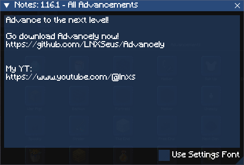
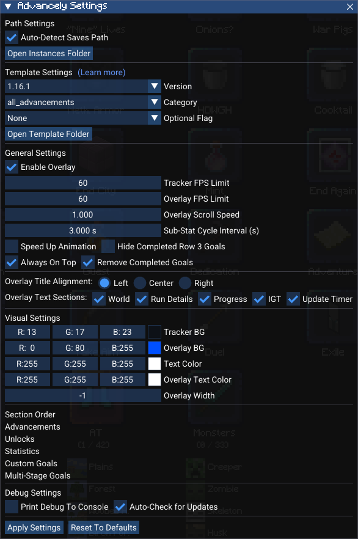

# [**DOWNLOAD ADVANCELY NOW\! (Windows, Linux & macOS, any MC Java Version)**](https://github.com/LNXSeus/Advancely/releases)

# A highly customizable and interactive tool to track Minecraft progress beyond just Advancements.

## This tracker supports an arbitrary number of advancements, recipes, custom statistics, unlocks, multi-stage goals, manual goals, and custom counters for over 100 Minecraft versions.

### Built for flexibility, Advancely supports everything from vanilla speedruns to modded adventures and custom datapacks. It automatically detects changes in your latest singleplayer world, providing real-time progress updates.

## Socials

**Put `#Advancely` in your content to support the project!**

* [Support Advancely](https://streamlabs.com/lnxseus/tip)
* [My YouTube](https://www.youtube.com/@lnxs?sub_confirmation=1)
* [My Twitch](https://www.twitch.tv/lnxseus)
* [My Twitch Archive + Advancely Devlogs](https://www.youtube.com/@lnxsarchive/playlists?view=1&sort=lad&flow=grid&sub_confirmation=1)
* [My Discord](https://discord.gg/TyNgXDz)
* [My GitHub](https://github.com/LNXSeus)

## What is Advancely?

Advancely is a sophisticated, data-driven progress tracker designed for Minecraft speedrunners, completionists, and content creators. Unlike other tools that only track vanilla advancements, Advancely can be configured to monitor virtually any goal you can imagine. It operates in real-time by watching your singleplayer save files for changes, meaning your progress is always up-to-date without any manual intervention. Its true power lies in its `.json` template system, which allows you to define exactly what you want to track for any version, mod, or playstyle.

_This animation here is compressed. When you use the tracker the framerate will be higher and the resolution perfectly sharp._

## Officially Added Templates

| Category           | Version(s)                                         | Optional Flag |
|--------------------|----------------------------------------------------|---------------|
| `all_advancements` | 1.16.1, 1.21.8                                     |               |
| `all_advancements` | 1.21.8                                             | `_optimized`  |
| `all_achievements` | 1.0, 1.1, 1.2.5, 1.3.1, 1.4.7, 1.5.2, 1.6.4        |               |
| `miku%`            | 1.21.8                                             |               |
| `test`             | 1.0, 1.6.4, 1.11.2, 1.16.1, 1.21.8, 25w14craftmine | `1`           |
_The `test1` templates are for you to learn and understand how templates work. These test templates include all the core functionalities of all goal types._

### Download Once, Update Forever

Advancely is designed to be easy to maintain. By default, **the tracker will automatically check for new versions on startup**. When an update is available, you will be notified with a prompt offering to download and install it for you. This process is designed to be safe for your data; your `settings.json` file and any custom `_notes.txt` files will not be replaced. However, official templates included with the application *will* be overwritten to ensure they are up-to-date, so if you have modified any of them, be sure to rename them before updating.
It's easiest to just add an optional flag (here it would be `_1`) turning something like `1_16_1_all_advancements.json` into `1_16_1_all_advancements_1.json`. Same thing with the language file. Turning `1_16_1_all_advancements_lang.json` `1_16_1_all_advancements_1_lang.json`. **IMPORTANT:** The optional flag is everything after the category INCLUDING the underscore. It's good practice to put an underscore for better file management. The tracker automatically removes any underscores within the category and optional flag and capitalizes the next letter, so it's intended to use underscores instead of spaces and keep everything lowercase for the categories and optional flags.

## Core Features

* **Interactive Map View**: The main tracker window is not a static list but an interactive map of your progress. You can freely organize your view to focus on what matters most.

* **Pan**: Right-Click or Middle-Click + Drag

* **Zoom**: Mouse Wheel

* **Search**: Use `Ctrl+F` (or `Cmd+F` on macOS) to focus the search box and filter goals by name. The filter is case-insensitive and works as follows:

  * **Advancements & Statistics**: Shows a category if its title or any of its sub-criteria match. If only a sub-criterion matches, only that specific one will be shown under its parent.
  * **Unlocks & Custom Goals**: Shows the goal if its name matches the search term.
  * **Multi-Stage Goals**: Shows the goal if its main title or the text of its currently active stage matches the search term.

* **Lock Layout**: Press `SPACE` to lock the grid layout, preventing it from rearranging when you resize the window or zoom.

* **Comprehensive Tracking**: Advancely isn't limited to just advancements. It tracks multiple data types directly from your save file, including:

  * **Advancements & Recipes**: Tracks completion status and individual criteria for any advancement or recipe from vanilla, mods, or datapacks.
  * **Statistics**: Monitors any in-game statistic (e.g., blocks mined, distance flown) against a target value. Supports nested "sub-stats" under a single category and allows for manual completion overrides via an in-app checkbox.
  * **Unlocks**: Fully tracks the unique "unlocks" progression system from the `25w14craftmine` snapshot.

* **Advanced Goal Types**:

  * **Multi-Stage Goals**: Create long-term objectives that combine several smaller steps. A single goal can require you to first complete a stat, then an unlock, then a specific **advancement criterion** (e.g., visiting a specific biome), and finally an entire advancement in sequence.
  * **Custom Counters & Manual Goals**: For objectives that can't be automatically tracked (like counting structures visited), you can create manual checklist goals or counters with target values. All progress is saved automatically into `settings.json`.
    * **Hotkeys**: Use configurable hotkeys to increment or decrement your custom counters. Up to 32 hotkeys are supported. Hotkeys currently only work when the tracker window is in focus.

* **Full Mod & Datapack Support**: The tracker is designed to be data-driven. It correctly parses items, stats, and advancements from any mod or data pack (e.g., `conquest:`, `blazeandcave:`) without being limited to the vanilla `minecraft:` namespace.

* **Stream Overlay**: As a streamer you'll have a nice animated overlay for your viewers to see your progress. Just create an OBS game capture, select the Advancely Overlay window (you might have to restart the tracker) and use the color key filter on the single-colored background (just copy the hex value of the Overlay BG Color) to make it transparent. It works relatively well to keep the `Similarity` at `1` and use a `Smoothness` of around `210`.

 
_This animation here is compressed. When you use the overlay the framerate will be higher and the resolution perfectly sharp._

**Template-Specific Notes**: A toggleable notes window is available in the bottom-right corner of the tracker. Any text you type is saved instantly to a `_notes.txt` file, which is stored right next to the template file you are currently using. This makes your notes specific to each category and version you track. Furthermore, if you edit the `.txt` file directly while the tracker is running, the notes window will update live with your changes. You can also change the font to be the settings font for better readability.

* **Important**: For GIFs to work correctly, they must be unoptimized with all frame data intact. You can prepare any GIF by uploading it to [**ezgif.com/maker**](https://ezgif.com/maker), selecting the **"Don't Stack Frames"** option, and exporting the result.

## Extensive Version Support (1.0 – 1.21+)

Advancely supports over 100 Minecraft versions, including every full release from 1.0 upwards and all April Fool's snapshots.

* **Playtime Tracking**: The tracker reads total playtime directly from the world's stats file, which is measured in in-game ticks (20 ticks per second).

* **Era-Specific Logic**:

  * **1.0 – 1.6.4 (Legacy)**: Advancely supports two modes for these versions:
    * **Default (Snapshot Mode)**: For vanilla play, it reads the global stats file. When you load a new world, it takes a "snapshot" of your progress and tracks all new stats and achievements against that baseline, effectively simulating per-world stats.
    * **StatsPerWorld Mod Support**: If you are using Legacy Fabric with the [StatsPerWorld Mod](https://github.com/RedLime/StatsPerWorld/releases), Advancely can be configured to read local `.dat` stat files directly, just like in modern versions. Playtime is tracked via the ID: `1100`.
  * **1.7.2 – 1.11.2 (Mid-Era)**: Reads achievements and stats from the per-world stats JSON file. Playtime is tracked via `stat.playOneMinute`.
  * **1.12 – 1.16.5 (Modern)**: Reads from separate, per-world advancements and stats files. Playtime is tracked via `minecraft:play_one_minute`.
  * **1.17+**: Same as above, but playtime is tracked via the renamed `minecraft:play_time` statistic.
  * **25w14craftmine**: Fully supports the unique advancements, stats, and unlocks files from this snapshot.

## Full Customization & Configuration

The true power of Advancely lies in its customization. All settings can be configured in real-time from the settings window (`ESC` key).

| Setting Group         | Options & Features                                                                                                                                                                                                                                                                                                                                                                                                                                                                                    |
|:----------------------|:------------------------------------------------------------------------------------------------------------------------------------------------------------------------------------------------------------------------------------------------------------------------------------------------------------------------------------------------------------------------------------------------------------------------------------------------------------------------------------------------------|
| **Path Settings** | `Auto-Detect` saves path for your OS or specify a `Manual` path. An `Open Instances Folder` button is also available, which navigates up three directories from your saves path—ideal for custom launchers.                                                                                                                                                                                                                                                                                           |
| **Template Settings** | Select your `Version`, `Category`, and an `Optional Flag` to load a specific ruleset. You can create your own templates by following the folder structure in `resources/templates` and use the `Open Template Folder` button for quick access.                                                                                                                                                                                                                                                        |
| **General Settings** | Toggle the `Overlay`, set a `Tracker FPS Limit`, keep the tracker `Always On Top`, automatically `Remove Completed Goals` from the main view, and enable the `StatsPerWorld Mod` compatibility for legacy versions.                                                                                                                                                                                                                                                                                   |
| **Visual Settings** | Full RGBA color customization for the tracker `background`, `text`, overlay `background`, and overlay `text`. You can also adjust the `Overlay Width`.                                                                                                                                                                                                                                                                                                                                                |
| **Overlay Settings** | Set the `Overlay FPS Limit` independently from the tracker. Fine-tune the `Overlay Scroll Speed` (negative values reverse direction), `Sub-Stat Cycle Speed` for multi-stat animations, and `Speed Up Animation` (also toggled with `SPACE` in the overlay window). You can also align the top progress text (`Left`, `Center`, or `Right`), toggle `Hide Completed Row 3 Goals`, and toggle visibility for each section of the info bar (`World`, `Run Details`, `Progress`, `IGT`, `Update Timer`). |
| **Hotkey Settings** | Assign keyboard hotkeys to increment/decrement any custom counters defined in your template (hotkeys only work when the tracker window is focused). You can find a list of supported key names [here](https://pastebin.com/vPKgWAen).                                                                                                                                                                                                                                                                 |
| **Section Order** | Drag and drop to reorder the sections in the main tracker window. Default: Advancements -\> Unlocks -\> Stats -\> Custom Goals -\> Multi-Stage Goals.                                                                                                                                                                                                                                                                                                                                                 |
| **Debug Settings** | `Print Debug To Console` to see detailed, real-time status updates in your terminal. It also displays the FPS of the overlay window and opens an ImGui debug window on the tracker. `Auto-Check for Updates` is enabled by default and notifies the user on startup when a new version of Advancely is available and offers to automatically install it.                                                                                                                                              |

## How To Use

1.  **Download**: Grab the latest release (Windows, Linux, or macOS are all in one) from the [**releases page**](https://github.com/LNXSeus/Advancely/releases).
2.  **Extract to Folder**: Extract the downloaded zip file into a folder and run the executable. You can **create a shortcut**, but **DO NOT MOVE THE ORIGINAL .EXE FILE OUT OF THAT FOLDER**.
3.  **Configure (Optional)**: For first-time use, you can simply run the application. To customize, press `ESC` in the tracker window to open the settings. Here you can select your Minecraft version, choose a tracking category, and configure visuals and hotkeys. To keep your settings after updating to a newer version, just paste your old `settings.json` file into the updated `resources/config` folder, and do the same for your `_notes.txt` files in the `resources/templates` folder.
4.  **Run**: Launch Advancely from the extracted folder. It will automatically find your most recently played singleplayer world and begin displaying your progress in real-time.

### Known Limitations

* **Symbolic Links**: On Windows and macOS, the real-time file watcher may not function correctly if your `.minecraft/saves` folder is a symbolic link. For best results, please provide a direct path to your saves folder in the settings if you use a custom location.
* **Shortcuts**: You must always run the application from its installation directory where all the necessary `.dll` files are located. Do not create a shortcut directly to the executable file.

### You have a feature idea?

Contact me on [Discord @lnxseus](https://discord.gg/TyNgXDz) or [create a new issue](https://github.com/LNXSeus/Advancely/issues/new) on GitHub\!

### Running into Issues?

* **Is Windows Defender blocking the application?**: I've contacted Microsoft so windows defender does not falsely detect Advancely.exe as a virus. So make sure your Windows Defender version is up to date. Get the latest version [here](https://docs.microsoft.com/microsoft-365/security/defender-endpoint/manage-updates-baselines-microsoft-defender-antivirus).
* **Check log file**: First, look into the `advancely_log.txt` file to see if there are any errors that were caused by wrong usage of the application. With the `Print Debug To Console` setting enabled, the log file will also contain detailed progress updates, not just errors.
* **Report an Issue**: If you have any issues that aren't caused by incorrect usage, please contact me on [Discord @lnxseus](https://discord.gg/TyNgXDz) or [create a new issue](https://github.com/LNXSeus/Advancely/issues/new) on GitHub\!

### Beta Testers

Massive thanks to all the beta testers. _Message me on discord @lnxseus with proof of using Advancely before its full release and you'll be added here:_

* ethansplace98
* Yumeko
* zurtletif
* 3emis
* MoreTrident
* ShadowFlower64
* PhoenixAUS_
* metal_silver1234
* 36_Official

## License

Copyright (c) 2025 LNXSeus. All Rights Reserved.

This project is proprietary software. You are granted a license to use the software as-is. You may not copy, distribute, modify, reverse-engineer, or use this software or its source code in any way without the express written permission of the copyright holder.

### Credits

*This project uses dmon by Sepehr Taghdisian, licensed under the BSD 2-Clause License.*
*This project's user interface is powered by the excellent [Dear ImGui](https://github.com/ocornut/imgui) library.*
*This project also uses the SDL3 library suite and cJSON. More information can be found in the LICENSES.txt file.*
*This project uses [curl/libcurl](https://curl.se/libcurl) to download the latest update from github.*
*This project uses the [miniz](https://github.com/mongoose-os-libs/miniz) compression library to unzip the downloaded files.*
*Lots of assistance was provided by Gemini 2.5 Pro.*
*Minecraft item .png files downloaded from [Minecraft Asset Cloud](https://mcasset.cloud/1.0/) and block renders from the [Minecraft Wiki](https://www.minecraft.wiki) (downloaded by [Dogmaster](https://www.twitch.tv/thedogmaster28))*
*Shoutout to [Oskar](https://github.com/Oskar3141) for providing me his project files (kAAmel) and Darwin Baker for creating [AATool](https://github.com/DarwinBaker/AATool), which served as inspiration\!*