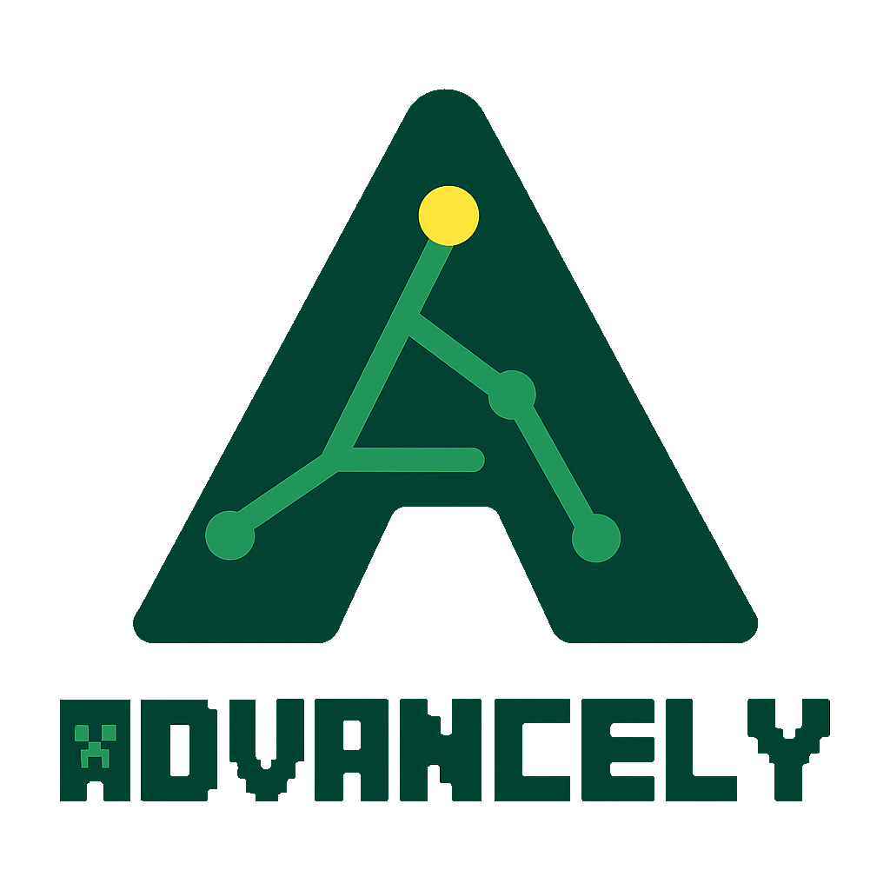
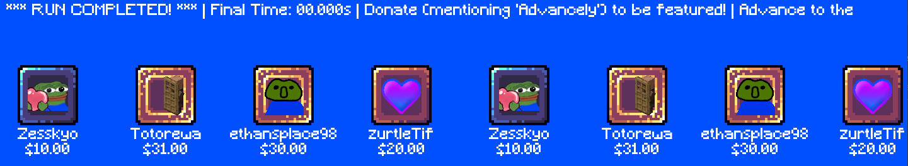
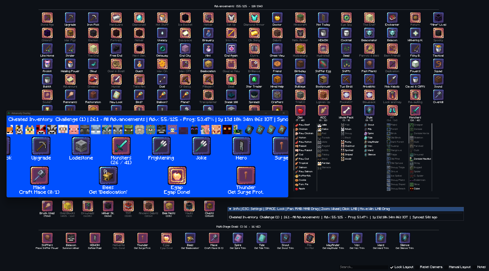
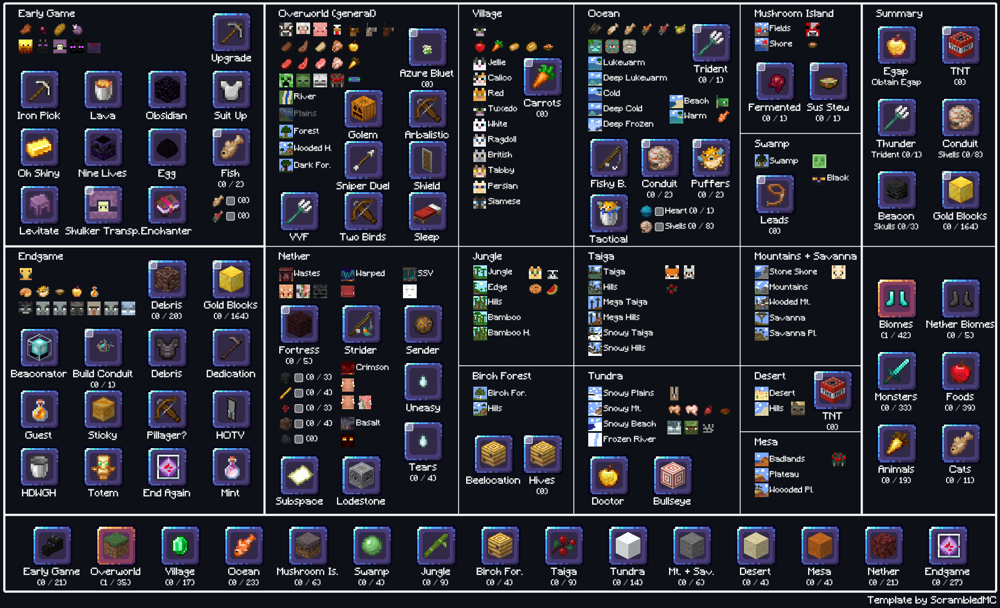
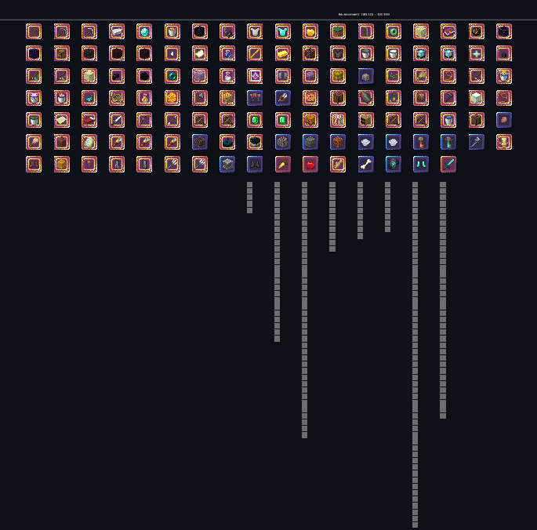
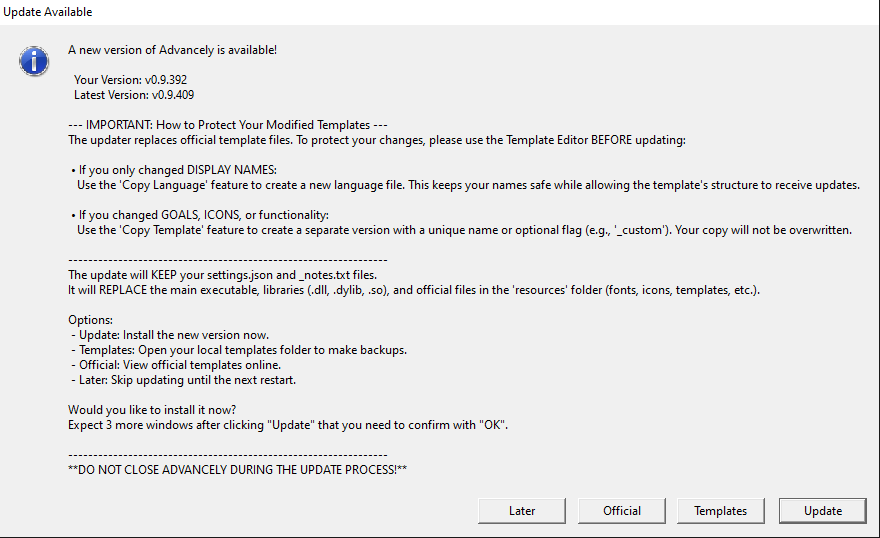
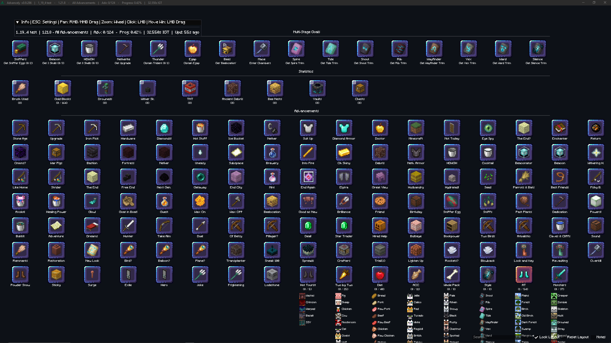
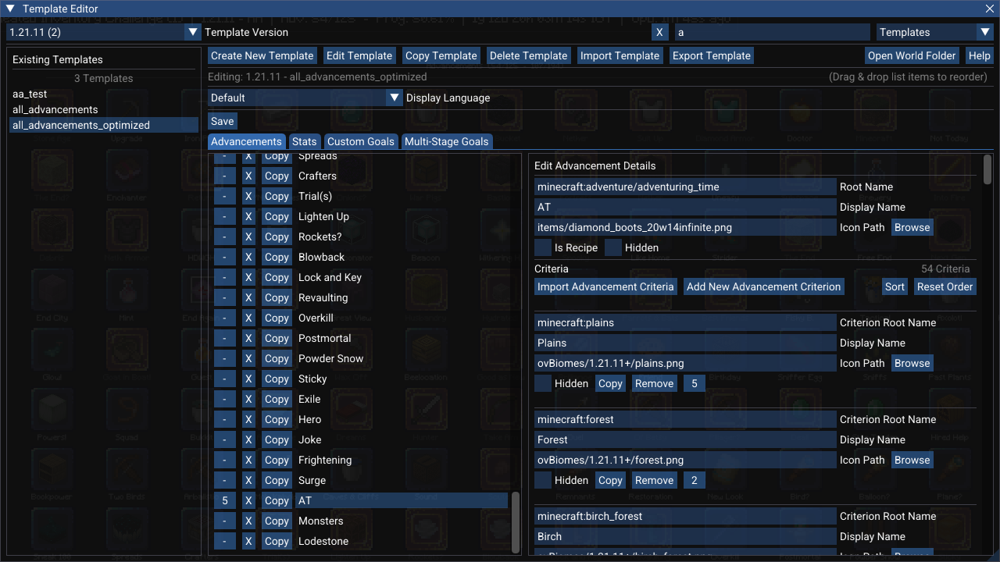
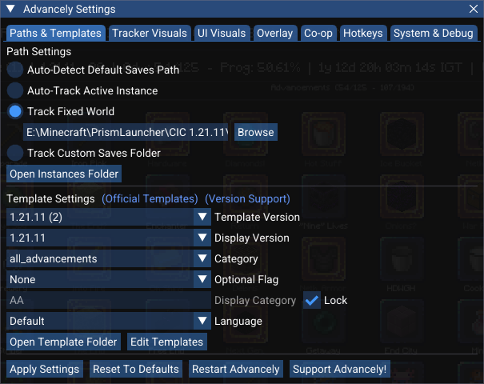

<p align="center">
  
</p>

# [⬇️ **DOWNLOAD ADVANCELY NOW\! (Windows, Linux & macOS)** ⬇️](#getting-started)

***

# A highly customizable and interactive tool to track Minecraft progress beyond just Advancements.

<p align="center">
  
  <br>
  <em>This animation here is compressed. When you use the tracker the framerate will be higher and the resolution perfectly sharp.</em>
</p>

***

## This tracker supports an arbitrary number of advancements, recipes, custom statistics, unlocks, multi-stage goals, manual goals, and custom counters for over 100 Minecraft versions.

## Advancely is fully speedrun legal based on the [Minecraft Speedrunning rules (A.3.10.a, A.11.1)](https://www.minecraftspeedrunning.com/public-resources/rules) by only reading from within the 'advancements', 'stats' and 'unlocks' (25w14craftmine) folders of a world that update when the game saves. With the **[Hermes Mod](https://github.com/DuncanRuns/Hermes)** tracker updates are instant and don't require pausing ([Minecraft Speedrunning rules (A.8.14 and A.8.15)](https://www.minecraftspeedrunning.com/public-resources/rules)).

### Built for flexibility, Advancely supports everything from vanilla speedruns to modded adventures and datapacks through the creation of custom templates with a built-in template editor. It automatically detects changes in your latest singleplayer world, providing real-time progress updates.

<p align="center">
  
</p>

# [Watch the full tutorial video here!](https://www.youtube.com/watch?v=Rxd1RJqg2WQ)

***

## Table of Contents

- [Become a Supporter!](#become-a-supporter)
- [Socials](#socials)
- [What is Advancely?](#what-is-advancely)
- [Core Features](#core-features)
- [Performance & Optimization](#performance--optimization)
- [Getting Started](#getting-started)
- [Download Once, Update Forever](#download-once-update-forever)
- [The Tracker Window](#the-tracker-window)
- [The Stream Overlay](#the-stream-overlay)
- [The Template Editor](#the-template-editor-esc--edit-templates)
- [The Settings Window](#the-settings-window-esc)
- [Co-op Multiplayer](#co-op-multiplayer)
- [Extensive Version Support](#extensive-version-support)
- [Officially Added Templates](#officially-added-templates)
- [Known Limitations](#known-limitations)
- [You have a feature idea?](#you-have-a-feature-idea)
- [Running into Issues?](#running-into-issues)
- [Command Line Arguments](#command-line-arguments)
- [Beta Testers](#beta-testers)
- [Contributors](#contributors)
- [License](#license)
- [Credits](#credits)

***

## Become a Supporter!

> 📺 **Video Guide:** [Jump to Support Section (33:53)](https://youtu.be/Rxd1RJqg2WQ?t=33m53s)

Love using Advancely? You can have your name immortalized in the tracker!

<p align="center">
  
</p>

**Supporters:**

* Totorewa: $31
* ethansplace98: $30
* zurtleTif: $20
* Zesskyo: $10

Simply [**donate here**](https://streamlabs.com/lnxseus/tip) and include the word "**Advancely**" in your donation
message. **With the next release** your name will be added permanently to two places:

- The **Settings window** inside Advancely, visible to every user on every tab
- The **overlay supporter showcase** that appears when anyone completes a run on stream

You'll also get a special role on my [Discord](https://discord.gg/TyNgXDz).

Thank you for supporting the project!

***

## Socials

**Put `#Advancely` in your content to support the project!**

* [Support Advancely (be featured on the overlay by mentioning
  `Advancely` in your donation message)](https://streamlabs.com/lnxseus/tip)
* [(Affiliate Link) Amazon](https://amzn.to/4scdytw)
* [My YouTube](https://www.youtube.com/@lnxs?sub_confirmation=1)
* [My Twitch](https://www.twitch.tv/lnxseus)
* [My Twitch Archive + Advancely Devlogs](https://www.youtube.com/@lnxsarchive/playlists?view=1&sort=lad&flow=grid&sub_confirmation=1)
* [Official Advancely Discord w/ **Unofficial Releases**!](https://discord.gg/TyNgXDz)
* [Tiktok](https://www.tiktok.com/@lnxseus)
* [Instagram](https://www.instagram.com/lnxseus/)
* [X/Twitter](https://x.com/lieinuxxseus)
* [My GitHub](https://github.com/LNXSeus)

***

## What is Advancely?

> 📺 **Video Guide:** [Intro (0:00)](https://youtu.be/Rxd1RJqg2WQ?t=0m00s) • [The Basics (1:50)](https://youtu.be/Rxd1RJqg2WQ?t=1m50s)

<p align="center">
  
  <br>
  <em>This screenshot shows the automatic layout.</em>
</p>

<p align="center">
  
  <br>
  <em>This screenshot shows a fully custom manual layout (<code>1.16</code> <code>all_advancements</code> <code>_categorical</code>) built with the Visual Layout Editor. Templates with a manual layout are marked with <code>(has layout)</code> within the template selection dropdowns. Then you must turn on <code>Manual Layout</code> on the tracker.</em>
</p>

Advancely is a sophisticated, data-driven progress tracker (just like [AATool](https://github.com/DarwinBaker/AATool)) -
that works on Windows, Linux and macOS - designed for Minecraft speedrunners, completionists, and
content creators. Unlike other tools that only track vanilla advancements (e.g., AATool by Darwin Baker), Advancely can
be configured to monitor virtually any goal imaginable. It operates in real-time by watching your singleplayer save
files for changes, meaning your progress is always up-to-date without any manual intervention.

With the `Manual Layout` mode and the built-in `Visual Layout Editor`, you have full control over where every goal,
stat, and decoration appears on the tracker. Drag and drop items directly on the live tracker, select multiple goals at
once, and arrange everything exactly how you want it; no config file editing required.

The tracker's true power lies in its `.json` template system, which allows you to define exactly what you want to track
for any version, mod, or playstyle. A template isn't just a list of advancements; it's a complete ruleset that can
include custom stats, multi-stage goals, manual counters, and more.

### The Advancely Template Editor

You don't need to be a developer to customize Advancely. The built-in **Template Editor** gives you full control to
import, create, copy, and modify any template directly within Advancely.

<details>
<summary><strong>Read more about Editor Features</strong></summary>
<br>

* **Import from Your World:** The fastest way to get started is by importing directly from an existing game save. The
  editor can automatically scan your player data and pull in all advancements/achievements, recipes, statistics, or
  unlocks to build a new template for you.
* **Full Customization:** Edit any goal's name, icon, or properties. Create complex multi-stage goals with several
  sequential steps, or add manual counters with hotkeys for objectives that can't be tracked automatically.
* **Easy Translation:** Every template has separate language files, allowing you to easily edit display names or provide
  translations without altering the core template logic.
* **Share Your Templates:** You can export any template - including all its language files - into a single `.zip` file to
  share with the Advancely community. Likewise, you can import (`.zip`) templates created by others.
* **Manual Layout & Visual Layout Editor:** Position every goal, criterion, and decoration precisely on the tracker map.
  Enable "Manual Layout" in settings, then use the **Visual Layout Editor** in the Template Editor to drag-and-drop
  items directly on the live tracker. Select multiple items at once with a selection rectangle or `Ctrl`/`Cmd`+Click and
  move them together.
* **Decorations:** Add visual elements to your manual layout that aren't tied to game data. **Text Headers** display
  custom text using the tracker font, **Lines** connect or separate areas with configurable thickness and opacity,
  and **Arrows** visually link goals together with customizable arrowheads, bend points, and goal-linked opacity.

This powerful and flexible system makes Advancely the ultimate tool for any Minecraft challenge, from a vanilla "All
Advancements" run to a heavily modded playthrough with hundreds of custom milestones.
</details>

***

## Core Features

<details>
<summary><strong>View All Core Features</strong></summary>
<br>

* **Automatic Instance Tracking** *(default)*: Advancely automatically detects which Minecraft instance you
  are actively playing and tracks it, even if multiple instances are open at once. This is the default
  path detection mode. It works with **Prism Launcher**, **MultiMC**, and similar launchers. Find out
  more [here](#the-settings-window-esc).
* **Fixed World Mode**: Lock the tracker to one specific world folder. Unlike the default mode which always
  follows your most recently played world, Fixed World Mode keeps the tracker focused on a single chosen world
  regardless of which world you open next. Useful for long-form playthroughs, modded runs, or setups where
  you want the tracker to stay on a specific save. Configure it in Settings by selecting **"Fixed World"** and
  browsing to the world folder.
* **Hermes Mod Live Tracking**: When the [Hermes mod](https://github.com/DuncanRuns/Hermes) is installed,
  Advancely can read its encrypted `play.log.enc` in real-time, updating stats and advancements as they happen
  rather than waiting for the game to save. Enable this in Settings under **"Using Hermes Mod (Live Tracking)"**.
  The update timer in the info bar and overlay changes from `Upd:` to `Synced:` when Hermes is active, indicating
  the last full disk sync rather than the last live event. All values self-correct on every normal game save.
  Compatible ultimately with all Fabric versions. Stat and advancement/achievement changes are applied instantly; the
  game files remain the authoritative source of truth.
* **Interactive Map View**: The main tracker window is an interactive map where you can pan by holding `Right-Click` or
  `Middle-Click`, zoom with the `Mouse Wheel`, and lock the layout in place by pressing `SPACE`.
* **Scrollable Lists**: Goals containing large numbers of sub-items (like "All Animals Bred" or complex stats) are
  automatically converted into scrollable lists to save screen space.
* **Comprehensive Real-Time Tracking**: Advancely operates in real-time by watching your singleplayer save files for
  changes. It can monitor a wide range of data types, including:
    * **Advancements & Recipes**: Tracks completion status and individual criteria for any advancement or recipe from
      vanilla, mods, or datapacks.
    * **Statistics**: Monitors any in-game statistic (e.g., blocks mined, distance flown) against a target value.
      Supports nested "sub-stats" under a single category and allows for manual completion overrides via an in-app
      checkbox. Stats and sub-stats can also be auto-completed by linking them to other goals (advancements, unlocks,
      counters, etc.) with an `AND` (all must be completed) or `OR` (at least one) mode.
    * **Unlocks**: Fully tracks the unique "unlocks" progression system of the `25w14craftmine` snapshot.
* **Advanced Goal Types**:
    * **Custom Counters & Manual Goals**: For objectives that can't be automatically tracked (like counting structures
      visited), you can create manual checklist goals or counters with target values. You may link other goals to these
      custom goals with an `AND` (all must be completed) or `OR` (at least one) mode to have them auto-complete. All progress is saved
      automatically into `settings.json`. _Switching templates will thus ERASE the progress of these custom goals._
        * **Hotkeys**: Use configurable hotkeys to increment or decrement your custom counters. Up to 32 hotkeys are
          supported. Hotkeys only work when the tracker window is in focus. Each row in the **Hotkeys** settings tab
          shows the goal name followed by the `Decr.` and `Incr.` slots. Click a slot's button and press any key to
          bind it; press `Escape`, `Backspace`, or `Delete` during capture to clear the binding back to `None`. The
          captured key respects your keyboard layout (e.g. on a German `QWERTZ` keyboard the key labeled `Y` will
          bind correctly even though the underlying scancode is `Z`). For custom goals with a target value of `-1`
          (infinite counters), the increment/decrement hotkeys are automatically blocked once the goal's checkbox is
          manually marked complete; the running counter and the completion checkbox are independent so toggling the
          checkbox no longer resets your progress.
    * **Multi-Stage Goals**: Create long-term objectives that combine several smaller steps. A single goal can require
      you to first complete a stat, then an unlock, then a specific **advancement criterion** (e.g., visiting a specific
      biome), and finally an entire advancement in sequence. You can assign **unique icons to each stage** to visualize
      progression.
    * **Counters**: Track how many of a selected set of goals are completed. Link any combination of advancements,
      criteria, stats, sub-stats, unlocks, custom goals, or multi-stage goal stages to a counter. It displays a main
      icon, a display name, and progress text (e.g., "3/10"). The background texture changes based on progress: default
      at zero, half-done for partial progress, and done when all linked goals are completed. Searching for a counter's
      display name also shows its exact linked goals in the search results.
* **Manual Layout Mode**: Break free from the automatic grid and position every goal exactly where you want it. When
  enabled, each item's position is defined by coordinates stored in the template file. Use the built-in **Visual
  Layout Editor** to drag items directly on the tracker map, or set coordinates numerically in the Template Editor.
  Templates with existing layout data are marked with **(has layout)** in the settings dropdowns so you can easily
  find them. Each position (icon, text, progress) can be individually hidden using per-position `Hide` checkboxes
  in the Template Editor, giving you fine-grained control over what appears on your layout.
* **Decorations**: Add purely visual elements to your manual layout. **Text Headers** render custom text using the
  tracker's font and size, perfect for labeling sections of your map. Text headers can also have **Linked Goals** (any
  combination of goals and counters) so that searching for the header's text keeps all linked items visible, allowing
  you to categorize your search. **Lines** draw between two endpoints with configurable thickness and opacity, using
  the tracker's text color. **Arrows** draw a path from a tail through optional bend points to an arrowhead tip, and
  can be linked to a **Start Goal** and **End Goal** to change opacity based on completion state, ideal for all
  achievement runs, where the completion order matters.
* **Section Completion Counters**: Each section header displays dynamic counters showing completed items versus the
  total visible items for that section, respecting both the current Goal Visibility setting and any active search
  filter.
    * **Format**:
        * Sections with sub-items (Advancements/Recipes with criteria, Statistics with sub-stats, Multi-Stage Goals)
          show counts for both main items and sub-items.
        * Sections without sub-items (Unlocks, Custom Goals, simple Statistics) show counts for main items only.


* **Powerful In-App Template Editor**: You don't need to manually edit files. The built-in editor allows you to create,
  copy, and modify any template. You can instantly build a new template by importing advancements, stats, and unlocks
  directly from your world save. Find more information [here](https://github.com/LNXSeus/Advancely#The-Template-Editor).
* **Customizable Stream Overlay**: An animated overlay is available to show your progress to viewers. You can customize
  its scroll speed, font, colors, FPS, if the 3rd row remains visible and which information is displayed. Find more
  information [here](https://github.com/LNXSeus/Advancely#The-Stream-Overlay).
* **Full Mod & Datapack Support**: The tracker is designed to be data-driven. It correctly parses items, stats, and
  advancements from any mod or data pack (e.g., `conquest:`, `blazeandcave:`) without being limited to the vanilla
  `minecraft:` namespace.
* **Extensive Version Support**: Advancely is built to work with over 100 Minecraft versions, from 1.0 to 1.21.9+ and
  beyond, including all April Fool's snapshots.
* **Automatic Updates**: The tracker automatically checks for new versions on startup and will prompt you to download
  and install them, ensuring you're always up-to-date.

</details>

***

## Performance & Optimization

<p align="center">
  
</p>

Advancely tries to be as lightweight as possible when it comes to system resources despite allowing for 1000+ goals
being displayed at once.

<details>
<summary><strong>View Technical Details (SDL3, ImGui, Culling & LOD)</strong></summary>
<br>

* **Efficient Tech Stack**: The application is built on [**SDL3**](https://github.com/libsdl-org/SDL), a
  high-performance, low-level media library.
    * **Tracker Window**: Utilizes **Dear ImGui** for a responsive, interactive, and highly customizable interface.
    * **Stream Overlay**: Bypasses UI libraries entirely to use **raw SDL3 hardware acceleration**. This ensures
      perfectly smooth 60fps+ animations with virtually zero overhead.
* **Virtual Scrollable Lists**: Templates with thousands of criteria (e.g. "All Items") are automatically converted into
  virtualized scrollable lists. This keeps the layout compact and ensures rendering remains performant regardless of
  list size.
* **Smart Culling**: The tracker features a robust culling system. It only processes and renders items that are
  currently visible within the window. You can have a template with thousands of goals, but if you are zoomed in on just
  ten of them, only those ten are drawn.
* **Level of Detail (LOD)**: To maintain clarity and performance when viewing the entire map:
    * **Text Hiding**: As you zoom out, sub-text (progress) and then main titles fade away to declutter the screen.
    * **Icon Simplification**: At the furthest zoom levels, complex item icons are replaced by simple, colored squares.
    * *Note: These thresholds are fully customizable in
      the [Settings](https://github.com/LNXSeus/Advancely#the-settings-window-esc) window.*

</details>

***

## Getting Started

> 📺 **Video Guide:** [How to Download (1:23)](https://youtu.be/Rxd1RJqg2WQ?t=1m23s)

### 1. Downloading the Correct Version

Go to the [**releases page**](https://github.com/LNXSeus/Advancely/releases) and download the `.zip` file that matches
your operating system. The `vX.X.X` is the Advancely version, that is also displayed in the title of the main window.

* **Windows:** `Advancely-vX.X.X-Windows.zip`
* **Linux (Portable):** `Advancely-vX.X.X-Linux.zip` — The standalone executable (no installation required).
* **Linux (Debian/Ubuntu):** `advancely-vX.X.X-Linux.deb` — The native installer for Ubuntu 25+ (or systems with SDL3
  installed).
* **Linux (Fedora/RHEL):** `advancely-vX.X.X-Linux.rpm` — The native installer for Fedora/RedHat systems.
* **macOS:** `Advancely-vX.X.X-macOS-Universal.zip` — For both Intel (down to macOS 13 Ventura) and Silicon Macs.

### 2. Installation & First-Time Run

#### For supported Linux distros

* **Arch Linux (AUR):**

Three packages are available on the AUR — pick whichever suits you:

| Package                                                           | Description                                                  |
|-------------------------------------------------------------------|--------------------------------------------------------------|
| [advancely](https://aur.archlinux.org/packages/advancely)         | Compiles from the latest release                             |
| [advancely-bin](https://aur.archlinux.org/packages/advancely-bin) | Precompiled binary from the latest release (fastest install) |
| [advancely-git](https://aur.archlinux.org/packages/advancely-git) | Compiles from the latest commit _(might be outdated)_        |

Use your favorite AUR helper, e.g.:

  ```
  paru -S advancely-bin
  ```

_Massive thanks to [R0dn3yS](https://github.com/R0dn3yS) for the AUR packages!_

* **NixOS:**

Advancely is available via [mcsr-nixos](https://git.uku3lig.net/uku/mcsr-nixos), a collection of NixOS packages for Minecraft speedrunning.

Add the following to your `flake.nix` inputs:
```nix
  inputs.mcsr-nixos = {
    url = "https://git.uku3lig.net/uku/mcsr-nixos/archive/main.tar.gz";
    inputs.nixpkgs.follows = "nixpkgs";
  };
```

Then add it to your system configuration:
```nix
  { pkgs, mcsr-nixos, ... }:
  let
    mcsrPkgs = mcsr-nixos.packages.${pkgs.stdenv.hostPlatform.system};
  in
  {
    environment.systemPackages = [
      mcsrPkgs.advancely
    ];
  }
```

_Massive thanks to [uku3lig](https://git.uku3lig.net/uku) for the NixOS package!_

#### For all other installations

To ensure the application works correctly, please follow the instructions for your operating system.

<details>
<summary><strong>🍎 macOS Instructions</strong></summary>
<br>

Due to macOS security (Gatekeeper), you cannot run the app directly from the Downloads folder.

> **⚠️ CRITICAL: Fix for "App Translocation" / Permission Errors**
>
> If you try to run Advancely directly from your **Downloads** folder, macOS will isolate it in a read-only temporary
> location (App Translocation).
>
> **You MUST move the app to fix this:**
> 1. Drag `Advancely.app` AND the `resources` folder from Downloads to your **Applications** folder or **Desktop**.
> 2. Run it from the new location.

**Authorizing the App (First Run):**

✔️ **Method 1: Terminal Authorization**
If you still encounter issues, you can strip the quarantine tags manually:

1. Open the **Terminal** app.
2. Type `xattr -cr ` (note the space at the end).
3. Drag the `Advancely.app` file from Finder onto the Terminal window.
4. Press **Enter**.

✔️ **Method 2: The Right-Click Trick**

1. After moving the app to your Applications folder or Desktop...
2. **Right-click** (or Control-click) `Advancely.app` and select **Open** from the menu.
3. A warning will appear. Click **Open**. macOS will now remember that you trust this application.

✔️ **Method 3: System Settings (If Method 1 and 2 fail)**
If the app still refuses to open:

1. Open **System Settings** -> **Privacy & Security**.
2. Scroll down to the **Security** section.
3. Look for a message stating "Advancely was blocked...".
4. Click **Open Anyway** and confirm with your password.

</details>

<details>
<summary><strong>🪟 Windows & 🐧 Linux Instructions</strong></summary>
<br>

Your application folder contains the main executable, required library files, and the `resources` folder. The executable
must always stay in the same folder as its supporting files.

✔️ **Correct Way to Run:**

* To run Advancely from another location like your Desktop, please create a shortcut to the main executable.
    * **Windows:** Right-click `Advancely.exe` → "Create shortcut".
    * **Linux:** Right-click the `Advancely` file → "Create Link".
* You can then move this new shortcut or link anywhere you like.
* **Do not** move or copy the original executable file by itself, as it will fail to start or find its resources.

</details>

### 3. Your First Launch

Launch Advancely by running the executable (or the shortcut you created). On its first run, it will default to finding
your most recently played world from the standard Minecraft installation. To begin customizing, press the `ESC` key to
open the settings window, where you can switch to `Auto-Track Active Instance` if you use Prism Launcher, MultiMC or
some other custom launcher.

***

## Download Once, Update Forever

> 📺 **Video Guide:** [Auto-Updates Explained (33:01)](https://youtu.be/Rxd1RJqg2WQ?t=33m01s)

Advancely is designed to be easy to maintain. By default, **the tracker will automatically check for new versions on
startup**. When an update is available, you will be notified with a prompt offering to download and install it for you.
This process is designed to be as safe as possible for your custom files.

<p align="center">
  
</p>

<details>
<summary><strong>How the Automatic Update Works</strong></summary>
<br>

The updater is smart about which files it replaces to ensure your personal configurations are preserved.

* ✅ **Files that are SAFE and WILL NOT be replaced:**
    * Your main `settings.json` file.
    * Your `_notes.txt` files for each template.
    * Any custom templates or user-created files in the `resources` folder.

* ⚠️ **Files that WILL BE REPLACED:**
    * The main application executable (`Advancely.exe`, `Advancely.app`, etc.).
    * Core library files (`.dll`, `.so`).
    * Official templates, fonts, icons, reference_files, and GUI assets included with the release.

### Protecting Your Modified Official Templates

To prevent losing your work during an automatic update, it's highly recommended to **avoid editing official template
files directly**. Instead, use the **Template Editor** to create your own safe-to-edit versions. The correct method
depends on the types of changes you want to make.

**If you only want to change display names:**

The best approach is to create a new **language file** for the official template. This keeps your custom names separate
while still allowing the underlying template structure (the goals, criteria, icons, etc.) to receive official updates.

1. Open the **Template Editor** and select the official template you wish to customize.
2. In the "Languages" section, select the "Default" language and click **Copy Language**.
3. Give your new language a unique flag (e.g., `custom` or `mypack`).
4. You can now select your custom language in the main settings, and your display names will be safe from updates.

**If you have changed goals, criteria, or icons (core functionality):**

The best approach is to create a complete **copy of the template**. This makes your version fully independent and
protects it from being overwritten.

1. Open the **Template Editor** and select the official template you want to use as a base.
2. Click the **Copy Template** button.
3. Give your new version a unique name, typically by adding an **Optional Flag** (e.g., `_custom`).
4. You can now safely edit your new, independent template in any way you wish.

Your custom template will appear separately in the template list and will not be touched by the auto-updater.
</details>

***

## The Tracker Window

> 📺 **Video Guide:** [Main Tracker Overview (18:23)](https://youtu.be/Rxd1RJqg2WQ?t=18m23s) • [Controls & Navigation (6:22)](https://youtu.be/Rxd1RJqg2WQ?t=6m22s)

<p align="center">
  
</p>

The main window is an interactive canvas where all your tracked goals are displayed. You can freely zoom in and out to
rearrange the items in view to suit your needs, making it easy to focus on what matters most for your current run. The
order of the sections (advancements, recipes, multi-stage goals, ...) can be configured in
the [settings window](#the-settings-window-esc).

<details>
<summary><strong>Controls & Features (Pan, Zoom, Search, Notes)</strong></summary>
<br>

### Navigating the Map

You can manipulate the view using several intuitive controls:

* **Pan**: Hold `Right-Click` or `Middle-Click` and drag to move the entire map of goals.
* **Zoom**: Use the `Mouse Wheel` to zoom in and out, allowing you to see an overview or focus on specific details.
* **Scroll Lists**: When hovering over a goal with many sub-items, the `Mouse Wheel` will scroll the list contents
  instead of zooming the map. You can also left-click and drag the scrollbar.
* **Lock Layout**: Press the `SPACE` key to lock the grid layout. This prevents goals from rearranging when you resize
  the window, giving you precise control over how many items appear in each row.
* **Reset Camera**: Click the `Reset Camera` button in the bottom-right corner to instantly reset the pan and zoom to
  their default positions.

### Searching & Filtering

To quickly find a specific goal, press `Ctrl+F` (or `Cmd+F` on macOS) to focus the search box in the bottom-right
corner. The filter is case-insensitive and intelligently searches across different goal types. Using the search filter
also dynamically updates the completion counters in the section headers.

* **Advancements, Recipes & Statistics**: Shows a category if its main title or any of its sub-criteria/sub-stats match
  the search term. If only a sub-item matches, it will be the only one shown under its parent.
* **Unlocks & Custom Goals**: Shows the goal if its name matches the search term.
* **Multi-Stage Goals**: Shows the goal if its main title or the text of its *currently active stage* matches the search
  term.
* **Counters**: Shows the counter if its name matches. Additionally, all goals linked to a matching counter are shown
  as exact matches; linking to an advancement shows only the advancement itself (not its criteria), and linking to a
  specific criterion shows only that criterion under its parent.
* **Text Headers**: Searching for a text header's display text shows all goals and counters directly linked to that
  header. Like counters, this uses exact matching and is one layer deep so a linked counter will show up, but the
  counter's own linked goals will not.

### Section Completion Counters

Each section header (e.g., "Advancements", "Statistics") now displays dynamic counters reflecting the completion status
based on the currently visible items. These counters respect both the "Goal Visibility" setting and any active search
filter.

**Format:**

* Sections with sub-items (Advancements/Recipes with criteria, Statistics with sub-stats, Multi-Stage Goals) show:
  `(Completed Main / Total Main - Completed Sub / Total Sub)`
* Sections without sub-items (Unlocks, Custom Goals, Counters, simple Statistics) show: `(Completed Main / Total Main)`

**How Goal Visibility Affects Counters:**

* **Hide All Completed**: Since only incomplete items are shown, the counters display only the **total number of
  remaining
  items** (e.g., `(Remaining Main - Remaining Sub)` or `(Remaining Main)`).
* **Hide Template-Hidden Only**: Counts show **completed vs. total** for all items not marked as hidden in the
  template (
  e.g., `(Completed Main / Total Main)`).
* **Show All**: Counts show completed vs. total for every single item defined in the template for that section,
  including hidden ones (e.g., `(Completed Main / Total Main)`).

**Hiding in Manual Layout vs. Automatic Layout:**

Advancely has two separate hiding systems that target different layout modes:

* **`Hidden` checkbox** (per goal, in the Template Editor): Controls visibility on the **automatic layout** and the
  **stream overlay**. This checkbox is completely ignored when using the manual layout.
* **Per-position `Hide` checkboxes** (per icon/text/progress position, in the Template Editor): Controls visibility
  on the **manual layout** only. Each position (icon, text, progress) can be hidden independently. These checkboxes
  only take effect in `Hide All Completed` and `Hide Template-Hidden Only` modes; `Show All` ignores them.

In `Hide All Completed` mode, completed goals fully disappear from the manual layout. In `Hide Template-Hidden Only`
mode, completed goals are greyed out but remain visible.

### The Player Dropdown (Co-op)

When a co-op lobby is active (either as Host or Receiver), the tracker shows a **Player Dropdown** with entries for
`All Players` and every individual player in the roster. Switching to an individual player shows that player's raw
progress (as if you were looking at their singleplayer tracker), and edits to checkboxes/custom goals in that view
only affect that player. The `All Players` view applies the configured merge rules instead. The `RUN COMPLETED!`
banner and frozen timer are tracked per view. See [The Player Dropdown](#the-player-dropdown) for the full
behavior.

### The Info Bar

A transparent info bar at the top of the window provides a live summary of your run. It includes:

* **World**: The name of the world currently being tracked.
* **Run Details**: The Minecraft version, template category, and optional flag you have selected.
* **Progress**: The main advancement/achievement counter and the overall completion percentage, which includes every
  single sub-task from all categories (recipes, criteria, stats, etc.).
* **IGT**: The total in-game time for the current world, read directly from the stats file.
* **Update Timer**: A timer showing how long it has been since the game last saved its files.

### The Notes Window

A powerful notes editor can be toggled via the "Notes" button in the bottom-right corner. All text is saved instantly as
you type. The notes system has two distinct modes, which can be changed from within the notes window:

* **Per-World Mode (Default)**: Notes are saved for each world individually. This is perfect for keeping track of
  world-specific information like coordinates or To-Do lists. The tracker automatically remembers the notes for your
  last 32 played worlds.
* **Per-Template Mode**: Notes are tied directly to the loaded template. This is useful for storing general strategies
  or information that applies to every run using that specific template.

The notes window also supports live-reloading (if you edit the `.txt` file externally, the window updates instantly) and
allows you to switch to the UI font for improved readability.
</details>

***

## The Stream Overlay

> 📺 **Video Guide:** [Overlay Setup & Customization (18:45)](https://youtu.be/Rxd1RJqg2WQ?t=18m45s) • [Overlay Progress (14:10)](https://youtu.be/Rxd1RJqg2WQ?t=14m10s)

<p align="center">
  
  <br>
  <em>This animation here is compressed. When you use the overlay the framerate will be higher and the resolution perfectly sharp.</em>
</p>

Advancely includes a dedicated, customizable window perfect for showing your progress to viewers. It's an animated,
real-time display that you can easily add to your stream layout.

<details>
<summary><strong>Setup in OBS & Customization Guide</strong></summary>
<br>

### Setup in OBS (or other streaming software)

1. **Enable the Overlay**: In Advancely's settings (`ESC`), check the `Enable Overlay` box and click `Apply Settings` or
   hit `ENTER`. A new `Advancely Overlay` window will appear.
2. **Add a Source**: In your streaming software (like OBS), add a new `Game Capture` source on Windows or Linux and a
   `Window Capture` source on macOS.
3. **Select the Window**: Choose the `[Advancely.exe]: Advancely Overlay` window from the list.
4. **Add a Color Key Filter**: Right-click the new source, go to "Filters", and add a "Color Key" filter.
5. **Set the Color**: Use the color picker to select the overlay's background color. You can copy the exact HEX code
   from the Advancely's `Overlay Background Color` setting to ensure a perfect match.
6. **Adjust Settings**: For a clean, transparent background, it's recommended to set the **Similarity** to `1` and *
   *Smoothness** to around `210`.

> **Important for Streamers:** Applying any changes in Advancely's settings will restart the overlay window. You may
> need to re-select the window in your capture source properties afterward.

### Overlay Layout Explained

The overlay is organized into three horizontally scrolling rows, each dedicated to different types of goals:

* **Row 1 (Top)**: This row displays the icons of the smallest sub-tasks. It shows the individual criteria for
  advancements/recipes and the sub-stats for complex stat goals.
* **Row 2 (Middle)**: This row shows the main parent goals, such as primary advancements, recipes, and unlocks. **It can
  also include Stats, Custom Goals, Multi-Stage Goals, and Counters if forced via the Template Editor.** Items in this
  row always hide when completed.
* **Row 3 (Bottom)**: This row is the standard location for all other goal types, including statistics, custom goals,
  multi-stage goals, and counters. **It can also include Advancements, Recipes, and Unlocks if forced via the Template
  Editor's `Row 3` checkbox.**

### Customization

Nearly every aspect of the overlay can be tailored to your liking from the settings window:

* **Speed & Direction**: Adjust the `Overlay Scroll Speed`. A positive value scrolls left-to-right, while a negative
  value scrolls right-to-left. A value of 0 makes the items static.
* **Animation**: Set the `Overlay FPS Limit` and toggle the `Speed Up Animation` option. You can also temporarily speed
  up the animation by holding `SPACE` while the overlay window is focused.
* **Stat Cycling**: For multi-stat goals, you can set the `Sub-Stat Cycle Interval` to control how frequently the
  overlay cycles through displaying each sub-stat. **Note:** Sub-stats marked as "Hidden" in the template will be
  skipped during this cycle.
* **Visibility**: Choose whether to hide completed goals from Row 3 (items in Row 1 & 2 always hide unless forced to
  Row 3), and toggle the visibility of each section of the
  top info bar (`World`, `Run Details`, `Progress`, `IGT`, `Update Timer`).
* **Segment Separator**: Configure the character drawn between segments anywhere a separator is shown (the overlay's
  top bar, the tracker info bar, the tracker info window's title bar, and the OS window title). Defaults to `|`.
  Replace it (up to 8 characters) with whatever your tracker/overlay font supports if the pipe glyph is missing.
* **Alignment**: The main progress text at the top of the overlay can be aligned to the `Left`, `Center`, or `Right`.
* **Spacing**: You can fully adjust the `spacing` between each row to either be dynamic based on the longest text width
  within that row or be fully fixed. When two items within the first row share the same texture (based on hashing) their
  parent icon will be overlaid to distinguish them further. The `size` of this overlaid icon can also be configured.

</details>

***

## The Template Editor (`ESC` ▶ Edit Templates)

<details>
<summary>📺 <strong>Video Guide: Template Editor Chapters (Click to View)</strong></summary>

* [**6. Template Editor Overview** (19:58)](https://youtu.be/Rxd1RJqg2WQ?t=19m58s)
* [6.1 Interface](https://youtu.be/Rxd1RJqg2WQ?t=20m14s)
* [6.2 Creating Templates](https://youtu.be/Rxd1RJqg2WQ?t=20m56s)
    * [6.2.1 New Template](https://youtu.be/Rxd1RJqg2WQ?t=21m06s)
    * [6.2.2 Advancements](https://youtu.be/Rxd1RJqg2WQ?t=21m51s)
    * [6.2.3 Stats](https://youtu.be/Rxd1RJqg2WQ?t=25m22s)
    * [6.2.4 Custom Goals](https://youtu.be/Rxd1RJqg2WQ?t=27m03s)
    * [6.2.5 Multi-Stage Goals](https://youtu.be/Rxd1RJqg2WQ?t=27m45s)
    * [6.2.6 Unlocks](https://youtu.be/Rxd1RJqg2WQ?t=28m56s)
* [6.3 Buttons](https://youtu.be/Rxd1RJqg2WQ?t=29m05s)
    * [6.3.1 Sorting Badges](https://youtu.be/lKDQGEbx20M?t=19m53s)
* [6.4 Languages](https://youtu.be/Rxd1RJqg2WQ?t=29m53s)
* [6.5 Search Bar](https://youtu.be/Rxd1RJqg2WQ?t=30m46s)
* [6.6 Legacy Versions](https://youtu.be/Rxd1RJqg2WQ?t=31m23s)
* [6.7 Testing](https://youtu.be/Rxd1RJqg2WQ?t=32m42s)
* [**7. Manual Layout & Visual Layout Editor**](https://youtu.be/lJtLpCAGrFc)

</details>

This is the heart of Advancely's customization. The in-app editor gives you complete control to define, modify, and
share the rulesets or `templates` that the tracker uses. You can access it by opening the settings (`ESC`) and clicking
the `Edit Templates` button.

<p align="center">
  
</p>

<details>
<summary><strong>Detailed Editor Usage</strong></summary>

### Template Management

From the main editor view, you can manage entire template packages:

* **Create New Template**: Builds a new, empty template from scratch for the selected version. You provide a unique
  `Category Name` and an `Optional Flag`.
* **Copy Template**: Duplicates an existing template, including all its language files. This is the perfect starting
  point for creating a variation of a complex template.
* **Delete Template**: Permanently removes a template and all of its associated language **and notes files**.
* **Import Template**: Imports a full template package from a `.zip` file. You can confirm or change the version,
  category, and flag before the files are added. If the zip contains bundled icon files, an **Import bundled icon
  files** checkbox will appear and enabling it extracts those icons directly into your `resources/icons/` folder so
  they resolve automatically with no further setup required (icons get put into the same folder structure as the template).
* **Export Template**: Packages the selected template and all its language files into a single `.zip` file, perfect for
  sharing with others on the [Official Advancely Discord](https://discord.gg/TyNgXDz). Clicking the button opens a
  small confirmation popup where you can optionally enable **Bundle icon files** before confirming and this copies all
  icon files referenced by the template into an `icons/` folder inside the zip. This is strictly a **copy** operation and
  your local `resources/icons/` folder is never modified or deleted. Recommended whenever your template uses custom
  icons not included with a standard Advancely install, so recipients get everything they need in a single file.

### Language File Management

Each template can have multiple language files for localization. The editor allows you to manage these for any selected
template:

* **Create Language**: Creates a new, blank language file. Display names will initially default to their internal root
  names.
* **Copy Language**: Duplicates an existing language file to a new one, preserving all translations.
* **Delete Language**: Removes a specific language file (you cannot delete the default `_lang.json`).
* **Import/Export Language**: Import a single `.json` language file from an external source or open the folder
  containing the selected language file to export it.

### Editing a Template

Opening a template reveals a tabbed interface where you can define every goal.

> **Important**: For GIFs to work correctly, they must be unoptimized with all frame data intact. You can prepare any
> GIF by uploading it to [**ezgif.com/maker**](https://ezgif.com/maker), selecting the **"Don't Stack Frames"** option,
> and exporting the result.

* **Sorting & Reordering**: You can easily rearrange any goals, categories, criteria, or stages. Click the small badge next to an item to assign it a sequential sort order. Once you've numbered the items you want to move, click the **Sort** button to instantly reorder them, or use **Reset Order** to clear your selections. Combine the search feature with the badge sorting for efficient template creation!
* **Visibility Controls**: Each goal has a `Hidden` checkbox that controls visibility on the **automatic layout** and
  the **stream overlay**. Separately, when a goal has manual positions set (for use with Manual Layout mode), each
  position (icon, text, progress) gains its own `Hide` checkbox that controls visibility on the **manual layout**
  only. This lets you, for example, hide a goal's progress text in the manual layout while still showing it on the
  overlay.
* **Advancements & Recipes**: List all achievements or advancements you want to track. Each entry has a `Root Name` (the
  in-game ID, e.g., `minecraft:story/mine_stone`), a `Display Name`, and an `Icon Path`. You can also import or add
  `Criteria` to track sub-tasks, and a checkbox designates an entry as a `Recipe` to sort it into its own section and
  move it to the percentage progress calculation instead.
    * **Row 3 Toggle**: You can check the `Row 3` box to force an advancement or recipe to appear in the bottom row of
      the overlay instead of the middle row.
* **Statistics**: Track any in-game statistic.
    * **Simple Stats**: A single goal with a `Target` value (e.g., track "Blocks Mined" until a goal of 10,000 is
      reached).
    * **Multi-Stat Categories**: Group related stats under one parent icon. Each `Sub-Stat` has its own name, icon, and
      target, and will cycle on the stream overlay.
    * **Auto-Complete via Linked Goals**: Both stat categories and individual sub-stats support automatic completion
      through linked goals. Use the `Select Goals` button to pick any combination of advancements, criteria, stats,
      sub-stats, unlocks, custom goals, or multi-stage goal stages. Choose between `AND` mode (all selected goals must
      be completed) or `OR` mode (at least one selected goal must be completed) using the dropdown next to the goal
      list. When the condition is met, the stat is automatically marked as done — in addition to natural progress-based
      completion and manual checkbox overrides.
    * **Row 2 Toggle**: You can check the "Row 2" box to force a stat category to appear in the middle row of the
      overlay instead of the bottom row.
* **Unlocks**: For the `25w14craftmine` snapshot, this tab allows you to track the completion of player unlocks like
  `minecraft:exploration`.
    * **Row 3 Toggle**: You can check the `Row 3` box to force an unlock to appear in the bottom row of the overlay
      instead of the middle row.
* **Custom Goals**: Create goals for things that can't be automatically tracked (you may add linked goals similar to stats). The "Target Goal" value
  defines its behavior:
    * `0`: A simple on/off toggle (manual checklist item).
    * `>0`: A progress-based counter that completes when the target is reached.
    * `-1`: An infinite counter with no completion state.
    * **Row 2 Toggle**: You can check the "Row 2" box to force a custom goal to appear in the middle row of the overlay.
* **Multi-Stage Goals**: Design complex, sequential objectives. Each goal has a parent name and icon, and a list of
  `Stages`. You can toggle **Per-Stage Icons** to assign a specific image to every individual step. Each stage is a
  smaller goal that must be completed in order. A stage's `Type` determines its trigger:
    * **Stat/Achievement**: Triggers when a specific stat reaches its target or an achievement is earned (read from the
      `stats` folder).
    * **Advancement**: Triggers when a specific advancement or recipe is earned (read from the `advancements` folder).
    * **Criterion**: Triggers when a specific *sub-criterion* of a parent advancement is met (e.g., visiting a single
      biome for "Adventuring Time").
    * **Unlock**: Triggers when a specific player unlock is obtained (read from the `unlocks` folder).
    * **Final**: The mandatory last stage that completes the entire multi-stage goal.
    * **Row 2 Toggle**: You can check the "Row 2" box to force a multi-stage goal to appear in the middle row of the
      overlay.
* **Counters**: Track how many goals from a selected set are completed. Each counter has a `Root Name`, `Display Name`,
  and `Icon Path`. Use the **Select Goals** button to open a multi-select popup where you can pick any combination of
  advancements, criteria, stats, sub-stats, unlocks, custom goals, or multi-stage goal stages. Hold **Shift** and click
  to select a range. The counter displays progress as "(completed / total)" and uses the default, half-done, and done
  background textures based on progress. Only full completion (all linked goals done) contributes to the overall progress
  percentage.
    * **Row 2 Toggle**: You can check the "Row 2" box to force a counter to appear in the middle row of the overlay.

### Decorations Tab

The **Decorations** tab in the Template Editor allows you to add visual elements to your manual layout that are not
tied to any game data. These elements are only visible when "Manual Layout" mode is enabled.

* **Text Headers**: Display custom text on the tracker map using the main tracker font and font size. Useful for
  labeling different sections or areas of your layout. Each text header has a position that can be set numerically
  or dragged in the Visual Layout Editor.
* **Lines**: Draw a line between two endpoints on the map. Lines use the tracker's text color and have configurable
  **Thickness** and **Opacity** sliders. Each endpoint can be dragged independently in the Visual Layout Editor, or
  you can drag the line's midpoint marker to move the entire line at once.
* **Arrows**: Draw a directional path from a **Tail** to an arrowhead **Tip**, optionally passing through up to 16
  **Bend** points. Arrows use the tracker's text color and have configurable **Thickness** and **Arrowhead Size**.
  All points (tail, bends, tip) can be dragged independently in the Visual Layout Editor, or use the midpoint marker
  to move the entire arrow at once. Arrows support **Goal Linking**:
    * **Start Goal**: Select any goal, sub-goal, or multi-stage goal stage from the template. Before this goal is
      completed the arrow renders at its **Opacity Before** value (default: faded). Once completed, the arrow
      transitions to **Opacity After** (default: fully opaque).
    * **End Goal**: When this goal is completed and the Goal Visibility setting is set to "Remove Completed Goals",
      the arrow is hidden entirely.
    * Use the **Select Goal** popup (with search via `Ctrl+F` / `Cmd+F`) to pick goals from any tab in the template.

### Visual Layout Editor

The **Visual Layout Editor** is the fastest way to build a manual layout. It lets you drag-and-drop items directly on
the live tracker map instead of typing coordinates by hand.

* **Activation**: Click the **"Visual Layout Editor"** button in the top-right corner of the Template Editor. The
  button is only available when the template you are editing is also the one currently applied in Settings. Activating
  the editor automatically enables "Manual Layout" mode, sets "Goal Visibility" to "Show All", and auto-saves any
  pending template changes.
* **Dragging**: Left-click and drag any goal icon, text label, progress text, decoration, or criterion to reposition
  it. A crosshair appears at the item's anchor point while dragging, and a tooltip shows the current coordinates.
* **Multi-Select**: Click and drag on empty space to draw a **selection rectangle**. All items whose center falls
  inside the rectangle are selected and highlighted. You can then drag any selected item to move the entire group
  together. Hold `Ctrl` (`Cmd` on macOS) and click individual items to add or remove them from the selection without
  clearing it. `Ctrl`+drag on empty space draws a selection rectangle that adds to the existing selection. Click on
  empty space without `Ctrl` to deselect.
* **Saving**: Changes made in the Visual Layout Editor are synced back to the Template Editor in real-time. Click
  **"Stop Visual Editing"** when finished, then click **"Save"** in the Template Editor to persist your layout to
  disk.
* **Restrictions**: While the Visual Layout Editor is active, applying settings and switching templates are disabled
  to prevent reloads. Custom Goal Hotkeys are also disabled.

### Importing from Game Files

To save you from manually typing hundreds of root names, nearly every editor tab has an **"Import..."** button. This
powerful feature allows you to:

1. Click the button (e.g., "Import Advancements").
2. Select a player data file (`.json` or `.dat`) from one of your world saves.
3. A popup will appear with a searchable list of every single advancement, stat, or unlock present in that file.
4. Simply check the boxes for the items you want to add to your template and confirm. They will be instantly added,
   ready for you to assign icons and display names.

### The Help Button

If you need help finding the correct root name for an item or want to see examples, click the "Help" button in the
editor. This will open the `resources/reference_files` folder, which contains guides, examples, and version-specific
lists of game data to assist you in building the perfect template.
</details>

***

## The Settings Window (`ESC`)

<details>
<summary>📺 <strong>Video Guide: Settings Chapters (Click to View)</strong></summary>

* [**3. Settings Overview** (7:36)](https://youtu.be/Rxd1RJqg2WQ?t=7m36s)
* [3.1 Paths](https://youtu.be/Rxd1RJqg2WQ?t=8m21s) | [3.2 Templates](https://youtu.be/Rxd1RJqg2WQ?t=8m29s) | [3.3 General](https://youtu.be/Rxd1RJqg2WQ?t=12m03s)
* [3.4 Goal Visibility](https://youtu.be/Rxd1RJqg2WQ?t=13m48s) | [3.5 Overlay Progress](https://youtu.be/Rxd1RJqg2WQ?t=14m10s)
* [3.6 Visuals](https://youtu.be/Rxd1RJqg2WQ?t=14m27s) | [3.7 Colors](https://youtu.be/Rxd1RJqg2WQ?t=14m33s) | [3.8 Textures](https://youtu.be/Rxd1RJqg2WQ?t=15m10s)
* [3.9 Fonts](https://youtu.be/Rxd1RJqg2WQ?t=15m18s) | [3.10 Level of Detail](https://youtu.be/Rxd1RJqg2WQ?t=15m53s)
* [3.11 List Behavior](https://youtu.be/Rxd1RJqg2WQ?t=16m20s) | [3.12 Tracker Spacing](https://youtu.be/Rxd1RJqg2WQ?t=16m36s)
* [3.13 Overlay Spacing](https://youtu.be/Rxd1RJqg2WQ?t=16m57s) | [3.14 Section Order](https://youtu.be/Rxd1RJqg2WQ?t=17m25s)
* [3.15 Debugging](https://youtu.be/Rxd1RJqg2WQ?t=17m32s) | [3.16 Hotkeys](https://youtu.be/Rxd1RJqg2WQ?t=18m16s)

</details>

The true power of Advancely lies in its deep customization. Every feature can be configured in real-time from the
settings window, which can be opened at any time by pressing the `ESC` key. The settings window is divided into 7 tabs.

_All the settings are then saved to `resources/config/settings.json`, meaning you can easily back up the `settings.json`
file as it requires that exact naming, but make sure Advancely IS CLOSED while renaming the `settings.json` file. The
settings file also saves the status on manual overrides of stats and custom goals, which get erased when switching
templates._

<p align="center">
  
</p>

<details>
<summary><strong>View Full Settings List</strong></summary>
<br>

| Tab & Setting Group       | Options & Features                                                                                                                                                                                                                                                                                                                                                                                                                                                                                                                                                                                                                                                                                                                                                                                                                   |
|:--------------------------|:-------------------------------------------------------------------------------------------------------------------------------------------------------------------------------------------------------------------------------------------------------------------------------------------------------------------------------------------------------------------------------------------------------------------------------------------------------------------------------------------------------------------------------------------------------------------------------------------------------------------------------------------------------------------------------------------------------------------------------------------------------------------------------------------------------------------------------------|
| **Paths & Templates**     |                                                                                                                                                                                                                                                                                                                                                                                                                                                                                                                                                                                                                                                                                                                                                                                                                                      |
| Path Settings             | Choose how Advancely finds your saves. `Auto-Detect` finds the default Minecraft path. `Track Custom Saves Folder` lets you specify a manual path. `Auto-Track Active Instance` automatically finds and follows the instance you are playing from **Prism Launcher**, **MultiMC** etc. You may also track a `Fixed World` path and the `Open Instances Folder` button helps you quickly navigate to your launcher's instance directory.                                                                                                                                                                                                                                                                                                                                                                                              |
| Template Settings         | Select the `Template Version` (functional version), `Display Version` (visual-only), enable `Using StatsPerWorld Mod` compatibility for legacy Minecraft versions (1.0 - 1.6.4) as well as `Using Hermes Mod` for real-time updates, `Category`, `Optional Flag`, `Display Category` (visual-only), and `Language`. Changing the `Template Version`, `Category`, or `Optional Flag` will automatically pre-fill the `Display Category` text. **You can check the `Lock` box next to the display name to prevent this auto-update behavior.** Templates that contain manual position data are marked with **(has layout)** in the Category or Optional Flag dropdowns. Enable the `Manual Layout` checkbox to use these positions instead of the automatic grid. You can also use the `Open Template Folder` button for quick access. |
| **Tracker Visuals**       |                                                                                                                                                                                                                                                                                                                                                                                                                                                                                                                                                                                                                                                                                                                                                                                                                                      |
| Window & Behavior         | Set the `Tracker FPS Limit` and keep the tracker `Always On Top`.                                                                                                                                                                                                                                                                                                                                                                                                                                                                                                                                                                                                                                                                                                                                                                    |
| Goal Visibility           | Fine-tune which completed goals are displayed on the tracker with three modes: `Hide All Completed` (strictest), `Hide Template-Hidden Only`, or `Show All`. This setting also affects which items are counted in the section completion counters.                                                                                                                                                                                                                                                                                                                                                                                                                                                                                                                                                                                   |
| Layout & Spacing          | Drag and drop to reorder the sections (`Advancements`, `Stats`, `Unlocks`, etc.) in the main tracker window. Adjust the `Tracker Vertical Spacing` (in pixels) between rows of items. You can also enable `Custom Section Item Width` to adjust the horizontal width (in pixels) for *each item* within a specific section (e.g., set "Advancements" to 150px), overriding the dynamic width calculation.                                                                                                                                                                                                                                                                                                                                                                                                                            |
| Level of Detail & Lists   | Adjust the zoom thresholds at which elements disappear to declutter the view and improve performance (`Hide Sub-Item Text`, `Hide Main Text/Checkbox`, `Simplify Icons`). Control how long lists are handled by setting the `Scrollable List Threshold` to determine when a list becomes a scrollable box, and adjust the `List Scroll Speed`.                                                                                                                                                                                                                                                                                                                                                                                                                                                                                       |
| Fonts & Aesthetics        | Independently set the font and sizes (`Main`, `Sub`, `UI`) for the Tracker window. Full RGBA color customization for the tracker `background` and `text`. Customize the `Default`, `Half-Done`, and `Done` background textures by selecting `.png` or `.gif` files from the `resources/gui` folder.                                                                                                                                                                                                                                                                                                                                                                                                                                                                                                                                  |
| **UI Visuals**            |                                                                                                                                                                                                                                                                                                                                                                                                                                                                                                                                                                                                                                                                                                                                                                                                                                      |
| UI Fonts                  | Select the font and size for UI windows (Settings, Editor, Notes). *Note: Requires an application restart.*                                                                                                                                                                                                                                                                                                                                                                                                                                                                                                                                                                                                                                                                                                                          |
| UI Colors                 | Customize the appearance of the interface (Settings, Editor, Notes windows). Adjust colors for `UI Text`, `Window Background`, `Frame Background` (and its hovered/active states), `Active Title Bar`, `Button` (and states), `Header` (collapsible sections), and `Check Mark`. *Note: Requires an application restart.*                                                                                                                                                                                                                                                                                                                                                                                                                                                                                                            |
| **Overlay**               |                                                                                                                                                                                                                                                                                                                                                                                                                                                                                                                                                                                                                                                                                                                                                                                                                                      |
| General                   | `Enable Overlay` and set the `Overlay FPS Limit` independently from the tracker.                                                                                                                                                                                                                                                                                                                                                                                                                                                                                                                                                                                                                                                                                                                                                     |
| Content & Behavior        | Configure which `Overlay Text Sections` to display (`World`, `Run Details`, `Progress`, `IGT`, `Update Timer`). The `Segment Separator` (default "\|") may also be adjusted. You may also want to add spacing to the timers (`Timer Unit Spacing`) or always show milliseconds (`Timer Always Show ms`). Choose whether to `Hide Completed Row 3 Goals`. Set the `Sub-Stat Cycle Interval` for multi-stat animations and adjust the `Overlay Scroll Speed` (negative values reverse the direction).                                                                                                                                                                                                                                                                                                                                  |
| Layout & Spacing          | Adjust the `Overlay Width` with a pixel-perfect slider and align the top progress text (`Left`, `Center`, or `Right`). Configure the horizontal spacing for `Row 1 Icon Spacing`, adjust `Row 1 Shared Icon Size`, or enable a fixed custom width for Row 2 and Row 3.                                                                                                                                                                                                                                                                                                                                                                                                                                                                                                                                                               |
| Aesthetics                | Customize the `Overlay Font`, `Overlay Background Color`, and `Overlay Text Color`.                                                                                                                                                                                                                                                                                                                                                                                                                                                                                                                                                                                                                                                                                                                                                  |
| **Co-op**                 |                                                                                                                                                                                                                                                                                                                                                                                                                                                                                                                                                                                                                                                                                                                                                                                                                                      |
| Account                   | Identifies you to the lobby. Pick `Online` (enter your Minecraft username and click `Fetch UUID` to pull your real Mojang UUID via the public Mojang API) or `Offline` (enter username + UUID manually for cracked/TLauncher/LAN setups). Optional `Display Name` is shown in the Player Dropdown. Stored under `"account"` in `settings.json`. Duplicate usernames within the same lobby are rejected. See [Co-op Multiplayer](#co-op-multiplayer) - open the **View Full Co-op Documentation** dropdown and scroll to **Account & Player Identity**.                                                                                                                                                                                                                                                                               |
| Network Mode              | Toggle between `Singleplayer` (co-op disabled), `Host` (run a lobby), or `Receiver` (join someone else's lobby). Defaults to `Singleplayer`. See [Co-op Multiplayer](#co-op-multiplayer) - open the **View Full Co-op Documentation** dropdown and scroll to **How Co-op Works**.                                                                                                                                                                                                                                                                                                                                                                                                                                                                                                                                                    |
| Transport                 | `Host locally (LAN / VPN)` checkbox. **Off (default):** routes through the official Advancely **relay server** (TLS, hosted in New York). No port forwarding, no VPN, just a 6-character room code + optional password. **On:** classic LAN / VPN hosting where the Host binds a local port and Receivers connect by IP. Persisted under `coop.transport` in `settings.json` (`"relay"` / `"direct"`). The setting is locked while a lobby is active — disconnect first to switch. See [Co-op Multiplayer](#co-op-multiplayer) - open the **View Full Co-op Documentation** dropdown and scroll to **Networking Options**.                                                                                                                                                                                                           |
| Create a Lobby (Host)     | **Relay path:** click `Start Lobby` to ask the relay for a fresh 6-char room code; optionally set a `Password` (hashed client-side before send). Share `Room Code: ABC123 - Password: 12345` with the `Copy Room Code` button. **Direct path:** `IP Address` sets the local bind address; `Port` defaults to `12345`; optional `Public IP` is embedded in the room code (port forwarding case). `Start Lobby` begins listening. The `Waiting Room` (direct path only) lets you `Accept`/`Decline` each incoming join request; the relay path always auto-accepts because the password is the gate. See [Co-op Multiplayer](#co-op-multiplayer) - open the **View Full Co-op Documentation** dropdown and scroll to **Lobby Setup Walkthrough**.                                                                                      |
| Auto-accept join requests | **Direct (LAN / VPN) path only.** Checkbox in the Host section. **On:** every join request that passes the template/version check is auto-accepted, the Waiting Room is bypassed. **Off (default for direct):** join requests appear in the Waiting Room and require manual `Accept`. The relay path is always auto-accept (the password is the gate) and the checkbox is force-disabled there. See [Co-op Multiplayer](#co-op-multiplayer) - open the **View Full Co-op Documentation** dropdown and scroll to **Lobby Setup Walkthrough**.                                                                                                                                                                                                                                                                                         |
| Join a Lobby (Receiver)   | **Relay path:** type the host's 6-char room code, enter the password if set, click `Join`. **Direct path:** `Paste Room Code` decodes the Host's shared code and sends a join request. While connected, the Receiver's tracker skips local save-file reads and mirrors the Host's broadcasts. Disconnect at any time with the `Disconnect` button. See [Co-op Multiplayer](#co-op-multiplayer) - open the **View Full Co-op Documentation** dropdown and scroll to **Lobby Setup Walkthrough**.                                                                                                                                                                                                                                                                                                                                      |
| Goal Merging Rules        | `Stat Merge Mode` (`Highest` or `Cumulative`) controls how stats combine in the All Players view. `Stat Completion` (`Any Player` or `Host Only`) decides whose stat counts toward the auto-checkbox completion. `Custom Goal Mode` (`Any Player` or `Host Only`) does the same for manual/custom goals. Advancements/achievements/recipes always merge with `OR` (any player); `25w14craftmine` unlocks always merge with `AND` (every player must have it). See [Co-op Multiplayer](#co-op-multiplayer) - open the **View Full Co-op Documentation** dropdown and scroll to **Goal Merging Rules** for the full breakdown.                                                                                                                                                                                                         |
| Player Dropdown           | Available on both the Host and every Receiver while a lobby is active. Switches between the merged `All Players` view and each individual player's view. Checkboxes and custom goals in an individual view edit only that player's state; in the All Players view they route per the merge-mode settings. See [Co-op Multiplayer](#co-op-multiplayer) - open the **View Full Co-op Documentation** dropdown and scroll to **The Player Dropdown**.                                                                                                                                                                                                                                                                                                                                                                                   |
| **Hotkeys**               |                                                                                                                                                                                                                                                                                                                                                                                                                                                                                                                                                                                                                                                                                                                                                                                                                                      |
| Hotkey Settings           | This section appears if your template contains custom counters using a target value different from 0. Click `Decr.` / `Incr.` and press a key to bind it (`Esc`/`Backspace`/`Delete` clears it). Layout-aware so `QWERTZ` shows the real keycap. Hotkeys only work when the tracker window is focused, and are auto-blocked on `-1` counters once manually marked complete.                                                                                                                                                                                                                                                                                                                                                                                                                                                          |
| **System & Debug**        |                                                                                                                                                                                                                                                                                                                                                                                                                                                                                                                                                                                                                                                                                                                                                                                                                                      |
| System & Developer        | Toggle `Auto-Check for Updates` on startup. Toggle `Print Debug To Console` for detailed status updates in your terminal or `advancely_log.txt` and `advancely_overlay_log.txt` for the overlay.                                                                                                                                                                                                                                                                                                                                                                                                                                                                                                                                                                                                                                     |
| **(Bottom Bar)**          |                                                                                                                                                                                                                                                                                                                                                                                                                                                                                                                                                                                                                                                                                                                                                                                                                                      |
| Action Buttons            | `Apply Settings` (Enter or Ctrl/Cmd+S), `Revert Changes` (Ctrl/Cmd+Z), `Reset To Defaults`, `Restart Advancely` (required for ui/font/size changes), and the `Support Advancely!` button. If you try to close Advancely with unsaved changes in Settings or the Template Editor, a confirmation popup will appear telling you exactly what has unsaved changes and letting you choose to exit (Enter) or cancel (Escape).                                                                                                                                                                                                                                                                                                                                                                                                            | 


> You can find the default settings in the `resources/reference_files` folder as `settings.json` and
`Default_Settings.png`. The [Help](https://github.com/LNXSeus/Advancely#the-help-button) button within
> the [template editor](https://github.com/LNXSeus/Advancely#the-template-editor-esc--edit-templates) opens this folder.
</details>

***

## Co-op Multiplayer

> 📺 **Video Guide:** [Full Advancely Coop Guide](https://youtu.be/qBglJWOdhGk)

Advancely has built-in co-op support so a group of players can share a single tracker/overlay view of their combined
progress. One player runs the tracker as the **Host**; everyone else runs it as a **Receiver**. The Host merges
everyone's save files into one view and broadcasts the result back to each Receiver, so every player (and their
stream) sees identical numbers in real time.

**Default transport (relay):** Out of the box, Advancely connects through the official **Advancely relay server**
(TLS, hosted in New York). The Host gets a fresh 6-character room code from the relay and shares that code (plus an
optional password) with each Receiver. **No port forwarding, no VPN, no firewall rules required.** The relay only
forwards encrypted bytes, thus never sees your save files or progress; that data is exchanged end-to-end between Host
and Receivers.

**Offline / direct hosting (opt-in):** If you'd rather not use the relay (e.g. everyone is already on the same LAN
or VPN), tick `Host locally (LAN / VPN)` in the **Co-op** tab. This switches to classic IP+port hosting with the
Waiting Room flow. See [Networking Options](#networking-options-lan-zerotierhamachi-port-forwarding).

The entire co-op UI lives in the **Co-op** tab of the Settings window (`ESC`).

<details>
<summary><strong>View Full Co-op Documentation</strong></summary>
<br>

### Chapters

 - [How Co-op Works](#how-co-op-works)
 - [Account & Player Identity](#account--player-identity)
 - [Lobby Setup Walkthrough](#lobby-setup-walkthrough)
 - [Networking Options (LAN, ZeroTier/Hamachi, Port Forwarding)](#networking-options-lan-zerotierhamachi-port-forwarding)
 - [Firewall Rules (Windows, Linux, macOS)](#firewall-rules-windows-linux-macos)
 - [Template Matching](#template-matching)
 - [Goal Merging Rules](#goal-merging-rules)
 - [The Player Dropdown](#the-player-dropdown)

### How Co-op Works

* **Host:** Reads every player's save files from disk (plus any data pushed over the network for legacy versions,
  see below), merges progress into a single view, and broadcasts the merged state plus a per-player snapshot to all
  Receivers every update tick.
* **Receivers:** Skip reading their local save files while connected. They apply the Host's broadcasts directly to
  their tracker/overlay, so every Receiver's window mirrors the Host's view exactly (modulo the Player Dropdown
  selection).
* **Transport:** Plain TCP. Default port `12345`. Room codes encode the Host's IP + port so Receivers can paste a
  single string to join. The Host must explicitly approve each join request from the Waiting Room.
* **Legacy versions (≤ 1.6.4):** These versions store stats globally (per-launcher) rather than per-world, so a
  Receiver's stats file exists only on their own machine. Receivers automatically upload their stats file to the
  Host over the network (throttled to 1/second, deduplicated by content) so the Host can merge it. _The host can
  still toggle `Using StatsPerWorld Mod` as if they were in singleplayer, but Receivers always fall back to the
  global stats file regardless of the setting, because no per-world folder exists on the Receiver side._

### Account & Player Identity

The top of the Co-op tab has an **Account** section that identifies *you* to the lobby (host or receiver). This is
separate from the co-op lobby itself and is saved under the new `"account"` object in `settings.json`.

* **Online account:** Enter your in-game username and click **Fetch UUID** to pull your real Mojang UUID via the
  public Mojang API. Use this if you play on official Minecraft accounts.
* **Offline account:** Enter a username and a UUID manually. Useful for cracked clients, TLauncher, LAN-only setups,
  or servers where the Mojang API can't resolve your name.
* **Display Name:** Optional friendly name shown in the player dropdown. Falls back to the username if empty.

**How identity is used in the [Hermes Mod](https://github.com/DuncanRuns/Hermes) integration:** Hermes events contain
the player's username, which Advancely maps to the configured **UUID** for each roster entry. Both fields matter —
the UUID is the stable key used in all merge/diff/caching logic, while the username is what the mod reports at
runtime. _Duplicate usernames in the roster are rejected with an error when a Receiver tries to join._

### Lobby Setup Walkthrough

The walkthrough below covers both transports. Pick the one that matches your
`Host locally (LAN / VPN)` checkbox: **off** = relay (default), **on** = direct.

#### Relay (default, recommended)

**For the Host:**

1. Open the **Co-op** tab in Settings (`ESC`).
2. Fill in your Account section (Online + Fetch UUID, or Offline + manual UUID).
3. Select **Host** as the network mode. Leave `Host locally (LAN / VPN)` **unchecked**.
4. Under **Create a Lobby**, optionally type a **Password** (hashed client-side before being sent to the relay; receivers must enter the same string to join).
5. Click **Start Lobby**. The relay assigns you a fresh 6-character room code. _No firewall prompt, no port forwarding, no VPN required._
6. Click **Copy Room Code** and share `Room Code: ABC123 - Password: 12345` privately with each Receiver (Discord DM, etc.).
7. Join requests are auto-accepted on the relay path because the password is the gate. Receivers appear in the Player Roster as they connect.

**For Receivers:**

1. Open the **Co-op** tab and fill in your Account section.
2. Select **Receiver** as the network mode. Leave `Host locally (LAN / VPN)` **unchecked**.
3. Enter the Host's 6-character room code (and the password if one was set).
4. Click **Join**. Once the relay forwards the connection, your tracker switches to broadcast mode and mirrors the Host's view in real time.
5. If your template does not match the Host's (see below), you will be rejected with a clear error status. Fix your Category / Optional Flag / Template Version / Hermes setting in the Template Settings and try again.

#### Direct (LAN / VPN, opt-in)

Tick `Host locally (LAN / VPN)` on both sides before starting. Use this when everyone is already on the same LAN, on a ZeroTier/Hamachi network, or you want to port-forward yourself instead of going through the relay.

**For the Host:**

1. Open the **Co-op** tab in Settings (`ESC`).
2. Fill in your Account section (Online + Fetch UUID, or Offline + manual UUID).
3. Select **Host** as the network mode and tick `Host locally (LAN / VPN)`.
4. Under **Create a Lobby**, enter the `IP Address` you want to bind to (your local IP, e.g. `192.168.1.50`) and the
   port (default `12345`). Optionally enter a **Public IP** or **Domain** that will be embedded in the room code instead of the
   local bind IP (used for port forwarding - see below).
5. Click **Start Lobby**. Your firewall may prompt you - allow the connection for both **Private** and **Public**
   network profiles (ZeroTier/Hamachi adapters register as Public on Windows).
6. Click **Copy Room Code** and share that string privately with each Receiver (Discord DM, etc.).
7. When a Receiver sends a join request, a **Waiting Room** entry appears. Review their username/UUID and click
   **Accept** or **Decline**. Accepted players appear in the Player Roster.

**For Receivers:**

1. Open the **Co-op** tab and fill in your Account section.
2. Select **Receiver** as the network mode and tick `Host locally (LAN / VPN)`.
3. Click **Paste Room Code** to auto-fill the IP/port from the Host's shared code.
4. A join request is sent. Once the Host accepts, your tracker switches to broadcast mode and mirrors the Host's
   view in real time.
5. If your template does not match the Host's (see below), you will be rejected with a clear error status. Fix your
   Category / Optional Flag / Template Version / Hermes setting in the Template Settings and try again.

### Networking Options (LAN, ZeroTier/Hamachi, Port Forwarding)

> **Relay (default) — skip this whole section.** With `Host locally (LAN / VPN)` **off**, Advancely tunnels through
> the official Advancely relay server (TLS, hosted in New York). No LAN, no VPN, no port forwarding, no firewall
> rules. Just share the 6-character room code (and optional password) and you're done. Use the options below only
> when you've ticked `Host locally (LAN / VPN)` to opt into direct hosting.

Co-op (direct path) uses a single TCP port (default `12345`) between each Receiver and the Host. Port `25565` is the port that the `Force Port Mod`
uses as default, but Advancely itself should **not** use it, but it's important to allow both the `12345` and `25565` as
an incoming public port connection as a rule in the firewall settings on a Windows machine.

**Option 1 - Same LAN:** Nothing special. The Host binds to their local IP (e.g. `192.168.1.50`), Receivers paste
the room code, done. _No port forwarding or VPN required._

**Option 2 - ZeroTier or LogMeIn Hamachi (VPN-over-Internet):** Every player joins the same virtual network; their
VPN client assigns each machine a virtual IPv4 address on that network. The Host binds to **their own ZeroTier
IPv4**, not their public internet IP. Receivers paste the room code as usual.

_Finding your ZeroTier IPv4 address:_ Open the ZeroTier Desktop UI or system tray, click the network you're on, and
look for **Managed Addresses**. On Windows you can also run `ipconfig` and look for the adapter
labeled `ZeroTier One [...]` - its IPv4 address is what you want (typically in `10.x.x.x` or `172.x.x.x` range).
_Never share your ZeroTier **Network ID** publicly - it's effectively a join token for your network (the host of that
network still has to authorize the device). Share it
privately the same way you'd share a Discord invite._

_LogMeIn Hamachi_ works the same way: install on every player's machine, create/join a network, use the Hamachi-
assigned IPv4 (shown in the Hamachi UI) as the Host's bind IP.

**Option 3 - Port Forwarding (direct internet connection):**

Port forwarding lets players connect to your lobby over the internet without needing a VPN like ZeroTier or Hamachi.

_How it works:_

1. Your computer has a **local IP** (e.g. `192.168.1.50`) on your home network.
2. Your router has a **public IP** (e.g. `85.123.45.67`) visible to the internet.
3. Port forwarding tells your router: "any traffic arriving on port `12345`, send it to `192.168.1.50:12345`".
4. You put your **local IP** in the `IP Address` field (for binding) and your **public IP** in the `Public IP`
   field (embedded in the room code that Receivers use to connect).

_Setup steps:_

1. **Find your local IP** — run `ipconfig` (Windows), `ifconfig` (macOS), or `ip addr` (Linux).
2. **Find your public IP** — search "what is my IP" in a browser.
3. **Log into your router** (usually `192.168.1.1` or `192.168.0.1` in a browser).
4. **Find the port forwarding section** (often under "NAT", "Virtual Servers", or "Firewall").
5. **Add a rule:** external port `12345` TCP → internal IP `<your local IP>` port `12345`.
6. **In Advancely**, enter your local IP as the `IP Address` and your public IP as the `Public IP`.

General port forwarding tutorial (router-agnostic):
[nordvpn.com/blog/open-ports-on-router](https://nordvpn.com/blog/open-ports-on-router/).

_Note:_ Port forwarding won't work if your ISP uses **CGNAT** (carrier-grade NAT). You can check by comparing the
WAN IP shown in your router's admin page with your public IP - if they differ, you're behind CGNAT and will need a
VPN solution instead (ZeroTier/Hamachi).

### Firewall Rules (Windows, Linux, macOS)

The Host's OS firewall must allow inbound TCP connections on the co-op port. Receivers don't need inbound rules —
they only make outbound connections — but some corporate firewalls restrict outbound ports as well.

**Windows (Defender Firewall):**

The Host's firewall rule **must allow the Public network profile** — ZeroTier and Hamachi adapters register as
Public on Windows, not Private.

_Fast path (command line, run as Administrator):_

```
netsh advfirewall firewall add rule name="Advancely Coop 12345" dir=in action=allow protocol=TCP localport=12345
```

_And for the minecraft port additionally use `25565`:_

```
netsh advfirewall firewall add rule name="Minecraft Coop 25565" dir=in action=allow protocol=TCP localport=25565
```

_GUI path:_ Windows Security → Firewall & network protection → Advanced settings → Inbound Rules → New Rule → Port
→ TCP → Specific local ports `12345` (and `25565` for MC) → Allow the connection → tick **Domain**, **Private**, **AND
Public** (Public might be enough) → name it "Advancely Coop".

_If Windows Defender Firewall prompted you when you first clicked **Start Lobby**_ and you dismissed it: delete the
app-based rule it auto-created (`wf.msc` → Inbound Rules → look for Advancely) and create the port-based rule
above. Port rules are easier to troubleshoot than app rules.

**Linux (ufw):**

```
sudo ufw allow 12345/tcp
```

**Linux (firewalld, Fedora/RHEL):**

```
sudo firewall-cmd --permanent --add-port=12345/tcp
sudo firewall-cmd --reload
```

**macOS:** The built-in Application Firewall is off by default. If enabled, System Settings → Network → Firewall →
Options → add Advancely and allow incoming connections. Alternatively use `pfctl` if you maintain your own ruleset.

### Template Matching

When a Receiver joins, Advancely hashes the *structural* content of both players' template files with a 64-bit
FNV-1a hash and refuses to connect unless the hashes are identical. The hash is
computed from the raw template `.json` so language file differences are irrelevant.

_The hash **INCLUDES** (these must match exactly on host and receiver):_

* **Advancements:** each root_name (key), the `is_recipe` flag, every criterion key, and each criterion's `target`.
* **Stats:** each category key, each `root_name`, each `target`, every sub-stat key + target, and the
  `linked_goals` array + `linked_goal_mode` (both at the category level and per sub-stat).
* **Unlocks:** every `root_name`.
* **Custom goals:** each `root_name`, each `target`, and — only when `target <= 0` (manual/infinite) - the
  `linked_goals` array and `linked_goal_mode`.
* **Multi-stage goals:** each goal's `root_name`, every stage's `stage_id`, `type`, `root_name`,
  `parent_advancement`, and `target`.
* **Counter goals:** each `root_name` and its `linked_goals` array.

_The hash **IGNORES** (cosmetic/layout-only, free to differ between host and receiver):_

* **Display names** and any language file contents.
* **Icon paths** (both top-level and per-goal).
* **Manual Layout positions** (`x`/`y` coordinates for icons, text, progress) and per-position `Hide` flags.
* **Decorations** - text headers, lines, arrows, their positions, colors, opacities, linked start/end goals.
* **Row 2 / Row 3 overlay flags** and any other overlay-only fields.
* **`Hidden` flag** (automatic layout visibility).
* **Display order / sort order** fields.

In short: the ruleset (what gets tracked, against what targets, with what linked completion logic) must match. How
it's drawn or labeled does not. If you rearrange the layout or translate display names for your stream, joining a
lobby using the same underlying template still works.

### Goal Merging Rules

How the Host combines multiple players' progress into the **All Players** view depends on the goal type:

* **Advancements / Achievements / Recipes (all eras):** `OR` - once *any* player completes it, it's marked done in
  the merged view.
* **Advancement criteria:** `OR` - once any player has the criterion, it's done globally.
* **Unlocks (25w14craftmine):** `AND` - an unlock counts only when *every* roster player has obtained it. Pre-
  initialized to done; each player's merge flips it back to false if that player is missing it.
* **Stats:** Configurable per lobby via **Stat Merge Mode** in Settings:
    * `Highest` _(default)_: the group's value is the maximum across players.
    * `Cumulative`: values are summed across players.
* **Stat auto-complete checkbox** (applies once the combined stat reaches its target): configurable via **Stat
  Completion** - `Any Player` (OR, default) vs `Host Only` (only the Host's own subtree counts toward the auto-
  tick).
* **Custom Goals / Manual Goals:** Stored **per-player** in `settings.json` (separated by UUID). Each player has
  their own independent progress for manual checklists and counters. The **All Players** view combines them via
  the **Custom Goal Mode**: `Any Player` (OR) or `Host Only`. Switching the Player Dropdown to a specific player
  shows only that player's custom-goal state and lets you edit it without affecting others.
* **Multi-Stage Goals:** Merged globally - any player reaching any stage advances the group. _(Receivers sync the
  current stage from the Host's broadcast.)_
* **Counters:** Derived from their linked goals' merged state, so they follow whichever rule applies to each linked
  goal.
* **Play Time / IGT:** Taken from the Host's own world. The merged run-completion timer freezes the first time the
  view hits 100% (per-view, so a per-player view and the All Players view each have their own frozen timer - see
  the Player Dropdown section below).

### The Player Dropdown

While connected to a lobby (or hosting one), the tracker shows a **Player Dropdown** with entries for **All
Players** and every individual player in the roster. Each view is fully populated - not just a filter - and
behaves consistently across the Host and every Receiver:

* **All Players (default):** the merged view defined by the Goal Merging Rules above. Checkboxes in this view
  affect whichever player(s) the rules route the edit to - see below.
* **Individual Player:** that single player's raw progress, as if you were looking at their singleplayer tracker.
  Advancements/stats/unlocks/multi-stage goals come from their save files; custom goals come from their per-UUID
  subtree in `settings.json`.

**What each view lets you edit:**

* **Advancement / stat manual-override checkboxes in an individual player's view** edit only that player's
  override (stored under their UUID in `settings.json`). Other players are untouched.
* **Custom goals in an individual player's view** edit only that player's custom-goal state.
* **Checkboxes in the All Players view** follow the corresponding merge-mode setting: with `Any Player`, ticking
  it counts as the *local* player completing it; with `Host Only`, only the Host's checkbox matters.
* **"RUN COMPLETED!" banner and the frozen run timer** are tracked **per view** - the first time the All Players
  view hits 100%, it freezes an All-Players final time; each individual view similarly freezes its own final time
  the first time *that* player reaches 100%. Switching the dropdown may forget the frozen state if the latch
  for the new view hasn't been populated yet (by design - this is a lightweight per-view cache, not persistent).

</details>

***

## Extensive Version Support

Advancely supports over 100 Minecraft versions **(1.0 - 1.21.9+)**, including every full release from 1.0 upwards and
all April Fool's snapshots.

* **Playtime Tracking**: The tracker reads total playtime directly from the world's stats file, which is measured in
  in-game ticks (20 ticks per second).

<details>
<summary><strong>View Era-Specific Logic (1.0 - 26.1+)</strong></summary>
<br>

* **1.0 – 1.6.4 (Legacy)**: Advancely supports two modes for these versions:
    * **Default (Snapshot Mode)**: For vanilla play, it reads the global stats file. When you load a new world, it
      takes a "snapshot" of your progress and tracks all new stats and achievements against that baseline,
      effectively simulating per-world stats.
    * **StatsPerWorld Mod Support**: If you are using [Legacy Fabric](https://legacyfabric.net) with
      the [StatsPerWorld Mod](https://github.com/RedLime/StatsPerWorld/releases), Advancely can be configured to
      read local `.dat` stat files directly, just like in modern versions. Playtime is tracked via the ID: `1100`.
    * **Co-op note**: In these versions the stats file is saved **locally per launcher** for every player rather
      than inside the world folder, so the Host cannot read any Receiver's stats from disk. Receivers automatically
      upload their stats file to the Host over the network (1/sec, deduplicated by content), and the Host merges
      those uploads into the All Players view. Only the Host can benefit from `Using StatsPerWorld Mod` - Receivers
      always fall back to the global stats file regardless of the setting because no per-world folder exists on
      the Receiver side. See [Co-op Multiplayer](#co-op-multiplayer).
* **1.7.2 – 1.11.2 (Mid-Era)**: Reads achievements and stats from the per-world stats JSON file. Playtime is tracked
  via `stat.playOneMinute`.
* **1.12 – 1.12.2 (Hybrid)**: Reads from separate, per-world modern advancements and mid-era stats files. Playtime
  is tracked via `stat.playOneMinute` as it's still the mid-era flat stats format.
* **1.13 – 1.16.5 (Modern)**: Reads from separate, per-world advancements and stats files. Playtime is tracked via
  `minecraft:play_one_minute`.
* **1.17-1.21.11**: Same as above, but playtime is tracked via the renamed `minecraft:play_time` statistic.
* **25w14craftmine**: Fully supports the unique advancements, stats, and unlocks files of this snapshot. In co-op,
  advancements/recipes merge with `OR` (any player) while **unlocks merge with `AND`** - an unlock counts in the
  All Players view only when *every* roster player has obtained it.
* **26.1+**: Players' advancements and statistic files are now within the `players/advancements` and `players/stats`
  folders instead of `advancements` and `stats`.

_It may still work for minecraft pre-releases or snapshots by selecting the closest Template Version, but no guarantee is given._
</details>

***

## Officially Added Templates

> **These will get replaced through auto updates!**

The versions mentioned below are the functional `Template Versions` that the templates were created for. You may still
choose a different `Display Version` within the same version range (e.g., `1.21.6` and `1.21.10` for `all_advancements`)
to make it clear to your viewers (on the overlay and the progress texts) what exact subversion you're playing.
This way templates don't need to be copied for each subversion.

<details>
<summary><strong>View Template List</strong></summary>
<br>

| Category           | Template Version(s)                                     | Optional Flag(s)                    | Languages           |
|--------------------|---------------------------------------------------------|-------------------------------------|---------------------|
| `any%`             | 25w14craftmine                                          |                                     | Default             |
| `AMI`              | 25w14craftmine                                          |                                     | Default             |
| `all_achievements` | 1.0, 1.1, 1.2.5, 1.3.1, 1.4.7, 1.5.2, 1.6.4             |                                     | Default, ger        |
| `all_achievements` | 1.11                                                    |                                     | Default             |
| `all_advancements` | 1.12, 1.13, 25w14craftmine                              |                                     | Default             |
| `all_advancements` | 1.14, 1.15, 1.16.1, 1.21.3, 1.21.6, 1.21.11, 26.1, 26.2 |                                     | Default, ger, zh_cn |
| `all_advancements` | 1.16.1                                                  | `_categorical`, `_aatool_optimized` | Default, ger, zh_cn |
| `all_advancements` | 1.17                                                    | `_aatool_optimized`                 | Default, ger, zh_cn |
| `all_advancements` | 1.21.3, 1.21.6, 1.21.11, 26.1, 26.2                     | `_optimized`                        | Default, ger, zh_cn |
| `miku%`            | 1.21                                                    |                                     | Default             |
| `all_trims`        | 1.21                                                    |                                     | Default             |
| `test`             | 1.0, 1.6.4, 1.11.2, 1.16.1, 25w14craftmine              | `1`                                 | Default             |

If a `Template Version` or `Optional Flag` shows `(has layout)` then you must enable the `Manual Layout` in the bottom right of the tracker.

_The `test1` templates are for you to learn and understand how templates work. These test templates include all the core
functionalities of all goal types. The `Default` language is the standard english template (`_lang.json`). Any
non-default languages are appended after `lang_`._

Full credits to creators of templates displayed [here](#contributors).

- @towardstars and @yumekotism on dc: `zh_cn` translations for `all_advancements` templates. _Make sure you use
  the `SourceHanSansCN-Normal.otf` font in all places (tracker, overlay and UI)._

_(Submit your template through the [official discord](https://discord.gg/TyNgXDz)._
</details>

***

## Known Limitations

<details>
<summary><strong>View Known Limitations</strong></summary>
<br>

* **Symbolic Links**: On Windows and macOS, the real-time file watcher may not function correctly if your
  `.minecraft/saves` folder is a symbolic link. For best results, please provide a direct path to your saves folder in
  the settings if you use a custom location.
* **Font Support**: The default `Minecraft.ttf` font doesn't support many more characters beyond the standard english
  language. Simply import your own `.ttf`, `.otf` or `.ttc` file if needed (has to be within the `resources/fonts` folder).
* **UI Language Support**: The UI language is hardcoded to english only the language files of display names can be
  changed.
* **Local Co-op Support Only (No External Servers)**: Advancely now supports full co-op when one player runs a **lobby
  as the Host** (see [Co-op Multiplayer](#co-op-multiplayer)) and the other players connect as Receivers on the same
  LAN, via a VPN like ZeroTier/Hamachi, or through port forwarding. This means every Receiver mirrors the Host's
  merged view of everyone's progress. It does **not** work on a fully external dedicated server where the players'
  save files live remotely on the server - Advancely reads each player's local save files (for modern versions) or
  relies on each Receiver uploading their own legacy stats file, and a hosted server never writes those files to any
  player's machine.
* **Overlay Recording**: Especially on a Windows machine and OBS you must use **Gamecapture** to capture the overlay.
  Window capture can cause weird issues.
* **PNG Image Compatibility**: On Linux and macOS, custom icons must be standard **8-bit per channel (32-bit RGBA)**
  PNG files. Files with 16-bit depth, interlacing, or complex color profiles may fail to load (showing as pink squares
  on the overlay within the first row or being invisible on the tracker). Checking the `advancely_log.txt` or
  `advancely_overlay_log.txt` file will tell you about incompatible images.
  To fix this, re-save the images in a standard format or use ImageMagick:
  `magick mogrify -define png:format=png32 -interlace none -strip -depth 8 *.png`.
* **Frame drops when no saves folder**: Whenever Advancely is set to track the active instance, 
but no instance is open, it might hook onto a different java process and unsuccessfully try to locate a saves folder from it.

</details>

***

## You have a feature idea?

Suggest it in the [Official Advancely Discord](https://discord.gg/TyNgXDz) within the `📊│advancely-tracker` channel or
[create a new issue](https://github.com/LNXSeus/Advancely/issues/new) on GitHub\!

***

## Running into Issues?

<details>
<summary><strong>View Troubleshooting Steps</strong></summary>
<br>

* **Is Windows Defender blocking the application?**: I've contacted Microsoft so windows defender does not falsely
  detect Advancely.exe as a virus. So make sure your Windows Defender version is up to date. Get the latest
  version [here](https://docs.microsoft.com/microsoft-365/security/defender-endpoint/manage-updates-baselines-microsoft-defender-antivirus).
  Also **don't** open Advancely using **Jingle**.
* **Multiple Advancely Windows**: If for whatever reason you have Advancely open multiple times the Overlay will most
  likely glitch out as it's a separate process and it then doesn't know from which main Advancely process to read
  from. So make sure to only ever have `ONE Advancely window` open at all times.
* **Check log file**: First, look into the `advancely_log.txt` file to see if there are any errors that were caused by
  wrong usage of the application. With the `Print Debug To Console` setting enabled, the log file will also contain
  detailed progress updates, not just errors.
* **Report an Issue**: If you have any issues that aren't caused by incorrect usage, please contact me
  on [Discord @lnxseus](https://discord.gg/TyNgXDz)
  or [create a new issue](https://github.com/LNXSeus/Advancely/issues/new) on GitHub\!

</details>

***

## Command Line Arguments

<details>
<summary><strong>View Command Line Arguments</strong></summary>
<br>

Advancely supports several command-line arguments to customize its behavior. These are particularly useful for package
maintainers or advanced users who want to override default behaviors.

| Argument                 | Description                                                                                                                                                                          |
|:-------------------------|:-------------------------------------------------------------------------------------------------------------------------------------------------------------------------------------|
| `--settings-file <path>` | Specifies a custom absolute or relative path for the `settings.json` configuration file. Useful for system-wide installations where config should reside in `~/.config/` or similar. |
| `--disable-updater`      | Disables the automatic update check on startup. **Recommended for package maintainers** (e.g., AUR, RPM, DEB) to prevent the app from modifying itself.                              |
| `--use-home-dir`         | **Linux ONLY:** So Advancely uses the users home directory for applicable files that need to be user-writable such as templates, notes and config. Used within the package manager.  |
| `--version`              | Prints the current version of Advancely to the console and exits.                                                                                                                    |
| `--overlay`              | Launches the application in "Overlay Mode". **Note:** This is primarily used internally by the main process to spawn the overlay window.                                             |
| `--test-mode`            | Enables test mode for debugging and development purposes. This is mainly used by the github action runners to assure functionality and forcing termination after 5 seconds.          |
| `--relay-test`           | Performs a one-shot TLS handshake + cert-pin check against the configured Advancely relay server, prints the result, and exits. Useful for verifying relay connectivity from a host. |
| `--updated`              | **Internal Flag:** Signals to the application that it has just been updated, triggering the release notes popup.                                                                     |

</details>

***

## Beta Testers

<details>
<summary><strong>View Beta Testers</strong></summary>
<br>

Massive thanks to all the beta testers who tested Advancely before its full release.

* Windows: ethansplace98, Yumeko, zurtletif, 3emis, MoreTrident, PhoenixAUS_, metal_silver1234, 36_Official,
  TheDogmaster28, Fangfang, Zesskyo, xiaojiangshi (Dilu)
* macOS: Slackow, TheDogmaster28, ethansplace98, DesktopFolder, Zesskyo
* Linux: DesktopFolder, ShadowFlower64, me_nx, TheDogmaster28

</details>

***

## Contributors

<details>
<summary><strong>View Contributors</strong></summary>
<br>

Massive thanks to all people involved in improving and shaping Advancely:

* **Oskar33**: Initial inspiration to even start work on Advancely.
* **[ethansplace98](https://www.twitch.tv/ethansplace98)**: Early interest in Advancely. Helped bringing ideas for early development. Advancely supporter.
* **Yumeko**: Many feature suggestions, also mainly responsible for chinese translations of templates.
* **[zurtleTif](https://www.twitch.tv/zurtleTif)**: Has used my tracker more than anyone else. Suggested features, provided background textures and is Advancelys first supporter.
* **[MoreTrident](https://www.twitch.tv/MoreTrident)**: Made the `all_trims` template.
* **[TowardStars](https://github.com/towardstars)**: Helped with Chinese translations.
* **[InFectDilu](https://github.com/InFectDilu)**: Feature suggestions along with help on chinese translations, also
  provided custom background textures.
* **[Slackow](https://github.com/Slackow)**: Massive help with optimizing the macOS implementation and making the
  automatic instance detection possible.
* **[DesktopFolder](https://github.com/DesktopFolder)**: Crucial macOS tester.
* **[Zesskyo](https://www.twitch.tv/Zesskyo)**: Advancely supporter. Many feature suggestions. Important macOS tester (especially for coop). Made `_aatool_optimized` 1.16 template alongside the 1.14, 1.15 and 1.17 `all_advancements` templates.
* **me_nx**: Help with Linux implementation.
* **[amathew4538](https://github.com/amathew4538)**: Important contribution to fixing macOS imports and building.
* **[R0dn3yS](https://github.com/R0dn3yS)**: Helped fixing renaming issue for 1.16 all_advancements templates and crash
  on Linux w/ nikander100.
* **[nikander100](https://github.com/nikander100)**: Helped fixing Segmentation fault on Linux.
* **[uku](https://git.uku3lig.net/uku)**: NixOS package via mcsr-nixos.
* **[ScrambledMC](https://www.youtube.com/@scrambledmc3772)**: Made the fantastic `_categorical` `all_advancements` template for 1.16.
* **[3emis](https://www.twitch.tv/3emis)**: Made the 1.11 `all_achievements` template and optimized the 1.12 and 1.13 `all_advancements` templates. Helped testing coop on Windows.
* **[Ercha](https://www.twitch.tv/ErchamionMC)**: Made the `_ssg_blackcat` `all_advancements` template for 1.16.
* **Jaykeycakey** (`jaykeycakey_` on Discord): Windows coop tester.
* **[DCMii](https://www.twitch.tv/dcmii)**: Windows coop tester.
* **[Lune](https://www.twitch.tv/lunemcsr)**: Fantastic Linux coop tester.
* **[Duncan](https://linktr.ee/DuncanRuns)**: Creator of the `Hermes` mod and important coop tester.

</details>

***

## License

Copyright (c) 2026 LNXSeus. All Rights Reserved.

This project is proprietary software. You are granted a license to use the software as-is. You may not copy, distribute,
modify, reverse-engineer, or use this software or its source code in any way without the express written permission of
the copyright holder.

***

## Credits

<details>
<summary><strong>View Credits</strong></summary>
<br>

*This project uses [dmon](https://github.com/septag/dmon) by Sepehr Taghdisian, licensed under the BSD 2-Clause
License.*
*This project's user interface is powered by the excellent [Dear ImGui](https://github.com/ocornut/imgui) library.*
*This project also uses the [SDL3](https://github.com/libsdl-org/SDL) library suite
and [cJSON](https://github.com/DaveGamble/cJSON).
*This project uses [curl/libcurl](https://curl.se/libcurl) to download the latest update from github.*
*This project uses the [miniz](https://github.com/mongoose-os-libs/miniz) compression library to unzip the downloaded
files.*
*This project uses [tiny file dialogs](https://sourceforge.net/projects/tinyfiledialogs) to open file dialogs.*
*This project uses [Mbed TLS](https://github.com/Mbed-TLS/mbedtls) (Apache-2.0) for the encrypted co-op relay transport.*
*More information can be found in the LICENSES.txt file.*

*Lots of assistance was provided by Gemini Pro and Claude.*
*Massive thanks to Jannox78 for allowing me to use his MacBook Pro for testing.*
*Minecraft item .png files downloaded from [Minecraft Asset Cloud](https://mcasset.cloud/1.0/) and block renders from
the [Minecraft Wiki](https://www.minecraft.wiki) (downloaded by [Dogmaster](https://www.twitch.tv/thedogmaster28))*
*Shoutout to [Oskar](https://github.com/Oskar3141) for providing me his project files (kAAmel) and Darwin Baker for
creating [AATool](https://github.com/DarwinBaker/AATool), which served as inspiration\!*
</details>