<p align="center">
  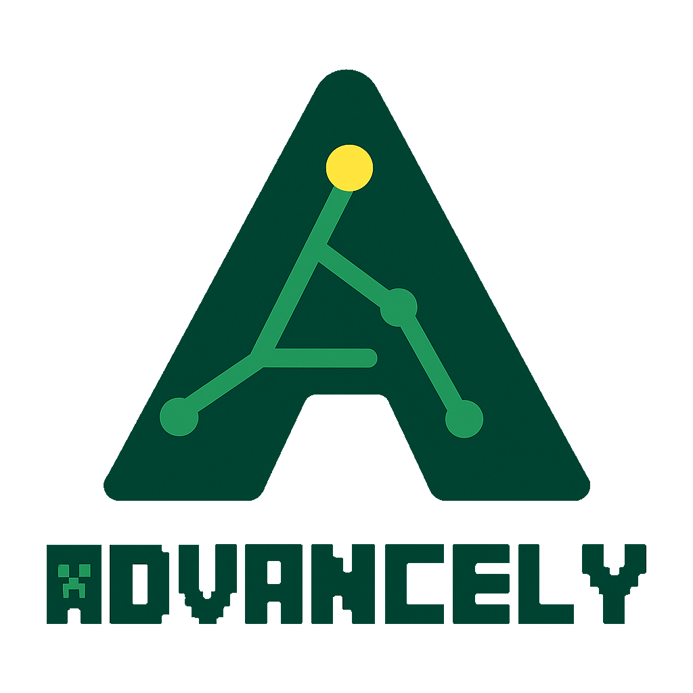
</p>

# [⬇️ **DOWNLOAD ADVANCELY NOW\! (Windows, Linux & macOS)** ⬇️](#getting-started)

***

# A highly customizable and interactive tool to track Minecraft progress beyond just Advancements.

<p align="center">
  
  <br>
  <em>This animation here is compressed. When you use the tracker the framerate will be higher and the resolution perfectly sharp.</em>
</p>

***

## This tracker supports an arbitrary number of advancements, recipes, custom statistics, unlocks, multi-stage goals, manual goals, and custom counters for over 100 Minecraft versions.

## Advancely is fully speedrun legal based on the [Minecraft Speedrunning rules (A.3.10.a, A.11.1)](https://www.minecraftspeedrunning.com/public-resources/rules) by only reading from within the 'advancements', 'stats' and 'unlocks' (25w14craftmine) folders of a world that update when the game saves. With the **[Hermes Mod](https://github.com/DuncanRuns/Hermes)** tracker updates are instant and don't require pausing ([Minecraft Speedrunning rules (A.8.14 and A.8.15)](https://www.minecraftspeedrunning.com/public-resources/rules)). Reading the **[SpeedrunIGT Mod](https://github.com/RedLime/SpeedRunIGT)**'s `speedrunigt/record.json` is also explicitly allowed ([Minecraft Speedrunning rules (A.8.14.a)](https://www.minecraftspeedrunning.com/public-resources/rules)), which Advancely uses to display a millisecond-exact final time.

### Built for flexibility, Advancely supports everything from vanilla speedruns to modded adventures and datapacks through the creation of custom templates with a built-in template editor. It automatically detects changes in your latest singleplayer world, providing real-time progress updates.

<p align="center">
  
</p>

# [Watch the full tutorial video here!](https://www.youtube.com/watch?v=Rxd1RJqg2WQ)
### [Watch all of the Advancely Devlogs here!](https://www.youtube.com/playlist?list=PLniMta_NW_NYfA5M6xzrVOuxsj9amRdP4)

***

## Table of Contents

- [Become a Supporter!](#become-a-supporter)
- [Socials](#socials)
- [What is Advancely?](#what-is-advancely)
- [Core Features](#core-features)
- [Performance & Optimization](#performance--optimization)
- [Getting Started](#getting-started)
- [Download Once, Update Forever](#download-once-update-forever)
- [The Tracker Window](#the-tracker-window)
- [The Stream Overlay](#the-stream-overlay)
- [The Template Editor](#the-template-editor-esc--open-template-editor)
- [The Settings Window](#the-settings-window-esc)
- [Officially Added Settings Presets](#officially-added-settings-presets)
- [Co-op Multiplayer](#co-op-multiplayer)
- [Extensive Version Support](#extensive-version-support)
- [Officially Added Templates](#officially-added-templates)
- [Known Limitations](#known-limitations)
- [You have a feature idea?](#you-have-a-feature-idea)
- [Running into Issues?](#running-into-issues)
- [Command Line Arguments](#command-line-arguments)
- [Beta Testers](#beta-testers)
- [Contributors](#contributors)
- [License](#license)
- [Credits](#credits)

***

## Become a Supporter!

> 📺 **Video Guide:** [Jump to Support Section (33:53)](https://youtu.be/Rxd1RJqg2WQ?t=33m53s)

Love using Advancely? You can have your name immortalized in the tracker!

<p align="center">
  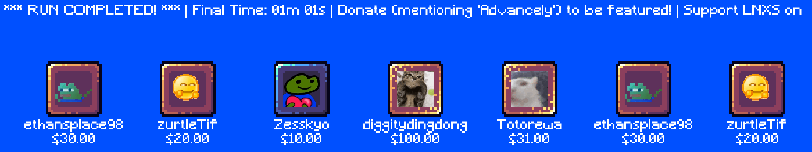
</p>

**Supporters:**

* diggitydingdong: $100
* Totorewa: $31
* ethansplace98: $30
* zurtleTif: $20
* Zesskyo: $10

Simply [**donate here**](https://streamlabs.com/lnxseus/tip) and include the word "**Advancely**" in your donation
message. Your name will be added permanently to two places:

- The **Settings window** inside Advancely, where the supporter list is always visible to every user on every tab
- The **overlay supporter showcase** that appears when anyone completes a run on stream

You'll also get a special role on my [Discord](https://discord.gg/TyNgXDz).

Thank you for supporting the project!

***

## Socials

**Put `#Advancely` in your content to support the project!**

* [Support Advancely (be featured on the overlay by mentioning
  `Advancely` in your donation message)](https://streamlabs.com/lnxseus/tip)
* [(Affiliate Link) Amazon](https://amzn.to/4scdytw)
* [My YouTube](https://www.youtube.com/@lnxs?sub_confirmation=1)
* [My Twitch](https://www.twitch.tv/lnxseus)
* [My Twitch Archive + Advancely Devlogs](https://www.youtube.com/@lnxsarchive/playlists?view=1&sort=lad&flow=grid&sub_confirmation=1)
* [Official Advancely Discord w/ **Unofficial Releases**!](https://discord.gg/TyNgXDz)
* [Tiktok](https://www.tiktok.com/@lnxseus)
* [Instagram](https://www.instagram.com/lnxseus/)
* [X/Twitter](https://x.com/lieinuxxseus)
* [My GitHub](https://github.com/LNXSeus)

***

## What is Advancely?

> 📺 **Video Guide:** [Intro (0:00)](https://youtu.be/Rxd1RJqg2WQ?t=0m00s) • [The Basics (1:50)](https://youtu.be/Rxd1RJqg2WQ?t=1m50s)

<p align="center">
  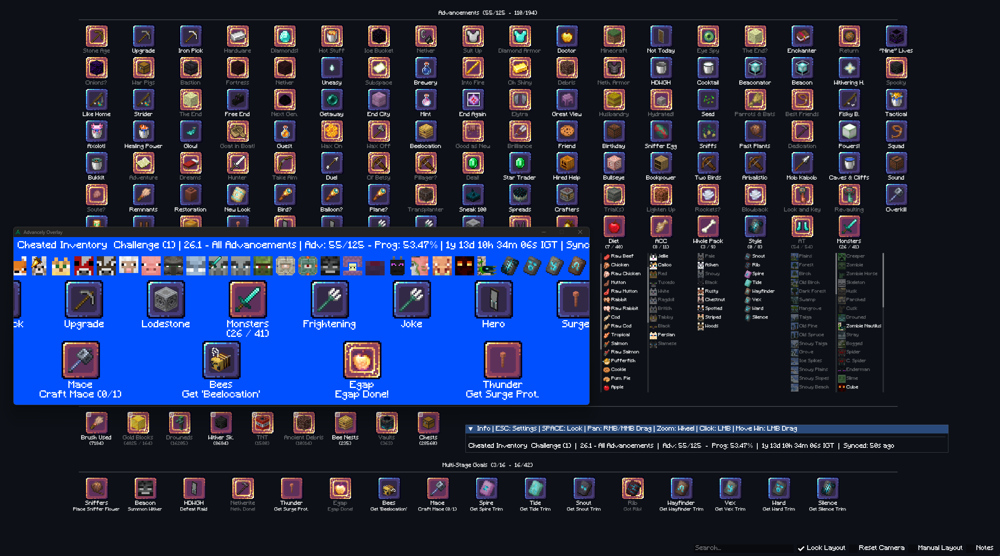
  <br>
  <em>This screenshot shows the automatic layout.</em>
</p>

<p align="center">
  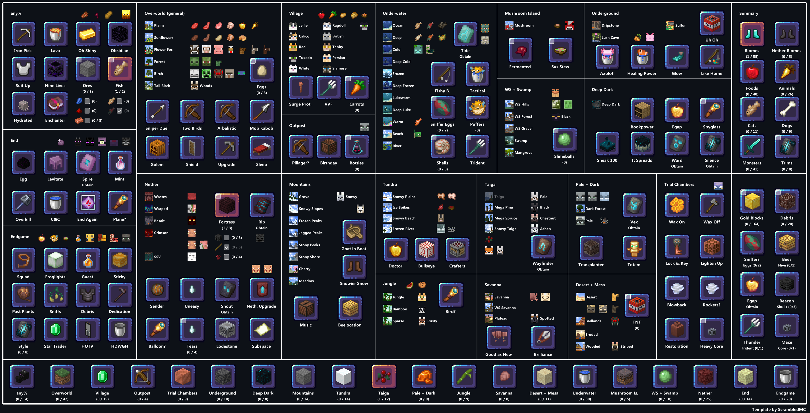
  <br>
  <em>This screenshot shows a fully custom manual layout (<code>26.2</code> <code>all_advancements</code> <code>_categorical</code>) built with the Visual Layout Editor. Templates with a manual layout are marked with <code>(has layout)</code> within the template selection dropdowns. Then you must turn on <code>Manual Layout</code> on the tracker.</em>
</p>

Advancely is a sophisticated, data-driven progress tracker (just like [AATool](https://github.com/DarwinBaker/AATool)) -
that works on Windows, Linux and macOS - designed for Minecraft speedrunners, completionists, and
content creators. Unlike other tools that only track vanilla advancements (e.g., AATool by Darwin Baker), Advancely can
be configured to monitor virtually any goal imaginable. It operates in real-time by watching your singleplayer save
files for changes, meaning your progress is always up-to-date without any manual intervention.

With the `Manual Layout` mode and the built-in `Visual Layout Editor`, you have full control over where every goal,
stat, and decoration appears on the tracker. Drag and drop items directly on the live tracker, select multiple goals at
once, and arrange everything exactly how you want it; no config file editing required.

The tracker's true power lies in its `.json` template system, which allows you to define exactly what you want to track
for any version, mod, or playstyle. A template isn't just a list of advancements; it's a complete ruleset that can
include custom stats, multi-stage goals, manual counters, and more.

### The Advancely Template Editor

You don't need to be a developer to customize Advancely. The built-in **Template Editor** gives you full control to
import, create, copy, and modify any template directly within Advancely.

<details>
<summary><strong>Read more about Editor Features</strong></summary>
<br>

* **Import from Your World:** The fastest way to get started is by importing directly from an existing game save. The
  editor can automatically scan your player data and pull in all advancements/achievements, recipes, statistics, or
  unlocks to build a new template for you.
* **Full Customization:** Edit any goal's name, icon, or properties. Create complex multi-stage goals with several
  sequential steps, or add manual counters with hotkeys for objectives that can't be tracked automatically.
* **Easy Translation:** Every template has separate language files, allowing you to easily edit display names or provide
  translations without altering the core template logic.
* **Separate Layout Files:** Manual layout positions and decorations live in their own `_layout` files alongside the
  language files, never inside the core template. This means a custom layout survives official template updates, a
  single template can carry multiple alternative layouts, and you can create, copy, import, and export layouts
  independently (just like language files).
* **Share Your Templates:** You can export any template - including all its language and layout files - into a single
  `.zip` file to share with the Advancely community. Likewise, you can import (`.zip`) templates created by others.
* **Manual Layout & Visual Layout Editor:** Position every goal, criterion, and decoration precisely on the tracker map.
  Enable "Manual Layout" in settings, then use the **Visual Layout Editor** in the Template Editor to drag-and-drop
  items directly on the live tracker. Select multiple items at once with a selection rectangle or `Ctrl`/`Cmd`+Click and
  move them together.
* **Decorations:** Add visual elements to your manual layout that aren't tied to game data. **Text Headers** display
  custom text using the tracker font, **Lines** connect or separate areas with configurable thickness and opacity,
  and **Arrows** visually link goals together with customizable arrowheads, bend points, and goal-linked opacity.

This powerful and flexible system makes Advancely the ultimate tool for any Minecraft challenge, from a vanilla "All
Advancements" run to a heavily modded playthrough with hundreds of custom milestones.
</details>

***

## Core Features

<details>
<summary><strong>View All Core Features</strong></summary>
<br>

* **Automatic Instance Tracking** *(default)*: Advancely detects which Minecraft instance you are actively playing and
  tracks it, even with several instances open. Works with **Prism Launcher**, **MultiMC**, and similar launchers.
* **Hermes Mod Live Tracking**: With the [Hermes mod](https://github.com/DuncanRuns/Hermes) installed, stats and
  advancements update instantly instead of waiting for the game to save.
* **SpeedrunIGT Accurate IGT**: With the [SpeedrunIGT mod](https://github.com/RedLime/SpeedRunIGT) installed, the IGT is
  exact to the millisecond instead of rounded to the game tick.
* **Comprehensive Real-Time Tracking**: Advancements, recipes, criteria, statistics (including nested sub-stats) and
  `25w14craftmine` unlocks, from vanilla, mods or datapacks.
* **Interactive Map View**: Pan, zoom and lock the tracker map. Goals with many sub-items become scrollable lists.
* **Advanced Goal Types**:
    * **Custom Goals & Counters**: Manual checklist goals or counters for anything that can't be tracked
      automatically. Change them with hotkeys (window-focused or global while you play) or by clicking the progress
      text to type a value. _Their progress is saved in `settings.json`, so switching templates ERASES it._
    * **Multi-Stage Goals**: Chain stats, unlocks, criteria and advancements into one goal completed in sequence, with
      a unique icon per stage.
    * **Counters**: Count how many of a chosen set of goals are completed.
    * **Linked Goals**: Stats and custom goals can auto-complete when other goals are done (`AND` / `OR`).
* **Manual Layout Mode & Decorations**: Place every goal exactly where you want with the **Visual Layout Editor**, and
  add text headers, lines and arrows. Layouts live in separate `_layout` files, so they survive official template
  updates.
* **Per-Template Run Completion**: Each template decides when a run counts as complete (e.g. all advancements, picked
  goals, or a Half% goal count), which freezes the IGT and shows the **RUN COMPLETED!** screen on the overlay.
* **Powerful In-App Template Editor**: Create, copy and modify templates without touching files, and import goals
  straight from your world save. Find more information [here](https://github.com/LNXSeus/Advancely#The-Template-Editor).
* **Customizable Stream Overlay**: Three render modes (`Scrolling Belt`, `Page`, `Compact`), and an optional truly
  transparent background so **no color key filter is needed**. Find more
  information [here](https://github.com/LNXSeus/Advancely#The-Stream-Overlay).
* **Full Mod & Datapack Support**: Any namespace works (e.g., `conquest:`, `blazeandcave:`), not just `minecraft:`.
* **Extensive Version Support**: Over 100 Minecraft versions, from 1.0 to 26.x and beyond, including all April Fool's
  snapshots.
* **Automatic Updates**: Advancely checks for new versions on startup and can install them for you.

</details>

***

## Performance & Optimization

<p align="center">
  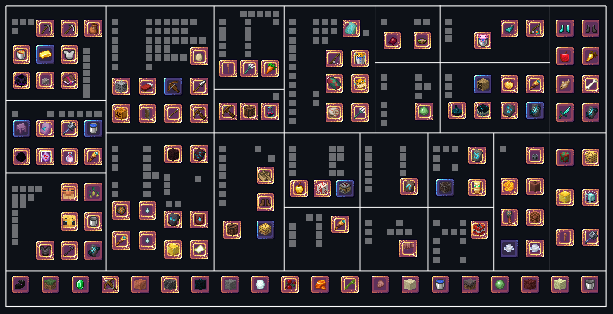
</p>

Advancely tries to be as lightweight as possible when it comes to system resources despite allowing for 1000+ goals
being displayed at once.

<details>
<summary><strong>View Technical Details (SDL3, ImGui, Culling & LOD)</strong></summary>
<br>

* **Efficient Tech Stack**: The application is built on [**SDL3**](https://github.com/libsdl-org/SDL), a
  high-performance, low-level media library.
    * **Tracker Window**: Utilizes **Dear ImGui** for a responsive, interactive, and highly customizable interface.
    * **Stream Overlay**: Bypasses UI libraries entirely to use **raw SDL3 hardware acceleration**. This ensures
      perfectly smooth 60fps+ animations with virtually zero overhead.
* **Virtual Scrollable Lists**: Templates with thousands of criteria (e.g. "All Items") are automatically converted into
  virtualized scrollable lists. This keeps the layout compact and ensures rendering remains performant regardless of
  list size.
* **Smart Culling**: The tracker features a robust culling system. It only processes and renders items that are
  currently visible within the window. You can have a template with thousands of goals, but if you are zoomed in on just
  ten of them, only those ten are drawn.
* **Level of Detail (LOD)**: To maintain clarity and performance when viewing the entire map:
    * **Text Hiding**: As you zoom out, sub-text (progress) and then main titles fade away to declutter the screen.
    * **Icon Simplification**: At the furthest zoom levels, complex item icons are replaced by simple, colored squares.
    * *Note: These thresholds are fully customizable in
      the [Settings](#the-settings-window-esc) window.*
* **Cursor Reveal**: For extremely large templates, you can optionally have checkboxes (and item names, progress text,
  and text headers) only drawn within a radius of the mouse cursor, so only the goals you are pointing at are measured
  and rendered. The radius is measured in template pixels, so it scales with the zoom level, and a faint ring shows the
  current radius while the mouse moves. These toggles live under `Performance` in the
  [Settings](#the-settings-window-esc) window.

</details>

***

## Getting Started

> 📺 **Video Guide:** [How to Download (1:23)](https://youtu.be/Rxd1RJqg2WQ?t=1m23s)

### 1. Downloading the Correct Version

Go to the [**releases page**](https://github.com/LNXSeus/Advancely/releases) and download the `.zip` file that matches
your operating system. The `vX.X.X` is the Advancely version, that is also displayed in the title of the main window.

* **Windows:** `Advancely-vX.X.X-Windows.zip`
* **Linux (Portable):** `Advancely-vX.X.X-Linux.zip` — The standalone executable (no installation required).
* **Linux (Debian/Ubuntu):** `advancely-vX.X.X-Linux.deb` — The native installer for Ubuntu 25+ (or systems with SDL3
  installed).
* **Linux (Fedora/RHEL):** `advancely-vX.X.X-Linux.rpm` — The native installer for Fedora/RedHat systems.
* **macOS:** `Advancely-vX.X.X-macOS-Universal.zip` — For both Intel (down to macOS 13 Ventura) and Silicon Macs.

### 2. Installation & First-Time Run

#### For supported Linux distros

* **Arch Linux (AUR):**

Three packages are available on the AUR — pick whichever suits you:

| Package                                                           | Description                                                  |
|-------------------------------------------------------------------|--------------------------------------------------------------|
| [advancely](https://aur.archlinux.org/packages/advancely)         | Compiles from the latest release                             |
| [advancely-bin](https://aur.archlinux.org/packages/advancely-bin) | Precompiled binary from the latest release (fastest install) |
| [advancely-git](https://aur.archlinux.org/packages/advancely-git) | Compiles from the latest commit _(might be outdated)_        |

Use your favorite AUR helper, e.g.:

  ```
  paru -S advancely-bin
  ```

_Massive thanks to [R0dn3yS](https://github.com/R0dn3yS) for the AUR packages!_

* **NixOS:**

Advancely is available via [mcsr-nixos](https://git.uku3lig.net/uku/mcsr-nixos), a collection of NixOS packages for Minecraft speedrunning.

Add the following to your `flake.nix` inputs:
```nix
  inputs.mcsr-nixos = {
    url = "https://git.uku3lig.net/uku/mcsr-nixos/archive/main.tar.gz";
    inputs.nixpkgs.follows = "nixpkgs";
  };
```

Then add it to your system configuration:
```nix
  { pkgs, mcsr-nixos, ... }:
  let
    mcsrPkgs = mcsr-nixos.packages.${pkgs.stdenv.hostPlatform.system};
  in
  {
    environment.systemPackages = [
      mcsrPkgs.advancely
    ];
  }
```

_Massive thanks to [uku3lig](https://git.uku3lig.net/uku) for the NixOS package!_

> **ℹ️ Where your data is stored (Linux packages)**
>
> Package installs (`.deb`, `.rpm`, AUR, NixOS) put the program files in a read-only system location, so everything you
> can edit lives in your home directory instead:
> - **Your data (editable):** `~/.local/share/advancely/` — holds `config/` (your `settings.json` and presets),
>   `templates/`, `notes/`, `icons/`, `fonts/`, `gui/` and `reference_files/`, plus the log files
>   (`advancely_log.txt`, `advancely_overlay_log.txt`) and `imgui.ini`
> - **Program files (read-only):** `/usr/share/advancely/`
>
> This is filled in automatically on first launch and topped up after every update. Custom templates, imported icons,
> fonts and backgrounds, and your settings are never overwritten; the shipped default templates and reference files are
> refreshed so updates actually reach you.
>
> If a default file ever goes missing, delete the hidden `.seed_version` file in that folder and restart:
> Advancely will restore anything missing without touching your own files.
>
> The **portable** `.zip` build is unaffected and keeps everything in its own `resources` folder next to the executable.

#### For all other installations

To ensure the application works correctly, please follow the instructions for your operating system.

<details>
<summary><strong>🍎 macOS Instructions</strong></summary>
<br>

Due to macOS security (Gatekeeper), you cannot run the app directly from the Downloads folder.

> **⚠️ CRITICAL: Fix for "App Translocation" / Permission Errors**
>
> If you try to run Advancely directly from your **Downloads** folder, macOS will isolate it in a read-only temporary
> location (App Translocation).
>
> **You MUST move the app to fix this:**
> 1. Drag `Advancely.app` AND the `resources` folder from Downloads to your **Applications** folder or **Desktop**.
> 2. Run it from the new location.

> **ℹ️ Where your data is stored**
>
> Your editable data is kept in your user Library, so the app saves correctly even when the app folder itself is
> read-only:
> - **User Data (Editable):** `~/Library/Application Support/Advancely/` — holds `config/` (your `settings.json` and
>   presets), `templates/`, `notes/`, `icons/`, `fonts/`, `gui/` and `reference_files/`
> - **System Files (Read-Only):** the `resources` folder next to `Advancely.app`, used only as the source to copy from
>
> This is created automatically on first launch and topped up after every update. Custom templates, imported icons,
> fonts and backgrounds, and your settings are never overwritten; the shipped default templates and reference files are
> refreshed so updates actually reach you.
>
> If a default file ever goes missing, delete the hidden `.seed_version` file in that folder and restart:
> Advancely will restore anything missing without touching your own files.

**Authorizing the App (First Run):**

✔️ **Method 1: Terminal Authorization**
If you still encounter issues, you can strip the quarantine tags manually:

1. Open the **Terminal** app.
2. Type `xattr -cr ` (note the space at the end).
3. Drag the `Advancely.app` file from Finder onto the Terminal window.
4. Press **Enter**.

✔️ **Method 2: The Right-Click Trick**

1. After moving the app to your Applications folder or Desktop...
2. **Right-click** (or Control-click) `Advancely.app` and select **Open** from the menu.
3. A warning will appear. Click **Open**. macOS will now remember that you trust this application.

✔️ **Method 3: System Settings (If Method 1 and 2 fail)**
If the app still refuses to open:

1. Open **System Settings** -> **Privacy & Security**.
2. Scroll down to the **Security** section.
3. Look for a message stating "Advancely was blocked...".
4. Click **Open Anyway** and confirm with your password.

</details>

<details>
<summary><strong>🪟 Windows & 🐧 Linux Instructions</strong></summary>
<br>

Your application folder contains the main executable, required library files, and the `resources` folder. The executable
must always stay in the same folder as its supporting files.

✔️ **Correct Way to Run:**

* To run Advancely from another location like your Desktop, please create a shortcut to the main executable.
    * **Windows:** Right-click `Advancely.exe` → "Create shortcut".
    * **Linux:** Right-click the `Advancely` file → "Create Link".
* You can then move this new shortcut or link anywhere you like.
* **Do not** move or copy the original executable file by itself, as it will fail to start or find its resources.

</details>

### 3. Your First Launch

Launch Advancely by running the executable (or the shortcut you created). On its first run, it will default to finding
your most recently played world from the standard Minecraft installation. To begin customizing, press the `ESC` key to
open the settings window, where you can switch to `Auto-Track Active Instance` if you use Prism Launcher, MultiMC or
some other custom launcher.

***

## Download Once, Update Forever

> 📺 **Video Guide:** [Auto-Updates Explained (33:01)](https://youtu.be/Rxd1RJqg2WQ?t=33m01s)

Advancely is designed to be easy to maintain. By default, **the tracker will automatically check for new versions on
startup**. When an update is available, you will be notified with a prompt offering to download and install it for you.
After you click `Update Now`, the rest happens automatically: a single progress window walks through the download,
extraction, and restart with no further clicks. This process is designed to be as safe as possible for your custom
files.

The prompt also offers `What's New?` to read the release notes of the latest version before updating, `View My
Templates` to open your local templates folder for backups, `View Official Templates` to browse the officially added
templates online, and `Later` to skip the update until the next restart.

> **Platform note:** The built-in auto-updater works on Windows, macOS, and the Linux **portable** build. If you
> installed Advancely from a Linux **package** (`.deb`, `.rpm`, AUR, or NixOS), update it through that installer or your
> package manager instead.

<p align="center">
  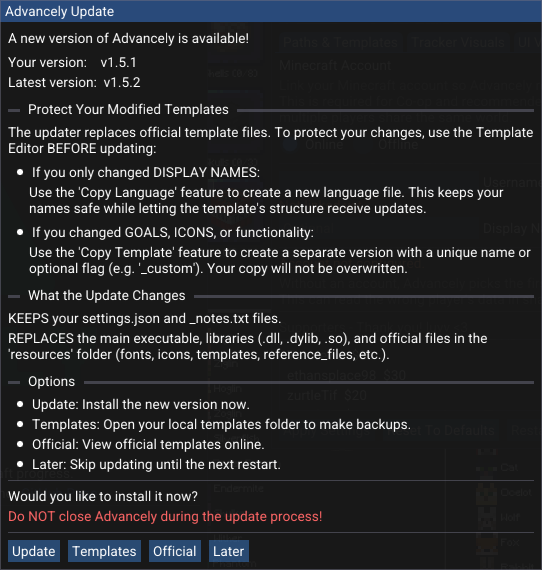
</p>

<p align="center">
  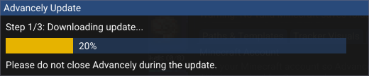
</p>

<details>
<summary><strong>How the Automatic Update Works</strong></summary>
<br>

The updater is smart about which files it replaces to ensure your personal configurations are preserved.

* ✅ **Files that are SAFE and WILL NOT be replaced:**
    * Your main `settings.json` file.
    * Your `_notes.txt` files for each template.
    * Any custom templates or user-created files in the `resources` folder.

* ⚠️ **Files that WILL BE REPLACED:**
    * The main application executable (`Advancely.exe`, `Advancely.app`, etc.).
    * Core library files (`.dll`, `.so`).
    * Official templates, fonts, icons, reference_files, and GUI assets included with the release.

### Protecting Your Modified Official Templates

To prevent losing your work during an automatic update, it's highly recommended to **avoid editing official template
files directly**. Instead, use the **Template Editor** to create your own safe-to-edit versions. The correct method
depends on the types of changes you want to make.

**If you only want to change display names:**

The best approach is to create a new **language file** for the official template. This keeps your custom names separate
while still allowing the underlying template structure (the goals, criteria, icons, etc.) to receive official updates.

1. Open the **Template Editor** and select the official template you wish to customize.
2. In the "Languages" section, select the "Default" language and click **Copy Language**.
3. Give your new language a unique flag (e.g., `custom` or `mypack`).
4. You can now select your custom language in the main settings, and your display names will be safe from updates.

**If you only want to change the manual layout (positions and decorations):**

Layout data lives in its own `_layout` file, so the same trick works for layouts. In the "Layouts" section, copy the
`Default` layout to a unique flag (or build a fresh one with **Create Layout**), then select it via the `Layout`
dropdown in settings. Your custom positions stay separate while the official template structure keeps receiving
updates.

**If you have changed goals, criteria, or icons (core functionality):**

The best approach is to create a complete **copy of the template**. This makes your version fully independent and
protects it from being overwritten.

1. Open the **Template Editor** and select the official template you want to use as a base.
2. Open the **`Template...`** dropdown and click **Copy Template**.
3. Give your new version a unique name, typically by adding an **Optional Flag** (e.g., `custom`).
4. You can now safely edit your new, independent template in any way you wish.

Your custom template will appear separately in the template list and will not be touched by the auto-updater.
</details>

***

## The Tracker Window

> 📺 **Video Guide:** [Main Tracker Overview (18:23)](https://youtu.be/Rxd1RJqg2WQ?t=18m23s) • [Controls & Navigation (6:22)](https://youtu.be/Rxd1RJqg2WQ?t=6m22s)

<p align="center">
  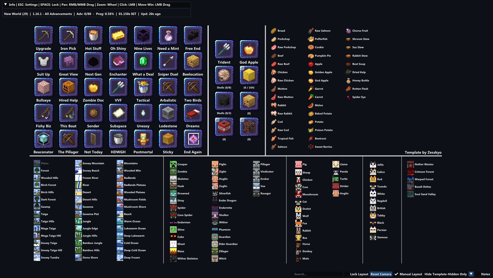
</p>

The main window is an interactive canvas where all your tracked goals are displayed. You can freely zoom in and out to
rearrange the items in view to suit your needs, making it easy to focus on what matters most for your current run. The
order of the sections (advancements, recipes, multi-stage goals, ...) can be configured in
the [settings window](#the-settings-window-esc).

<details>
<summary><strong>Controls & Features (Pan, Zoom, Search, Notes)</strong></summary>
<br>

### Navigating the Map

* **View Menu**: The `View` button in the bottom-right corner holds everything that decides how the map is drawn:
  `Zoom`, `Reset Camera`, `Lock Camera`, `Lock Layout`, `Selection Rectangle`, `Manual Layout`, and the goal visibility
  dropdown. `Lock Camera`, `Lock Layout`, `Selection Rectangle`, and `Manual Layout` also have shortcuts (`Shift+C`,
  `Space`, `Shift+S`, and `Shift+M` by default).
* **Pan & Zoom**: Hold `Right-Click` or `Middle-Click` and drag to pan, and use the `Mouse Wheel` to zoom. For an
  exact zoom level, use the `Zoom` slider in the `View` menu.
* **Scroll Lists**: Hovering over a goal with many sub-items makes the `Mouse Wheel` scroll the list instead of
  zooming the map.
* **Selection Rectangle**: Hold `Left-Click` on empty map and drag over manual completion checkboxes to tick them all
  at once. It takes a majority vote: sweep mostly unticked boxes and they all get ticked, sweep mostly ticked ones and
  they all get unticked.
* **Lock Camera**: Stops wheel zooming and drag panning, so your view can't be nudged out of place by accident.
* **Lock Layout**: Stops the automatic grid from rearranging goals when you resize the window.
* **Reset Camera**: Resets pan and zoom, and unlocks the layout.

### Searching & Filtering

Press `Ctrl+F` (`Cmd+F` on macOS) to focus the search box in the bottom-right corner. The search is case-insensitive
and also updates the section completion counters. If only a criterion or sub-stat matches, it is shown on its own under
its parent. Searching for a counter's or text header's name also shows the goals linked to it, and goal descriptions
are searched too.

Keywords such as `row1`, `row2`, `row3`, `hidden`, `complex`, `multi`, `pos`, and `desc` filter by goal properties.
They work in both the tracker and the template editor, and the full list is in each search box's tooltip.

### Section Completion Counters

Each section header in the automatic layout shows how many of its visible items are completed, as
`(Completed Main / Total Main - Completed Sub / Total Sub)` for sections with criteria or sub-stats, or
`(Completed Main / Total Main)` otherwise. The counters follow the current goal visibility mode and search filter.
The visibility dropdown's tooltip explains what each mode shows and counts.

**Hiding in Manual Layout vs. Automatic Layout:**

Advancely has two separate hiding systems that target different layout modes:

* **`Hidden` checkbox** (per goal, in the Template Editor): Controls visibility on the **automatic layout** and the
  **stream overlay**. This checkbox is completely ignored when using the manual layout.
* **Per-position `Hide` checkboxes** (per icon/text/progress position, in the Template Editor): Controls visibility
  on the **manual layout** only. Each position (icon, text, progress) can be hidden independently.

### The Player Dropdown (Co-op)

In an active co-op lobby, the tracker shows a **Player Dropdown** with `All Players` (progress merged by the lobby's
rules) and every individual player (their own raw progress). Players whose save files are in the world but who aren't
in the lobby are listed as ghosts under `Not in lobby`. See [The Player Dropdown](#the-player-dropdown) for the full
behavior.

### The Info Bar

A transparent info bar at the top of the window provides a live summary of your run. It includes:

* **World**: The name of the world currently being tracked.
* **Run Details**: The Minecraft version, template category, and optional flag you have selected.
* **Progress**: The main advancement/achievement counter and the overall completion percentage, which includes every
  single sub-task from all categories (recipes, criteria, stats, etc.).
* **IGT**: The total in-game time for the current world (millisecond-exact with the SpeedrunIGT mod).
* **Update Timer**: A timer showing how long it has been since the game last saved its files.

### The Notes Window

A powerful notes editor can be toggled via the `Notes` checkbox in the bottom-right corner. All text is saved instantly as
you type. The notes system has two distinct modes, which can be changed from within the notes window:

* **Per-World Mode (Default)**: Notes are saved for each world individually. This is perfect for keeping track of
  world-specific information like coordinates or To-Do lists. The tracker automatically remembers the notes for your
  last 32 played worlds.
* **Per-Template Mode**: Notes are tied directly to the loaded template. This is useful for storing general strategies
  or information that applies to every run using that specific template.

The notes window also supports live-reloading (if you edit the `.txt` file externally, the window updates instantly) and
allows you to switch to the UI font for improved readability.
</details>

***

## The Stream Overlay

> 📺 **Video Guide:** [Overlay Setup & Customization (18:45)](https://youtu.be/Rxd1RJqg2WQ?t=18m45s) • [Overlay Progress (14:10)](https://youtu.be/Rxd1RJqg2WQ?t=14m10s)

<p align="center">
  
  <br>
  <em>This animation here is compressed. When you use the overlay the framerate will be higher and the resolution perfectly sharp.</em>
</p>

Advancely includes a dedicated, customizable window perfect for showing your progress to viewers. It's an animated,
real-time display that you can easily add to your stream layout.

<p align="center">
  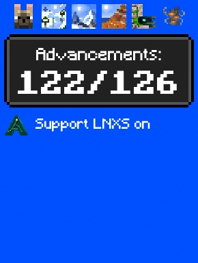
  <br>
  <em>The <code>Compact</code> overlay mode: a tall counter panel with goals popping out beneath it.</em> <b>Inspired by Zesskyo!</b>
</p>

<details>
<summary><strong>Setup in OBS & Customization Guide</strong></summary>
<br>

### Setup in OBS (or other streaming software)

1. **Enable the Overlay**: In Advancely's settings (`ESC`), check the `Enable Overlay` box and click `Apply Settings` or
   hit `ENTER`. A new `Advancely Overlay` window will appear.
2. **Add a Source**: In your streaming software (like OBS), add a new `Game Capture` source on Windows or Linux and a
   `Window Capture` source on macOS.
3. **Select the Window**: Choose the `[Advancely.exe]: Advancely Overlay` window from the list.
4. **Add a Color Key Filter**: Right-click the new source, go to "Filters", and add a "Color Key" filter.
5. **Set the Color**: Use the color picker to select the overlay's background color. You can copy the exact HEX code
   from the Advancely's `Overlay Background Color` setting to ensure a perfect match.
6. **Adjust Settings**: For a clean, transparent background, it's recommended to set the **Similarity** to `1` and *
   *Smoothness** to around `210`.

> **Alternative to steps 4-6:** Check `Transparent` next to the `Overlay Background Color` setting to make the overlay
> window itself transparent, so no color key filter is needed. On Windows, enable `Allow Transparency` on the
> `Game Capture` source. On Linux, a compositor has to be running, otherwise the background turns black. A transparent
> overlay also unlocks the `Fade Out` options, so cleared goals fade away instead of being cropped.

> **Important for Streamers:** Applying a change to an overlay-related setting will restart the overlay window (other
> changes, such as tracker visuals, hotkeys, or co-op, leave it running). If it does restart, you may need to re-select
> the window in your capture source properties afterward.

### Overlay Layout Explained

In `Scrolling Belt` and `Page` mode the overlay has three rows:

* **Row 1 (Top)**: Icons of the smallest sub-tasks: advancement criteria and the sub-stats of multi-stat goals.
* **Row 2 (Middle)**: Main goals such as advancements, recipes, and unlocks.
* **Row 3 (Bottom)**: Statistics, custom goals, multi-stage goals, and counters.

The Template Editor can move goals between Row 2 and Row 3, and keep a multi-stat's sub-stats out of Row 1.

`Compact` mode (inspired by [Zesskyo](https://www.youtube.com/@ZesskyoMC)) replaces the rows with a tall, narrow
column: a counter panel on top cycles through the goal types and goals you pick (`SPACE` on the focused overlay skips
to the next one), and progressing or completed goals pop out into a stack beneath it. Goals you can tick off yourself
are marked `[x]` (checked off manually), `[a]` (completed automatically), or `[o]` (not done).

### Customization

Nearly everything about the overlay can be adjusted in the settings window:

* **Modes & Movement**: Render mode, scroll speed and direction, per-row speeds, and auto-freezing a row once its
  remaining items fit. Hold `SPACE` on the focused overlay to temporarily speed up the animation.
* **Sizes & Spacing**: Window width, text sizes, icon and background sizes, and horizontal and vertical spacing.
* **Animations**: How cleared goals crop or fade away, and how the remaining ones slide into the gap.
* **Content**: Which top bar segments are shown, whether completed or template-hidden goals stay visible, and, in
  `Compact` mode, what the panel cycles through and what pops out into the stack.

Every setting is explained in its tooltip, and the settings search (`Ctrl+F` / `Cmd+F`) finds any of them by name or
tooltip text.

</details>

***

## The Template Editor (`ESC` ▶ Open Template Editor)

<details>
<summary>📺 <strong>Video Guide: Template Editor Chapters (Click to View)</strong></summary>

* [**6. Template Editor Overview** (19:58)](https://youtu.be/Rxd1RJqg2WQ?t=19m58s)
* [6.1 Interface](https://youtu.be/Rxd1RJqg2WQ?t=20m14s)
* [6.2 Creating Templates](https://youtu.be/Rxd1RJqg2WQ?t=20m56s)
    * [6.2.1 New Template](https://youtu.be/Rxd1RJqg2WQ?t=21m06s)
    * [6.2.2 Advancements](https://youtu.be/Rxd1RJqg2WQ?t=21m51s)
    * [6.2.3 Stats](https://youtu.be/Rxd1RJqg2WQ?t=25m22s)
    * [6.2.4 Custom Goals](https://youtu.be/Rxd1RJqg2WQ?t=27m03s)
    * [6.2.5 Multi-Stage Goals](https://youtu.be/Rxd1RJqg2WQ?t=27m45s)
    * [6.2.6 Unlocks](https://youtu.be/Rxd1RJqg2WQ?t=28m56s)
* [6.3 Buttons](https://youtu.be/Rxd1RJqg2WQ?t=29m05s)
    * [6.3.1 Sorting Badges](https://youtu.be/lKDQGEbx20M?t=19m53s)
* [6.4 Languages](https://youtu.be/Rxd1RJqg2WQ?t=29m53s)
* [6.5 Search Bar](https://youtu.be/Rxd1RJqg2WQ?t=30m46s)
* [6.6 Legacy Versions](https://youtu.be/Rxd1RJqg2WQ?t=31m23s)
* [6.7 Testing](https://youtu.be/Rxd1RJqg2WQ?t=32m42s)
* [**7. Manual Layout & Visual Layout Editor**](https://youtu.be/lJtLpCAGrFc)

</details>

This is the heart of Advancely's customization. The in-app editor gives you complete control to define, modify, and
share the rulesets or `templates` that the tracker uses. You can access it by opening the settings (`ESC`) and clicking
the `Open Template Editor` button.

<p align="center">
  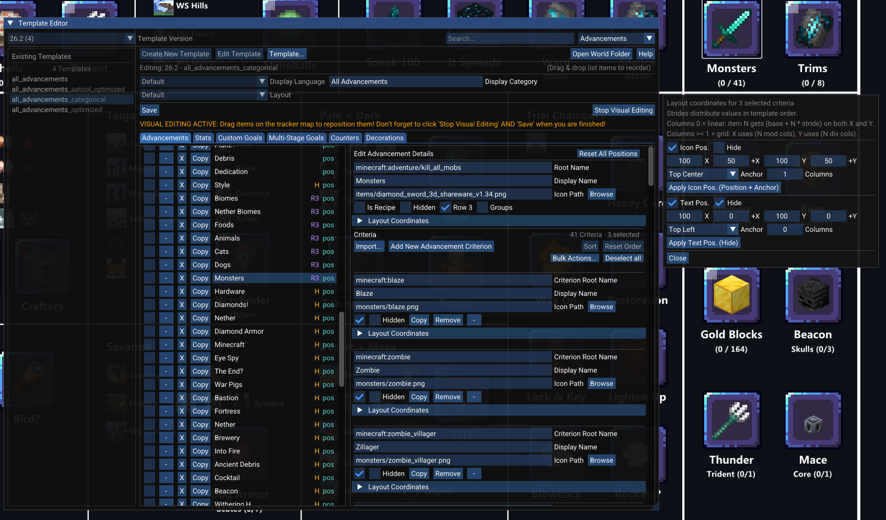
</p>

<details>
<summary><strong>Detailed Editor Usage</strong></summary>

### Template Management

**Create New Template** and **Edit Template** have their own buttons; copy, rename, delete, import, and export sit in
the **`Template...`** dropdown.

* **Template identity**: A template is identified by its `Category Name` **and** `Optional Flag` separately, not the
  two strung together. (`all_advancements` + `_x`) and (`all_advancements_x` + no flag) are two different templates.
* **Copy vs. Rename**: A copy takes the language and layout files with it, but not your `notes`. Rename moves the
  template with **all** of its files, notes included, and the tracker follows it if it is in use.
* **Replacing & Deleting**: Creating, copying, renaming, or importing onto an existing template asks before replacing
  it. Replacing or deleting a template permanently removes **all** of its files (language, layout, and notes).
* **Import & Export**: Templates are shared as `.zip` files, e.g. on the
  [Official Advancely Discord](https://discord.gg/TyNgXDz). Tick `Bundle icon files` when exporting a template that
  uses custom icons, so the recipient gets everything in one file.

### Language & Layout Files

Each template can have several language files (`_lang`) and several layout files (`_layout`), managed with the
buttons next to their dropdowns. Manual positions and decorations live in the layout files, so a custom layout
survives official template updates.

Text header texts are the exception: they are stored in the **language** files, which all layouts of a template share.
Text headers with the **same ID** in different layouts therefore share one text. Give a header an ID no other layout
uses to give that layout its own text.

### Editing a Template

Every tab lists its goals on the left and opens the selected one's fields on the right. Every field and checkbox is
explained in its tooltip, so this only covers what isn't obvious at first glance.

> **Important**: For GIFs to work correctly, they must be unoptimized with all frame data intact. You can prepare any
> GIF by uploading it to [**ezgif.com/maker**](https://ezgif.com/maker), selecting the **"Don't Stack Frames"** option,
> and exporting the result.

* **Custom Goal Targets**: `0` is a simple checkbox, `>0` a counter that completes at the target, and `-1` an infinite
  counter.
* **Multi-Stage Goals**: Each stage triggers on a stat, advancement, criterion, or unlock, or **mirrors** any other goal
  in the template and shows its value. `Start counting when stage is reached` makes a stat stage count only what is
  gained after the goal gets to it. `Auto-complete if next stage is completed` helps with stages that are hard to
  detect.
* **Linked Goals**: Stats, sub-stats, custom goals, stages, and counters can link to other goals and complete once
  all (`AND`) or any (`OR`) of them are done.
* **Overlay Rows**: `Row 2` / `Row 3` checkboxes move a goal between the overlay's middle and bottom rows.
* **Hiding**: `Hidden` affects the automatic layout and the overlay. Each manual position has its own `Hide` checkbox
  for the manual layout. An empty `Display Name` hands its spot to the progress text.
* **List Tools**: Number items with the small badges and press `Sort` (or drag a row by its handle) to reorder. The
  colored tags on each row summarize a goal's flags. Row checkboxes allow bulk selection, and `Bulk Actions...` then
  applies icons, toggles, deletion, or layout coordinates to the whole selection. `Ctrl+Z` / `Ctrl+Y` undo and redo.

### Decorations & Run Completion

* **Decorations** are only visible in manual layout: **Text Headers** (with an optional hover description), **Lines**,
  and **Arrows**. An arrow can link a `Start Goal` (it fades in once that goal is done) and an `End Goal` (it hides once
  that goal is done, when completed goals are hidden).
* **Run Completion** decides when a run of this template counts as complete: whole goal types, picked goals, a goal
  count (e.g. Half%), or a percentage. The picked goals also replace the progress counter, with an optional per-language
  `Counter Label`.

### Visual Layout Editor

The **Visual Layout Editor** button in the top-right of the Template Editor lets you drag goals directly on the live
tracker map. It only works on the template that is currently applied in the settings.

* While it runs, every goal shows as incomplete and normally hidden elements are drawn see-through, so you can place
  everything. The overlay keeps showing your real progress.
* Drag to move, drag on empty space for a selection rectangle, and `Ctrl+Click` (`Cmd+Click`) to add or remove items.
  Arrow keys nudge by one pixel, `WASD` by ten; all of its keys are listed and rebindable in
  [Advancely Hotkeys](#advancely-hotkeys).
* Moving a parent together with its still-automatic children leaves those children automatic, so they keep following
  the parent.
* With items selected, `Add Selected` next to `Select Goals` adds them as linked goals of the goal you're editing.
* Click **Stop Visual Editing** when done, then **Save** in the Template Editor to write the layout to disk.

### Importing from Game Files or Other Templates

Every tab's `Import...` button can pull goals `...from player file` (advancements, stats, and unlocks of one of your
world saves) or `...from other template` (a `.zip` or a template's main `.json`). Icons are copied along, and the
criteria, sub-stat, and stage lists have their own `Import...` buttons for finer picks.

* If the source template has all of your template's languages, every language's display names are imported at once.
* Root names that don't match the template's Minecraft version are highlighted with a warning.
* **Template update helpers**: For upgrading (or downgrading) a big template to another Minecraft version, the
  advancement import's `Select...` dropdown can find **new**, **renamed**, and **stale** advancements and **changed
  criteria**. Renames and deletions also update every link that pointed at the old name. Nothing changes until
  `Confirm Import`, and it can all be undone or discarded.

### The Help Button

If you need help finding the correct root name for an item or want to see examples, click the "Help" button in the
editor. This will open the `reference_files` folder, which contains guides, examples, and version-specific
lists of game data to assist you in building the perfect template.
</details>

***

## The Settings Window (`ESC`)

<details>
<summary>📺 <strong>Video Guide: Settings Chapters (Click to View)</strong></summary>

* [**3. Settings Overview** (7:36)](https://youtu.be/Rxd1RJqg2WQ?t=7m36s)
* [3.1 Paths](https://youtu.be/Rxd1RJqg2WQ?t=8m21s) | [3.2 Templates](https://youtu.be/Rxd1RJqg2WQ?t=8m29s) | [3.3 General](https://youtu.be/Rxd1RJqg2WQ?t=12m03s)
* [3.4 Goal Visibility](https://youtu.be/Rxd1RJqg2WQ?t=13m48s) | [3.5 Overlay Progress](https://youtu.be/Rxd1RJqg2WQ?t=14m10s)
* [3.6 Visuals](https://youtu.be/Rxd1RJqg2WQ?t=14m27s) | [3.7 Colors](https://youtu.be/Rxd1RJqg2WQ?t=14m33s) | [3.8 Textures](https://youtu.be/Rxd1RJqg2WQ?t=15m10s)
* [3.9 Fonts](https://youtu.be/Rxd1RJqg2WQ?t=15m18s) | [3.10 Level of Detail](https://youtu.be/Rxd1RJqg2WQ?t=15m53s)
* [3.11 List Behavior](https://youtu.be/Rxd1RJqg2WQ?t=16m20s) | [3.12 Tracker Spacing](https://youtu.be/Rxd1RJqg2WQ?t=16m36s)
* [3.13 Overlay Spacing](https://youtu.be/Rxd1RJqg2WQ?t=16m57s) | [3.14 Section Order](https://youtu.be/Rxd1RJqg2WQ?t=17m25s)
* [3.15 Debugging](https://youtu.be/Rxd1RJqg2WQ?t=17m32s) | [3.16 Hotkeys](https://youtu.be/Rxd1RJqg2WQ?t=18m16s)

</details>

The true power of Advancely lies in its deep customization. Every feature can be configured in real-time from the
settings window, which can be opened at any time by pressing the `ESC` key. The settings window is divided into 7 tabs.
Above the tabs sits a `Settings Presets` bar that lets you save full snapshots of your settings and switch between them.

_All the settings are then saved to `resources/config/settings.json`, meaning you can easily back up the `settings.json`
file as it requires that exact naming, but make sure Advancely IS CLOSED while renaming the `settings.json` file. The
settings file also saves the status on manual overrides of stats and custom goals, which get erased when switching
templates._

<p align="center">
  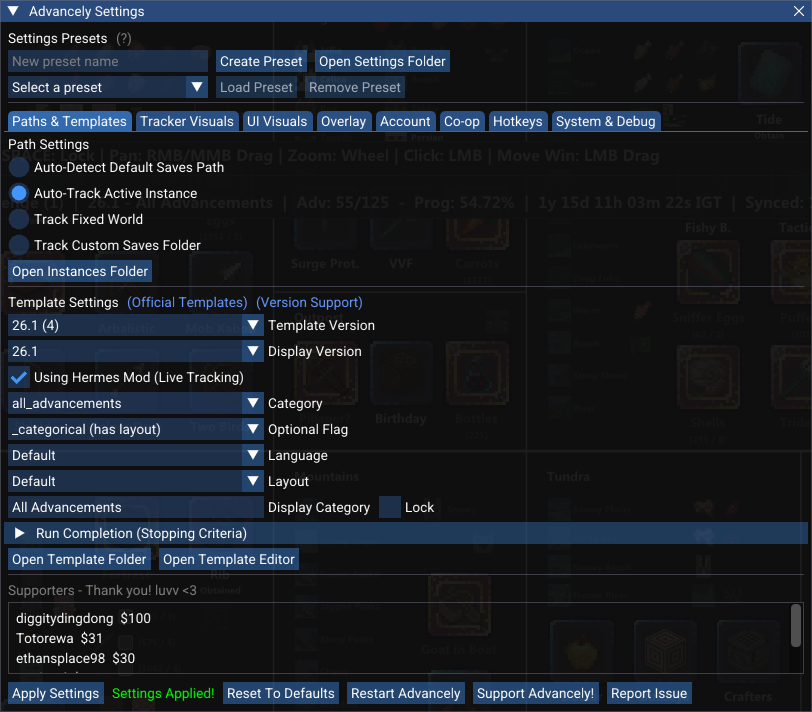
</p>

<details>
<summary><strong>View Full Settings List</strong></summary>
<br>

| Tab & Setting Group                           | Options & Features                                                                                                                                                                                                                                                                                                                                                                                                                                                                                                                                                                                                                                                                                                                                                                                                                                                                                                                                                                                                                                                                                                                                                                                                                                                                                                                                                                                                                                                                                                                                                                                                                                                                                                                                                                                                                                                                                                                                                                                                                                                                                                                                                                                                                                                                                                                                                                                                                                                                                                                                                                                                                                                                                                                                                                                                                                                                                                                                                                                                                                                                                                                                                                                                                                                                                                                                                                                                                                                                                                                                                                                                                                                                                                                                                                                                                                                                                                                                                                                                                                                                                                                               |
|:----------------------------------------------|:-------------------------------------------------------------------------------------------------------------------------------------------------------------------------------------------------------------------------------------------------------------------------------------------------------------------------------------------------------------------------------------------------------------------------------------------------------------------------------------------------------------------------------------------------------------------------------------------------------------------------------------------------------------------------------------------------------------------------------------------------------------------------------------------------------------------------------------------------------------------------------------------------------------------------------------------------------------------------------------------------------------------------------------------------------------------------------------------------------------------------------------------------------------------------------------------------------------------------------------------------------------------------------------------------------------------------------------------------------------------------------------------------------------------------------------------------------------------------------------------------------------------------------------------------------------------------------------------------------------------------------------------------------------------------------------------------------------------------------------------------------------------------------------------------------------------------------------------------------------------------------------------------------------------------------------------------------------------------------------------------------------------------------------------------------------------------------------------------------------------------------------------------------------------------------------------------------------------------------------------------------------------------------------------------------------------------------------------------------------------------------------------------------------------------------------------------------------------------------------------------------------------------------------------------------------------------------------------------------------------------------------------------------------------------------------------------------------------------------------------------------------------------------------------------------------------------------------------------------------------------------------------------------------------------------------------------------------------------------------------------------------------------------------------------------------------------------------------------------------------------------------------------------------------------------------------------------------------------------------------------------------------------------------------------------------------------------------------------------------------------------------------------------------------------------------------------------------------------------------------------------------------------------------------------------------------------------------------------------------------------------------------------------------------------------------------------------------------------------------------------------------------------------------------------------------------------------------------------------------------------------------------------------------------------------------------------------------------------------------------------------------------------------------------------------------------------------------------------------------------------------------------------|
| **(Top Bar)**                                 |                                                                                                                                                                                                                                                                                                                                                                                                                                                                                                                                                                                                                                                                                                                                                                                                                                                                                                                                                                                                                                                                                                                                                                                                                                                                                                                                                                                                                                                                                                                                                                                                                                                                                                                                                                                                                                                                                                                                                                                                                                                                                                                                                                                                                                                                                                                                                                                                                                                                                                                                                                                                                                                                                                                                                                                                                                                                                                                                                                                                                                                                                                                                                                                                                                                                                                                                                                                                                                                                                                                                                                                                                                                                                                                                                                                                                                                                                                                                                                                                                                                                                                                                                  |
| Settings Presets                              | Save full snapshots of your settings and switch between them. Type a name and click `Create Preset` (disabled while you have unsaved changes), then later pick it from the dropdown and click `Load Preset` to fill the window with its values (`Apply Settings` afterwards to actually use them) or `Remove Preset` to delete it. Presets are stored as `.json` files in `resources/config/` next to `settings.json`; `Open Settings Folder` opens that folder. The bar is locked while a co-op lobby is active.                                                                                                                                                                                                                                                                                                                                                                                                                                                                                                                                                                                                                                                                                                                                                                                                                                                                                                                                                                                                                                                                                                                                                                                                                                                                                                                                                                                                                                                                                                                                                                                                                                                                                                                                                                                                                                                                                                                                                                                                                                                                                                                                                                                                                                                                                                                                                                                                                                                                                                                                                                                                                                                                                                                                                                                                                                                                                                                                                                                                                                                                                                                                                                                                                                                                                                                                                                                                                                                                                                                                                                                                                                |
| **Paths & Templates**                         |                                                                                                                                                                                                                                                                                                                                                                                                                                                                                                                                                                                                                                                                                                                                                                                                                                                                                                                                                                                                                                                                                                                                                                                                                                                                                                                                                                                                                                                                                                                                                                                                                                                                                                                                                                                                                                                                                                                                                                                                                                                                                                                                                                                                                                                                                                                                                                                                                                                                                                                                                                                                                                                                                                                                                                                                                                                                                                                                                                                                                                                                                                                                                                                                                                                                                                                                                                                                                                                                                                                                                                                                                                                                                                                                                                                                                                                                                                                                                                                                                                                                                                                                                  |
| Path Settings                                 | Choose how Advancely finds your saves. `Auto-Detect` finds the default Minecraft path. `Track Custom Saves Folder` lets you specify a manual path. `Auto-Track Active Instance` automatically finds and follows the instance you are playing from **Prism Launcher**, **MultiMC** etc. You may also track a `Fixed World` path and the `Open Instances Folder` button helps you quickly navigate to your launcher's instance directory.                                                                                                                                                                                                                                                                                                                                                                                                                                                                                                                                                                                                                                                                                                                                                                                                                                                                                                                                                                                                                                                                                                                                                                                                                                                                                                                                                                                                                                                                                                                                                                                                                                                                                                                                                                                                                                                                                                                                                                                                                                                                                                                                                                                                                                                                                                                                                                                                                                                                                                                                                                                                                                                                                                                                                                                                                                                                                                                                                                                                                                                                                                                                                                                                                                                                                                                                                                                                                                                                                                                                                                                                                                                                                                          |
| Template Settings                             | Select the `Template Version` (functional version), `Display Version` (visual-only), enable `Using StatsPerWorld Mod` compatibility for legacy Minecraft versions (1.0 - 1.6.4) as well as `Using Hermes Mod` for real-time updates, `Category`, `Optional Flag`, `Display Category` (visual-only), and `Language`. Changing the `Template Version`, `Category`, `Optional Flag`, or `Language` will automatically pre-fill the `Display Category` text (each language file may set its own `display_category` for localized pre-fills, otherwise it falls back to the auto-generated name). **You can check the `Lock` box next to the display name to prevent this auto-update behavior.** The `Optional Flag` dropdown lists each flag without its leading underscore (`_aatool_optimized` shows as `aatool_optimized`). Templates that contain manual position data are marked with **(has layout)** in the Category or Optional Flag dropdowns. Enable the `Manual Layout` checkbox to use these positions instead of the automatic grid. You can also use the `Open Template Folder` button for quick access.                                                                                                                                                                                                                                                                                                                                                                                                                                                                                                                                                                                                                                                                                                                                                                                                                                                                                                                                                                                                                                                                                                                                                                                                                                                                                                                                                                                                                                                                                                                                                                                                                                                                                                                                                                                                                                                                                                                                                                                                                                                                                                                                                                                                                                                                                                                                                                                                                                                                                                                                                                                                                                                                                                                                                                                                                                                                                                                                                                                                                              |
| **Tracker Visuals**                           |                                                                                                                                                                                                                                                                                                                                                                                                                                                                                                                                                                                                                                                                                                                                                                                                                                                                                                                                                                                                                                                                                                                                                                                                                                                                                                                                                                                                                                                                                                                                                                                                                                                                                                                                                                                                                                                                                                                                                                                                                                                                                                                                                                                                                                                                                                                                                                                                                                                                                                                                                                                                                                                                                                                                                                                                                                                                                                                                                                                                                                                                                                                                                                                                                                                                                                                                                                                                                                                                                                                                                                                                                                                                                                                                                                                                                                                                                                                                                                                                                                                                                                                                                  |
| Window & Behavior                             | Set the `Tracker FPS Limit` and keep the tracker `Always On Top`.                                                                                                                                                                                                                                                                                                                                                                                                                                                                                                                                                                                                                                                                                                                                                                                                                                                                                                                                                                                                                                                                                                                                                                                                                                                                                                                                                                                                                                                                                                                                                                                                                                                                                                                                                                                                                                                                                                                                                                                                                                                                                                                                                                                                                                                                                                                                                                                                                                                                                                                                                                                                                                                                                                                                                                                                                                                                                                                                                                                                                                                                                                                                                                                                                                                                                                                                                                                                                                                                                                                                                                                                                                                                                                                                                                                                                                                                                                                                                                                                                                                                                |
| Performance                                   | Adjust the zoom thresholds at which elements disappear to declutter the view and improve performance (`Hide Sub-Item Text`, `Hide Main Text/Checkbox`, `Simplify Icons`). Control how long lists are handled by setting the `Scrollable List Threshold` to determine when a list becomes a scrollable box, and adjust the `List Scroll Speed`. Turn on `Incomplete Sub-Goals First` to float unfinished criteria/sub-stats to the top of their goal's list and sink the finished ones to the bottom; it applies to every automatically laid out list, but never to a goal whose criteria/sub-stats use manual coordinates, and `Invert Hiding Mode` flips which side comes first. Enable `Reveal Checkboxes Near Cursor` and/or `Also Reveal Text Near Cursor` to only draw checkboxes (and item names, progress text, and text headers) within the `Cursor Reveal Radius` of the mouse, decluttering very large templates; the radius is measured in template pixels, so it scales with the zoom level. Text reveals once the cursor reaches its `anchor point` (the same reference point its coordinates use in the template editor) rather than its mid-point.                                                                                                                                                                                                                                                                                                                                                                                                                                                                                                                                                                                                                                                                                                                                                                                                                                                                                                                                                                                                                                                                                                                                                                                                                                                                                                                                                                                                                                                                                                                                                                                                                                                                                                                                                                                                                                                                                                                                                                                                                                                                                                                                                                                                                                                                                                                                                                                                                                                                                                                                                                                                                                                                                                                                                                                                                                                                                                                                                                                |
| Layout & Spacing                              | Drag and drop to reorder the sections (`Advancements`, `Stats`, `Unlocks`, etc.) in the main tracker window. Adjust the `Tracker Vertical Spacing` (in pixels) between rows of items, and `Criteria Vertical Spacing` for the extra gap between the criteria/sub-stat rows listed underneath a goal (including inside scrollable lists). You can also enable `Custom Section Item Width` to adjust the horizontal width (in pixels) for *each item* within a specific section (e.g., set "Advancements" to 150px), overriding the dynamic width calculation.                                                                                                                                                                                                                                                                                                                                                                                                                                                                                                                                                                                                                                                                                                                                                                                                                                                                                                                                                                                                                                                                                                                                                                                                                                                                                                                                                                                                                                                                                                                                                                                                                                                                                                                                                                                                                                                                                                                                                                                                                                                                                                                                                                                                                                                                                                                                                                                                                                                                                                                                                                                                                                                                                                                                                                                                                                                                                                                                                                                                                                                                                                                                                                                                                                                                                                                                                                                                                                                                                                                                                                                     |
| Fonts & Aesthetics                            | Independently set the font and sizes (`Main`, `Sub`, `UI`) for the Tracker window. The default `Minecraft.ttf` is a pixel font on a 16 pt grid, so it renders pixel-sharp only when the size times the map zoom is a whole multiple of 16 (`16 pt` at `1x`, `2x`, `3x` or `32 pt` at `1x`); the `14 pt` sub-item default trades a little sharpness for smaller text. Full RGBA color customization for the tracker `background` and `text`. Customize the `Default`, `Half-Done`, and `Done` background textures by selecting `.png` or `.gif` files from the `gui` folder. Below the textures, use `Icon Size`, `Icon X Position`, and `Icon Y Position` to resize and reposition the goal icon within its 96x96 background (applies to both the tracker and overlay, not compact mode; the icon cannot exceed the background size and always stays inside it). `Shared Icon Size` sets the small parent icon drawn in the corner of a criterion/sub-stat icon that is shared with another goal's criterion/sub-stat, so overlapping icons stay tellable apart (the tracker counterpart to the overlay's `Shared Icon Size`; `0` hides it, and it can never exceed the 32x32 sub-item icon box). When two criteria share an icon and their goals share an icon too (or it is the same goal), that parent icon would look identical on both, so it is dropped; `Keep Redundant Shared Icons` draws it anyway.                                                                                                                                                                                                                                                                                                                                                                                                                                                                                                                                                                                                                                                                                                                                                                                                                                                                                                                                                                                                                                                                                                                                                                                                                                                                                                                                                                                                                                                                                                                                                                                                                                                                                                                                                                                                                                                                                                                                                                                                                                                                                                                                                                                                                                                                                                                                                                                                                                                                                                                                                                                                                                                                                                                                    |
| **UI Visuals**                                |                                                                                                                                                                                                                                                                                                                                                                                                                                                                                                                                                                                                                                                                                                                                                                                                                                                                                                                                                                                                                                                                                                                                                                                                                                                                                                                                                                                                                                                                                                                                                                                                                                                                                                                                                                                                                                                                                                                                                                                                                                                                                                                                                                                                                                                                                                                                                                                                                                                                                                                                                                                                                                                                                                                                                                                                                                                                                                                                                                                                                                                                                                                                                                                                                                                                                                                                                                                                                                                                                                                                                                                                                                                                                                                                                                                                                                                                                                                                                                                                                                                                                                                                                  |
| UI Fonts                                      | Select the font and size for UI windows (Settings, Editor, Notes). *Note: Requires an application restart.*                                                                                                                                                                                                                                                                                                                                                                                                                                                                                                                                                                                                                                                                                                                                                                                                                                                                                                                                                                                                                                                                                                                                                                                                                                                                                                                                                                                                                                                                                                                                                                                                                                                                                                                                                                                                                                                                                                                                                                                                                                                                                                                                                                                                                                                                                                                                                                                                                                                                                                                                                                                                                                                                                                                                                                                                                                                                                                                                                                                                                                                                                                                                                                                                                                                                                                                                                                                                                                                                                                                                                                                                                                                                                                                                                                                                                                                                                                                                                                                                                                      |
| UI Colors                                     | Customize the appearance of the interface (Settings, Editor, Notes windows). Adjust colors for `UI Text`, `Window Background`, `Frame Background` (and its hovered/active states), `Active Title Bar`, `Button` (and states), `Header` (collapsible sections), and `Check Mark`. *Note: Requires an application restart.*                                                                                                                                                                                                                                                                                                                                                                                                                                                                                                                                                                                                                                                                                                                                                                                                                                                                                                                                                                                                                                                                                                                                                                                                                                                                                                                                                                                                                                                                                                                                                                                                                                                                                                                                                                                                                                                                                                                                                                                                                                                                                                                                                                                                                                                                                                                                                                                                                                                                                                                                                                                                                                                                                                                                                                                                                                                                                                                                                                                                                                                                                                                                                                                                                                                                                                                                                                                                                                                                                                                                                                                                                                                                                                                                                                                                                        |
| **Overlay**                                   |                                                                                                                                                                                                                                                                                                                                                                                                                                                                                                                                                                                                                                                                                                                                                                                                                                                                                                                                                                                                                                                                                                                                                                                                                                                                                                                                                                                                                                                                                                                                                                                                                                                                                                                                                                                                                                                                                                                                                                                                                                                                                                                                                                                                                                                                                                                                                                                                                                                                                                                                                                                                                                                                                                                                                                                                                                                                                                                                                                                                                                                                                                                                                                                                                                                                                                                                                                                                                                                                                                                                                                                                                                                                                                                                                                                                                                                                                                                                                                                                                                                                                                                                                  |
| General                                       | `Enable Overlay` and set the `Overlay FPS Limit` independently from the tracker.                                                                                                                                                                                                                                                                                                                                                                                                                                                                                                                                                                                                                                                                                                                                                                                                                                                                                                                                                                                                                                                                                                                                                                                                                                                                                                                                                                                                                                                                                                                                                                                                                                                                                                                                                                                                                                                                                                                                                                                                                                                                                                                                                                                                                                                                                                                                                                                                                                                                                                                                                                                                                                                                                                                                                                                                                                                                                                                                                                                                                                                                                                                                                                                                                                                                                                                                                                                                                                                                                                                                                                                                                                                                                                                                                                                                                                                                                                                                                                                                                                                                 |
| Content & Behavior                            | **Hidden in `Compact` mode, which uses none of it.** Configure which `Overlay Text Sections` to display (`World`, `Run Details`, `Progress`, `IGT`, `Update Timer`). The `Segment Separator` may also be adjusted. Untick `Show Row 1` to leave Row 1 out entirely and move Rows 2 and 3 up (the window shrinks to match and the `Row 1` settings are disabled). Choose whether to `Show Completed Row 2 Goals` (kept instead of removed) and whether to `Hide Completed Row 3 Goals`. Set the `Sub-Stat Cycle Interval` for multi-stat animations and adjust the `Overlay Scroll Speed` (negative values reverse the direction). Each row can override the global speed: tick `Custom Row 1/2/3 Scroll Speed` to reveal a per-row speed input that row uses instead. Tick `Row 1/2/3 Auto-Freeze` to stop a row scrolling once its remaining items (measured with their text width) fit inside the overlay width, showing each item once; a dropdown then sets whether those frozen items are `Left`, `Center`, or `Right` aligned. Set the `Clear Animation (s)` to crop cleared goals away over a set time instead of vanishing instantly (`0` is instant; positive crops upwards, negative downwards). Tick `Fade Out` with its duration next to it to fade cleared goals out instead of cropping them (all three rows); a goal plays either the crop or the fade, never both, so `Fade Out` disables `Clear Animation (s)`, and it requires the `Transparent` overlay background. `Settle Animation (s)` below that slides the remaining goals over into a cleared goal's gap instead of jumping them into place (`0` jumps), easing in and out; it only runs on a row that stands still (held by `Auto-Freeze`, or a `Page` mode row once every remaining goal fits one page).                                                                                                                                                                                                                                                                                                                                                                                                                                                                                                                                                                                                                                                                                                                                                                                                                                                                                                                                                                                                                                                                                                                                                                                                                                                                                                                                                                                                                                                                                                                                                                                                                                                                                                                                                                                                                                                                                                                                                                                                                                                                                                                                                                                                                                                                                                                                                             |
| Mode                                          | Choose the `Overlay Mode` with radio buttons: `Scrolling Belt` (the classic scrolling conveyor with the scroll-speed and auto-freeze options above), `Page` (a static, centered page of items that cuts to the next page like a book), or `Compact` (a tall, narrow counter panel with goals popping out beneath it, inspired by Zesskyo). Selecting `Page` hides the belt-only scroll-speed and auto-freeze options and reveals: `Page Switch Interval (s)` (how long each page shows; pressing `SPACE` while the overlay window is focused cuts to the next page immediately) and `Page Alignment` (`Left`/`Center`/`Right`) for how a not-full page sits within the width. While more items remain than fit one page, pages repeat so each is full (no empty space); once every remaining item fits a single page they stop repeating and clear as they complete, aligned per `Page Alignment`. `Left` keeps the same left padding a full, centered page would have (so items stay put as the page empties), `Center` centers the remaining items, and `Right` pushes them to a full page's right edge. Selecting `Compact` replaces the three-row layout entirely, so `Content & Behavior`, `Layout & Spacing` and the belt/page-only options are all hidden and `Compact Mode Settings` appear instead.                                                                                                                                                                                                                                                                                                                                                                                                                                                                                                                                                                                                                                                                                                                                                                                                                                                                                                                                                                                                                                                                                                                                                                                                                                                                                                                                                                                                                                                                                                                                                                                                                                                                                                                                                                                                                                                                                                                                                                                                                                                                                                                                                                                                                                                                                                                                                                                                                                                                                                                                                                                                                                                                                                                                                                                                                                     |
| Show Hidden Goals                             | Sits right below the mode radios and applies to every mode. When off, goals marked `Hidden` in the template stay out of the overlay. Tick it to show them anyway - in `Compact` mode they then also become selectable in the Panel/Stack dropdowns and are counted in the `Stack Content` totals.                                                                                                                                                                                                                                                                                                                                                                                                                                                                                                                                                                                                                                                                                                                                                                                                                                                                                                                                                                                                                                                                                                                                                                                                                                                                                                                                                                                                                                                                                                                                                                                                                                                                                                                                                                                                                                                                                                                                                                                                                                                                                                                                                                                                                                                                                                                                                                                                                                                                                                                                                                                                                                                                                                                                                                                                                                                                                                                                                                                                                                                                                                                                                                                                                                                                                                                                                                                                                                                                                                                                                                                                                                                                                                                                                                                                                                                |
| Timer Formatting                              | Sits right below the mode radios and applies in every mode - and to the tracker's own timers, not just the overlay. `Freeze Timer on Completion` stops the IGT at the final time once the run is completed in the tracker info window, the debug print output and the overlay; turn it off to have those keep counting up like the tracker window title always does. With Hermes live tracking the frozen time is corrected once the game writes the save that ends the run, since Hermes events themselves carry no IGT. When the SpeedrunIGT mod is installed, every IGT (live and frozen) instead comes from that world's `speedrunigt/record.json` (`final_igt`), which is millisecond-exact instead of rounded to a game tick; once that record reports `"is_completed": true` on a run your template counts as complete as well, its `final_igt` is frozen immediately instead of on the next game save. If the mod stops its own timer before your run is complete, the first game save that moves the play time without moving the record hands the display back to the stats file, and the freeze then happens on that time. `Timers Unit Spacing` puts a space between every number and its unit in the IGT and Update Timer display, so `02m 04.500s` becomes `02 m 04 s 500 ms`. `IGT Always Show ms` keeps milliseconds in the IGT even once the time passes a minute. In `Compact` mode these two format the final time on the `RUN COMPLETED!` panel.                                                                                                                                                                                                                                                                                                                                                                                                                                                                                                                                                                                                                                                                                                                                                                                                                                                                                                                                                                                                                                                                                                                                                                                                                                                                                                                                                                                                                                                                                                                                                                                                                                                                                                                                                                                                                                                                                                                                                                                                                                                                                                                                                                                                                                                                                                                                                                                                                                                                                                                                                                                                                                                                             |
| Compact Mode Settings                         | **Only shown in `Compact` mode.** **Row 1 Icons:** `Show Row 1 Icons` adds a strip of the first-row icons (advancement criteria and sub-stats) above the panel, with `Icon Size`, `Shared Icon Size` (the small parent icon on a shared criterion, capped by `Icon Size`), `Horizontal Icon Spacing` (horizontal gap between the strip icons), `Icon Gap Below` (space between the strip and the panel), `Icon Cycle Interval` (how fast the strip flips, with `Space` advancing the strip and the panel together), `Clear Animation (s)` (how long a completed icon crops away, `0` = instant, positive clears upwards / negative downwards; independent of the Belt/Page `Clear Animation`), and its own `Fade Out` with its duration next to it (fade a completed icon out instead of cropping it - never both, so it disables `Clear Animation (s)` - requires the `Transparent` overlay background). `Settle Animation (s)` slides the remaining icons over into a cleared icon's gap instead of jumping them into place (`0` jumps), once every remaining icon fits one page. The strip fits as many icons as the panel is wide, follows `Panel Alignment`, respects hidden goals, and repeats to fill while more icons remain than fit one page, then clears them as they complete. **Panel:** `Panel Texture` (`Browse` for a `.png` or `.gif` in the `gui` folder), `Panel Pixel Scale` (on-screen px per source px), `Panel Border (L/R/T/B)` (the 9-slice source-pixel border that stays fixed while the middle stretches to fit the text), `Panel Padding` (px between the text and the border), and `Panel Alignment` (`Left`/`Center`/`Right`). **Panel Content:** `Main Goal Types` picks which whole-section counts cycle on the panel, leading with the `Progress Text` entries (the run completion counter, e.g. `Adv: 12/80`, and the overall percentage `Prog: 45.32%`, present under the same rules as the Belt/Page top bar), and a dropdown per category picks individual goals by name (complex advancements/recipes, simple stats, multi-stats, custom goals, counters). `Cycle Interval` sets how long each entry shows; `SPACE` cuts to the next entry and to the next `Row 1 Icons` page at the same time. `Show Goal Icon` draws an individual goal's icon beside the panel text, as tall as both lines (left for a `Left`/`Center` panel, right for `Right`), and `Text Alignment` aligns the text next to it; entries without an icon always stay centered. `Chain All Entries` shows every entry at once instead of cycling (labels chained on the top line, counts on the bottom, joined by the `Chain Separator`, default `-`), capped at 32 entries; the panel is still sized to the widest values, so it never resizes mid-run. At least one entry across all these dropdowns stays selected. Until you edit the selection, the default follows the template: the `Progress Text` counter when the template has its own `Run Completion` rule with a `run_completion.label` in its lang file, otherwise Advancements/Achievements. **Stack Content:** `Stack Goal Types` picks which whole-goal types pop out (only advancements, recipes and unlocks - everything else is picked per goal in the dropdowns below it). `Pop On Progress` sets per type whether it pops on every increment or only on completion (for a multi-stage goal "completion" means each stage cleared). `Max Stack Lines` (a 2-line group uses 2), `Hold Time` (how long a line stays), `Animation Time` (the slide-out), `Fade Out` with its duration next to it (fade a leaving line out instead of removing it instantly, requires the `Transparent` overlay background), `Pop Icon Size`, and `Shared Icon Size` (the parent icon overlaid on a shared criterion, `0` hides it - it is drawn on the pop-out icon, so `Pop Icon Size` is its upper bound and lowering that lowers this with it). `Keep Redundant Shared Icons` is the same overlay-wide toggle as in Belt/Page (see `Layout & Spacing`) and covers the icon strip and the stack. Every dropdown has `All`/`None` buttons and supports `Shift+Click` range-select. |
| Layout & Spacing                              | Adjust the `Overlay Width` with a pixel-perfect slider and align the top progress text (`Left`, `Center`, or `Right`). Set the `Row 1 Icon Size`, configure the horizontal spacing for `Row 1 Icon Spacing`, adjust `Row 1 Shared Icon Size` (capped by `Row 1 Icon Size`), or enable a fixed custom width for Row 2 and Row 3 (never narrower than that row's background, so icons can't overlap). `Row 2 Background Size` and `Row 3 Background Size` set the size of the background texture behind each item, and the icon inside scales with it, keeping the `Icon Size & Position` from `Tracker Visuals`. Changing any of these sizes moves the rows below and resizes the overlay window to fit. When two criteria share an icon and their goals share an icon too (or it is the same goal), the parent icon would look identical on both, so the overlay drops it; `Keep Redundant Shared Icons` draws it anyway (one toggle for every overlay mode, also shown in Compact mode). Enable `Custom Vertical Spacing` to individually tune the vertical gaps between the rows (`Top Bar -> Row 1 Gap`, `Row 1 -> Row 2 Gap`, `Row 2 -> Row 3 Gap`, and `Row 3 -> Bottom Gap`). Each gap adds on top of the default, font-driven layout and grows the overlay window height to match. When off, every gap is `0`, so the default spacing is unchanged.                                                                                                                                                                                                                                                                                                                                                                                                                                                                                                                                                                                                                                                                                                                                                                                                                                                                                                                                                                                                                                                                                                                                                                                                                                                                                                                                                                                                                                                                                                                                                                                                                                                                                                                                                                                                                                                                                                                                                                                                                                                                                                                                                                                                                                                                                                                                                                                                                                                                                                                                                                                                                                                                                                                                                                                       |
| Aesthetics                                    | Customize the `Overlay Font`, `Overlay Background Color`, and `Overlay Text Color`. The `Transparent` checkbox next to the background color makes the overlay window itself transparent instead, so no color key is needed. On Windows, enable `Allow Transparency` on the `Game Capture` source. On Linux, keep a compositor running, otherwise the background turns black. Set the `Top Text Size` (top info bar) and `Row Text Size` (row 2 and 3 item text) independently. A larger font or text size increases the overlay window height to fit the taller text. In `Compact` mode the single font and those two sizes are replaced by three independent faces, each with its own size: `Label Font` / `Label Text Size` (the goal-type label), `Count Font` / `Count Text Size` (the big count), and `Stack Font` / `Stack Text Size` (the pop-out lines and the promo).                                                                                                                                                                                                                                                                                                                                                                                                                                                                                                                                                                                                                                                                                                                                                                                                                                                                                                                                                                                                                                                                                                                                                                                                                                                                                                                                                                                                                                                                                                                                                                                                                                                                                                                                                                                                                                                                                                                                                                                                                                                                                                                                                                                                                                                                                                                                                                                                                                                                                                                                                                                                                                                                                                                                                                                                                                                                                                                                                                                                                                                                                                                                                                                                                                                                   |
| **Co-op**                                     |                                                                                                                                                                                                                                                                                                                                                                                                                                                                                                                                                                                                                                                                                                                                                                                                                                                                                                                                                                                                                                                                                                                                                                                                                                                                                                                                                                                                                                                                                                                                                                                                                                                                                                                                                                                                                                                                                                                                                                                                                                                                                                                                                                                                                                                                                                                                                                                                                                                                                                                                                                                                                                                                                                                                                                                                                                                                                                                                                                                                                                                                                                                                                                                                                                                                                                                                                                                                                                                                                                                                                                                                                                                                                                                                                                                                                                                                                                                                                                                                                                                                                                                                                  |
| Account                                       | Identifies you to the lobby. Pick `Online` (enter your Minecraft username and click `Fetch UUID` to pull your real Mojang UUID via the public Mojang API) or `Offline` (enter username + UUID manually for cracked/TLauncher/LAN setups). Optional `Display Name` is shown in the Player Dropdown. Stored under `"account"` in `settings.json`. Duplicate usernames within the same lobby are rejected. See [Co-op Multiplayer](#co-op-multiplayer) - open the **View Full Co-op Documentation** dropdown and scroll to **Account & Player Identity**.                                                                                                                                                                                                                                                                                                                                                                                                                                                                                                                                                                                                                                                                                                                                                                                                                                                                                                                                                                                                                                                                                                                                                                                                                                                                                                                                                                                                                                                                                                                                                                                                                                                                                                                                                                                                                                                                                                                                                                                                                                                                                                                                                                                                                                                                                                                                                                                                                                                                                                                                                                                                                                                                                                                                                                                                                                                                                                                                                                                                                                                                                                                                                                                                                                                                                                                                                                                                                                                                                                                                                                                           |
| Network Mode                                  | Toggle between `Singleplayer` (co-op disabled), `Host` (run a lobby), or `Receiver` (join someone else's lobby). See [Co-op Multiplayer](#co-op-multiplayer) - open the **View Full Co-op Documentation** dropdown and scroll to **How Co-op Works**.                                                                                                                                                                                                                                                                                                                                                                                                                                                                                                                                                                                                                                                                                                                                                                                                                                                                                                                                                                                                                                                                                                                                                                                                                                                                                                                                                                                                                                                                                                                                                                                                                                                                                                                                                                                                                                                                                                                                                                                                                                                                                                                                                                                                                                                                                                                                                                                                                                                                                                                                                                                                                                                                                                                                                                                                                                                                                                                                                                                                                                                                                                                                                                                                                                                                                                                                                                                                                                                                                                                                                                                                                                                                                                                                                                                                                                                                                            |
| Transport                                     | `Host locally (LAN / VPN)` checkbox. **Off:** routes through the official Advancely **server** (TLS, hosted in New York). No port forwarding, no VPN, just a 6-character room code + optional password. **On:** classic LAN / VPN hosting where the Host binds a local port and Receivers connect by IP. Persisted under `coop.transport` in `settings.json` (`"relay"` / `"direct"`). The setting is locked while a lobby is active — disconnect first to switch. See [Co-op Multiplayer](#co-op-multiplayer) - open the **View Full Co-op Documentation** dropdown and scroll to **Networking Options**.                                                                                                                                                                                                                                                                                                                                                                                                                                                                                                                                                                                                                                                                                                                                                                                                                                                                                                                                                                                                                                                                                                                                                                                                                                                                                                                                                                                                                                                                                                                                                                                                                                                                                                                                                                                                                                                                                                                                                                                                                                                                                                                                                                                                                                                                                                                                                                                                                                                                                                                                                                                                                                                                                                                                                                                                                                                                                                                                                                                                                                                                                                                                                                                                                                                                                                                                                                                                                                                                                                                                       |
| Create a Lobby (Host)                         | **Server path:** click `Start Lobby` to ask the server for a fresh 6-char room code; optionally set a `Password` (hashed client-side before send). Share `Room Code: ABC123 - Password: 12345` with the `Copy Room Code` button. **Direct path:** `IP Address` sets the local bind address; `Port` sets the listening port; optional `Public IP` is embedded in the room code (port forwarding case). `Start Lobby` begins listening. The `Waiting Room` (direct path only) lets you `Accept`/`Decline` each incoming join request; the server path always auto-accepts because the password is the gate. See [Co-op Multiplayer](#co-op-multiplayer) - open the **View Full Co-op Documentation** dropdown and scroll to **Lobby Setup Walkthrough**.                                                                                                                                                                                                                                                                                                                                                                                                                                                                                                                                                                                                                                                                                                                                                                                                                                                                                                                                                                                                                                                                                                                                                                                                                                                                                                                                                                                                                                                                                                                                                                                                                                                                                                                                                                                                                                                                                                                                                                                                                                                                                                                                                                                                                                                                                                                                                                                                                                                                                                                                                                                                                                                                                                                                                                                                                                                                                                                                                                                                                                                                                                                                                                                                                                                                                                                                                                                           |
| Auto-accept join requests                     | **Direct (LAN / VPN) path only.** Checkbox in the Host section. **On:** every join request that passes the template/version check is auto-accepted, the Waiting Room is bypassed. **Off:** join requests appear in the Waiting Room and require manual `Accept`. The server path is always auto-accept (the password is the gate) and the checkbox is force-disabled there. See [Co-op Multiplayer](#co-op-multiplayer) - open the **View Full Co-op Documentation** dropdown and scroll to **Lobby Setup Walkthrough**.                                                                                                                                                                                                                                                                                                                                                                                                                                                                                                                                                                                                                                                                                                                                                                                                                                                                                                                                                                                                                                                                                                                                                                                                                                                                                                                                                                                                                                                                                                                                                                                                                                                                                                                                                                                                                                                                                                                                                                                                                                                                                                                                                                                                                                                                                                                                                                                                                                                                                                                                                                                                                                                                                                                                                                                                                                                                                                                                                                                                                                                                                                                                                                                                                                                                                                                                                                                                                                                                                                                                                                                                                         |
| Join a Lobby (Receiver)                       | **Server path:** type the host's 6-char room code, enter the password if set, click `Join`. **Direct path:** `Paste Room Code` decodes the Host's shared code and sends a join request. While connected, the Receiver's tracker skips local save-file reads and mirrors the Host's broadcasts. Disconnect at any time with the `Disconnect` button. See [Co-op Multiplayer](#co-op-multiplayer) - open the **View Full Co-op Documentation** dropdown and scroll to **Lobby Setup Walkthrough**.                                                                                                                                                                                                                                                                                                                                                                                                                                                                                                                                                                                                                                                                                                                                                                                                                                                                                                                                                                                                                                                                                                                                                                                                                                                                                                                                                                                                                                                                                                                                                                                                                                                                                                                                                                                                                                                                                                                                                                                                                                                                                                                                                                                                                                                                                                                                                                                                                                                                                                                                                                                                                                                                                                                                                                                                                                                                                                                                                                                                                                                                                                                                                                                                                                                                                                                                                                                                                                                                                                                                                                                                                                                 |
| Track disconnected / offline players (ghosts) | **Host only**. Keeps reading save files for players not in the live lobby (mid-run disconnects, or non-Advancely players) so their progress still counts. Not supported on legacy (`<= 1.6.4`). Persisted under `coop.read_all_save_files`. See [The Tracker Window](#the-tracker-window) - open the **Controls & Features** dropdown and scroll to **The Player Dropdown (Co-op)**.                                                                                                                                                                                                                                                                                                                                                                                                                                                                                                                                                                                                                                                                                                                                                                                                                                                                                                                                                                                                                                                                                                                                                                                                                                                                                                                                                                                                                                                                                                                                                                                                                                                                                                                                                                                                                                                                                                                                                                                                                                                                                                                                                                                                                                                                                                                                                                                                                                                                                                                                                                                                                                                                                                                                                                                                                                                                                                                                                                                                                                                                                                                                                                                                                                                                                                                                                                                                                                                                                                                                                                                                                                                                                                                                                             |
| Goal Merging Rules                            | `Stat Merge Mode` (`Highest` or `Cumulative`) controls how stats combine in the All Players view. `Stat Completion` (`Any Player` or `Host Only`) decides whose stat counts toward the auto-checkbox completion. `Custom Goal Mode` (`Any Player` or `Host Only`) does the same for manual/custom goals. Advancements/achievements/recipes always merge with `OR` (any player); `25w14craftmine` unlocks always merge with `AND` (every player must have it). See [Co-op Multiplayer](#co-op-multiplayer) - open the **View Full Co-op Documentation** dropdown and scroll to **Goal Merging Rules** for the full breakdown.                                                                                                                                                                                                                                                                                                                                                                                                                                                                                                                                                                                                                                                                                                                                                                                                                                                                                                                                                                                                                                                                                                                                                                                                                                                                                                                                                                                                                                                                                                                                                                                                                                                                                                                                                                                                                                                                                                                                                                                                                                                                                                                                                                                                                                                                                                                                                                                                                                                                                                                                                                                                                                                                                                                                                                                                                                                                                                                                                                                                                                                                                                                                                                                                                                                                                                                                                                                                                                                                                                                     |
| Compact Overlay Player Face                   | **Only shown when the `Overlay Mode` is `Compact`.** When the overlay shows a single player's (or a spectated ghost's) view instead of `All Players`, it pins that player's face at the panel's bottom-right: `Panel Face Size` (`0` hides it), `Panel Face Offset X`, and `Panel Face Offset Y` (insets from the panel's right/bottom edge; negative overhangs the edge, and the face is always kept fully inside the overlay window). In the `All Players` view the per-line stack faces are used instead (see `Show Contributor Faces`); `Stack Face Size` (independent of `Pop Icon Size`) sets the size of those per-line faces, and a stack line reserves room for its face only when it credits a single player.                                                                                                                                                                                                                                                                                                                                                                                                                                                                                                                                                                                                                                                                                                                                                                                                                                                                                                                                                                                                                                                                                                                                                                                                                                                                                                                                                                                                                                                                                                                                                                                                                                                                                                                                                                                                                                                                                                                                                                                                                                                                                                                                                                                                                                                                                                                                                                                                                                                                                                                                                                                                                                                                                                                                                                                                                                                                                                                                                                                                                                                                                                                                                                                                                                                                                                                                                                                                                          |
| Player Dropdown                               | Available on both the Host and every Receiver while a lobby is active. Switches between the merged `All Players` view and each individual player's view. Any `ghost` players (see **Track disconnected / offline players**) are listed below the live roster under a `Not in lobby` separator and can be selected like anyone else, on both the Host and Receivers. Checkboxes and custom goals in an individual view edit only that player's state; in the All Players view they route per the merge-mode settings. Contributor faces on goals render only in the `All Players` view. See [Co-op Multiplayer](#co-op-multiplayer) - open the **View Full Co-op Documentation** dropdown and scroll to **The Player Dropdown**.                                                                                                                                                                                                                                                                                                                                                                                                                                                                                                                                                                                                                                                                                                                                                                                                                                                                                                                                                                                                                                                                                                                                                                                                                                                                                                                                                                                                                                                                                                                                                                                                                                                                                                                                                                                                                                                                                                                                                                                                                                                                                                                                                                                                                                                                                                                                                                                                                                                                                                                                                                                                                                                                                                                                                                                                                                                                                                                                                                                                                                                                                                                                                                                                                                                                                                                                                                                                                  |
| **Hotkeys**                                   |                                                                                                                                                                                                                                                                                                                                                                                                                                                                                                                                                                                                                                                                                                                                                                                                                                                                                                                                                                                                                                                                                                                                                                                                                                                                                                                                                                                                                                                                                                                                                                                                                                                                                                                                                                                                                                                                                                                                                                                                                                                                                                                                                                                                                                                                                                                                                                                                                                                                                                                                                                                                                                                                                                                                                                                                                                                                                                                                                                                                                                                                                                                                                                                                                                                                                                                                                                                                                                                                                                                                                                                                                                                                                                                                                                                                                                                                                                                                                                                                                                                                                                                                                  |
| Hotkey Settings                               | This section appears if your template contains custom goals. Counters (target value above 0 or `-1`) are listed under `Counters` with a `Decr.` and an `Incr.` slot; custom goals with a target value of `0` are listed under `Toggles (Target Value 0)` with a single `Toggle` slot that ticks the goal on and off, exactly like clicking it on the map. Click a slot and press a key to bind it (`Esc`/`Backspace`/`Delete` clears it). Layout-aware so `QWERTZ` shows the real keycap. Hotkeys only work when the tracker window is focused unless `Global` is ticked, and increment/decrement are auto-blocked on `-1` counters once manually marked complete (the toggle stays available).                                                                                                                                                                                                                                                                                                                                                                                                                                                                                                                                                                                                                                                                                                                                                                                                                                                                                                                                                                                                                                                                                                                                                                                                                                                                                                                                                                                                                                                                                                                                                                                                                                                                                                                                                                                                                                                                                                                                                                                                                                                                                                                                                                                                                                                                                                                                                                                                                                                                                                                                                                                                                                                                                                                                                                                                                                                                                                                                                                                                                                                                                                                                                                                                                                                                                                                                                                                                                                                  |
| Advancely Hotkeys                             | Below the custom goal rows: Advancely's own shortcuts, grouped by window (tracker, settings, overlay, template editor, Visual Layout Editor). Each group sits behind its own collapsible header (collapsed by default) with a tooltip explaining when that group fires. Rebindable like the rows above, but always window-focused with no `Global` option, and they bind the printed keycap rather than the physical key. Defaults include `Shift+V` (Visual Layout Editor), `Shift+E` (template editor), `Shift+N` (notes window), `WASD`/arrows to move a selection, `Delete` / `Ctrl+C`, and `Ctrl+S` / `Ctrl+Z` / `Ctrl+Y` for save/apply, undo and redo. Colliding rows block `Apply Settings`, even while their header is collapsed. See [Advancely Hotkeys](#advancely-hotkeys) for the full list.                                                                                                                                                                                                                                                                                                                                                                                                                                                                                                                                                                                                                                                                                                                                                                                                                                                                                                                                                                                                                                                                                                                                                                                                                                                                                                                                                                                                                                                                                                                                                                                                                                                                                                                                                                                                                                                                                                                                                                                                                                                                                                                                                                                                                                                                                                                                                                                                                                                                                                                                                                                                                                                                                                                                                                                                                                                                                                                                                                                                                                                                                                                                                                                                                                                                                                                                        |
| **System & Debug**                            |                                                                                                                                                                                                                                                                                                                                                                                                                                                                                                                                                                                                                                                                                                                                                                                                                                                                                                                                                                                                                                                                                                                                                                                                                                                                                                                                                                                                                                                                                                                                                                                                                                                                                                                                                                                                                                                                                                                                                                                                                                                                                                                                                                                                                                                                                                                                                                                                                                                                                                                                                                                                                                                                                                                                                                                                                                                                                                                                                                                                                                                                                                                                                                                                                                                                                                                                                                                                                                                                                                                                                                                                                                                                                                                                                                                                                                                                                                                                                                                                                                                                                                                                                  |
| System & Developer                            | Toggle `Auto-Check for Updates` on startup. Toggle `Print Debug To Console` for detailed status updates in your terminal or `advancely_log.txt` and `advancely_overlay_log.txt` for the overlay. `Open Log Folder` opens the folder containing both log files.                                                                                                                                                                                                                                                                                                                                                                                                                                                                                                                                                                                                                                                                                                                                                                                                                                                                                                                                                                                                                                                                                                                                                                                                                                                                                                                                                                                                                                                                                                                                                                                                                                                                                                                                                                                                                                                                                                                                                                                                                                                                                                                                                                                                                                                                                                                                                                                                                                                                                                                                                                                                                                                                                                                                                                                                                                                                                                                                                                                                                                                                                                                                                                                                                                                                                                                                                                                                                                                                                                                                                                                                                                                                                                                                                                                                                                                                                   |
| **(Bottom Bar)**                              |                                                                                                                                                                                                                                                                                                                                                                                                                                                                                                                                                                                                                                                                                                                                                                                                                                                                                                                                                                                                                                                                                                                                                                                                                                                                                                                                                                                                                                                                                                                                                                                                                                                                                                                                                                                                                                                                                                                                                                                                                                                                                                                                                                                                                                                                                                                                                                                                                                                                                                                                                                                                                                                                                                                                                                                                                                                                                                                                                                                                                                                                                                                                                                                                                                                                                                                                                                                                                                                                                                                                                                                                                                                                                                                                                                                                                                                                                                                                                                                                                                                                                                                                                  |
| Action Buttons                                | `Apply Settings` (Enter, or Ctrl/Cmd+S and rebindable), `Revert Changes` (Ctrl/Cmd+Z, rebindable), `Reset To Defaults`, `Restart Advancely` (**Windows only**, required for ui/font/size changes; on Linux and macOS, close and reopen Advancely manually to apply these), and the `Support Advancely!` button. If you try to close Advancely with unsaved changes in Settings or the Template Editor, a confirmation popup will appear telling you exactly what has unsaved changes and letting you choose to exit (Enter) or cancel (Escape).                                                                                                                                                                                                                                                                                                                                                                                                                                                                                                                                                                                                                                                                                                                                                                                                                                                                                                                                                                                                                                                                                                                                                                                                                                                                                                                                                                                                                                                                                                                                                                                                                                                                                                                                                                                                                                                                                                                                                                                                                                                                                                                                                                                                                                                                                                                                                                                                                                                                                                                                                                                                                                                                                                                                                                                                                                                                                                                                                                                                                                                                                                                                                                                                                                                                                                                                                                                                                                                                                                                                                                                                  |

> You can find the default settings in the `reference_files` folder as `settings.json`. The
> [Help](#the-help-button) button within
> the [template editor](#the-template-editor-esc--open-template-editor) opens this folder.

### Advancely Hotkeys

Below the custom goal hotkeys, the `Hotkeys` tab lists Advancely's own shortcuts, grouped by the window they belong
to. Each group sits behind its own collapsible header (collapsed by default) whose tooltip explains when that group's
shortcuts fire. Every row is rebindable: click its button and press a key, holding `Ctrl`, `Alt` or `Shift` for a
combination, or press `Escape` during capture to clear the row and switch that shortcut off. A `Reset` button appears
next to any row that differs from its default, and `Reset All Hotkeys` puts the whole list back at once (custom goal
hotkeys are left alone).

These shortcuts have no `Global` option, since only custom goals need to fire while you are playing Minecraft. They
also bind the letter printed on the key rather than its physical position, so `Ctrl+Z` is the same keycap on a `QWERTZ`
or `AZERTY` keyboard, while the custom goal hotkeys above keep binding the physical key.

Two shortcuts may share a key when they belong to windows or modes that are never active at the same time, which is why
the template editor and the settings window can both use `Ctrl+S`. Anything that could fire twice at once, including a
clash with a custom goal hotkey, is highlighted in red on both rows involved and blocks `Apply Settings` until it is
resolved. Every conflict is also listed in red at the top of the settings window, above the tabs, naming both sides of
the clash. That list is the one that decides whether `Apply Settings` is blocked, so a clash counts the same whether it
sits behind a collapsed group header or in a tab you never opened.
Visual Layout Editor shortcuts are the exception to the custom goal check: goal hotkeys are switched off while that
editor is open, so its rows can reuse their keys freely, `Global` ones included.

| Group                    | Default                    | Action                                                                                                                                                                                                                                                        |
|--------------------------|----------------------------|---------------------------------------------------------------------------------------------------------------------------------------------------------------------------------------------------------------------------------------------------------------|
| **Tracker Window**       | `Shift+V`                  | Toggle the Visual Layout Editor. Opens the template editor and puts the applied template into `Edit Template` first if needed.                                                                                                                                |
|                          | `Shift+E`                  | Toggle the Template Editor window.                                                                                                                                                                                                                            |
|                          | `Shift+N`                  | Toggle the `Notes` window.                                                                                                                                                                                                                                    |
|                          | `F11`                      | Toggle fullscreen for the tracker window. Whether it was fullscreen is remembered on restart. On macOS, the green window button and `Ctrl+Cmd+F` do the same.                                                                                                 |
|                          | `Shift+C`                  | Toggle `Lock Camera` in the `View` menu, which makes the map ignore wheel zooming and drag panning. Opens the menu to show the new state.                                                                                                                     |
|                          | `Space`                    | Toggle `Lock Layout` in the `View` menu. Opens the menu to show the new state.                                                                                                                                                                                |
|                          | `Shift+M`                  | Toggle `Manual Layout` in the `View` menu. Does nothing while the Visual Layout Editor runs, which forces it on. Opens the menu to show the new state.                                                                                                        |
|                          | `Shift+S`                  | Toggle `Selection Rectangle` in the `View` menu, which enables or disables the left-drag sweep over manual completion checkboxes. Does nothing while the Visual Layout Editor runs. Opens the menu to show the new state.                                     |
| **Settings Window**      | `Ctrl+S`                   | Apply Settings.                                                                                                                                                                                                                                               |
|                          | `Ctrl+Z`                   | Revert Changes.                                                                                                                                                                                                                                               |
| **Overlay Window**       | `Space`                    | Belt mode: hold to scroll faster. Page and Compact mode: press to cut to the next page or cycle entry (in Compact mode it advances the Row 1 icon strip too).                                                                                                 |
| **Template Editor**      | `Ctrl+Tab`                 | Select the next goal in the open tab's list, following the search filter.                                                                                                                                                                                     |
|                          | `Ctrl+Shift+Tab`           | Select the previous goal in that list.                                                                                                                                                                                                                        |
|                          | `Ctrl+S`                   | Save the template. Also fires while the map has focus, so a layout can be saved without clicking back into the editor.                                                                                                                                        |
|                          | `Ctrl+Z`                   | Undo the last editor step, jumping to whatever it changed. A whole typing run, a whole drag and a whole run of nudges each count as one step. Highlighting a row in a list is not a step, ticking its checkbox is, and it also fires while the map has focus. |
|                          | `Ctrl+Y`                   | Redo the step `Ctrl+Z` took back. Making a new change after undoing drops everything that was still ahead.                                                                                                                                                    |
| **Visual Layout Editor** | `Left` `Right` `Up` `Down` | Move the selection by 1 pixel. Holding repeats, and two directions can be held at once for a diagonal.                                                                                                                                                        |
|                          | `A` `D` `W` `S`            | Move the selection by 10 pixels. Holding repeats, and two directions can be held at once for a diagonal.                                                                                                                                                      |
|                          | `V`                        | Toggle the manual layout `Hide` checkbox of every selected element. If any is still visible they all get hidden, otherwise they are all shown again.                                                                                                          |
|                          | `H`                        | Toggle the `Hidden` checkbox (overlay and automatic layout) of every selected goal, with the same rule.                                                                                                                                                       |
|                          | `P`                        | Toggle the manual positioning checkbox (`Icon`, `Text` or `Progress`) of every selected element. If any has no position yet they all get one, starting where they currently sit, otherwise they all return to the automatic layout.                           |
|                          | `Delete`                   | Remove the selected goals, criteria, sub-stats and decorations from the template.                                                                                                                                                                             |
|                          | `Ctrl+C`                   | Duplicate them, layout coordinates included, under the usual `_copy` id. The copy ends up selected in the editor.                                                                                                                                             |

The three `View` menu toggles only fire while the tracker map itself is focused, never while you are working in the
settings or the template editor, which is what lets `Lock Layout` keep the bare `Space` it has always used. Each one
opens the `View` menu after toggling, anchored to the `View` button rather than to your cursor, so the checkbox that
changed is visible. That menu fades away again five seconds later unless you move the mouse onto it, in which case it
stays like one you opened by clicking. Pressing the key again while the menu is up toggles the checkbox back and
restarts the five seconds.

`V`, `H`, `P`, `Delete` and `Ctrl+C` change the template editor's copy of the template, which is the one that gets saved, so
the map catches up right away while the Visual Layout Editor runs, and `Undo` takes each press back one step. What each press did is
reported in a short green message left of the `Visual Layout Editor` button, which disappears as soon as the next editor
message appears or the changes are saved or reverted.

A few controls stay fixed: `ESC` opens the settings, `Enter` also applies settings and
saves the template, `Ctrl+F` focuses the search box, and the mouse controls (left-click to select, right-click or middle
mouse to pan, wheel to zoom). Right-clicking an element while the Visual Layout Editor runs shows that goal in the
template editor without changing the map selection.
</details>

***

## Officially Added Settings Presets

> **These will get replaced through auto updates!**

Settings presets are stored as `.json` files next to `settings.json` in the `resources/config/` folder. Select one in the
`Settings Presets` bar at the top of the settings window and click `Load Preset` to pick which of its settings to take
over. Your own `settings.json` is never touched by updates, but official presets are, so copy one under a new name
before editing it.

<details>
<summary><strong>View Preset List</strong></summary>
<br>

| Preset          | Made for Template                            | Description                                                                                                                                       |
|-----------------|----------------------------------------------|---------------------------------------------------------------------------------------------------------------------------------------------------|
| `1.16.1 AATool` | 1.16.1 `all_advancements` `aatool_optimized` | Most closely replicates the overlay and tracker layout of the classic 1.16.1 AATool compact mode. Only overlay settings differ from the defaults. |

_(Submit your preset through the [official discord](https://discord.gg/TyNgXDz))._
</details>

***

## Co-op Multiplayer

> 📺 **Video Guide:** [Full Advancely Coop Guide](https://youtu.be/qBglJWOdhGk)

Advancely has built-in co-op support so a group of players can share a single tracker/overlay view of their combined
progress. One player runs the tracker as the **Host**; everyone else runs it as a **Receiver**. The Host merges
everyone's save files into one view and broadcasts the result back to each Receiver, so every player (and their
stream) sees identical numbers in real time.

**Default transport (server):** Out of the box, Advancely connects through the official **Advancely server**
(TLS, hosted in New York). The Host gets a fresh 6-character room code from the server and shares that code (plus an
optional password) with each Receiver. **No port forwarding, no VPN, no firewall rules required.** The server only
forwards encrypted bytes, thus never sees your save files or progress; that data is exchanged end-to-end between Host
and Receivers.

**Offline / direct hosting (opt-in):** If you'd rather not use the server (e.g. everyone is already on the same LAN
or VPN), tick `Host locally (LAN / VPN)` in the **Co-op** tab. This switches to classic IP+port hosting with the
Waiting Room flow. See [Networking Options](#networking-options-lan-zerotierhamachi-port-forwarding).

The entire co-op UI lives in the **Co-op** tab of the Settings window (`ESC`).

<details>
<summary><strong>View Full Co-op Documentation</strong></summary>
<br>

### Chapters

 - [How Co-op Works](#how-co-op-works)
 - [Account & Player Identity](#account--player-identity)
 - [Lobby Setup Walkthrough](#lobby-setup-walkthrough)
 - [Networking Options (LAN, ZeroTier/Hamachi, Port Forwarding)](#networking-options-lan-zerotierhamachi-port-forwarding)
 - [Firewall Rules (Windows, Linux, macOS)](#firewall-rules-windows-linux-macos)
 - [Template Matching](#template-matching)
 - [Goal Merging Rules](#goal-merging-rules)
 - [The Player Dropdown](#the-player-dropdown)

### How Co-op Works

* **Host:** Reads every player's save files from disk (plus any data pushed over the network for legacy versions,
  see below), merges progress into a single view, and broadcasts the merged state plus a per-player snapshot to all
  Receivers every update tick.
* **Receivers:** Skip reading their local save files while connected. They apply the Host's broadcasts directly to
  their tracker/overlay, so every Receiver's window mirrors the Host's view exactly (modulo the Player Dropdown
  selection).
* **Transport:** Plain TCP. Default port `12345`. Room codes encode the Host's IP + port so Receivers can paste a
  single string to join. The Host must explicitly approve each join request from the Waiting Room.
* **Legacy versions (≤ 1.6.4):** These versions store stats globally (per-launcher) rather than per-world, so a
  Receiver's stats file exists only on their own machine. Receivers automatically upload their stats file to the
  Host over the network (throttled to 1/second, deduplicated by content) so the Host can merge it. _The host can
  still toggle `Using StatsPerWorld Mod` as if they were in singleplayer, but Receivers always fall back to the
  global stats file regardless of the setting, because no per-world folder exists on the Receiver side._

### Account & Player Identity

The top of the Co-op tab has an **Account** section that identifies *you* to the lobby (host or receiver). This is
separate from the co-op lobby itself and is saved under the new `"account"` object in `settings.json`.

* **Online account:** Enter your in-game username and click **Fetch UUID** to pull your real Mojang UUID via the
  public Mojang API. Use this if you play on official Minecraft accounts.
* **Offline account:** Enter a username and a UUID manually. Useful for cracked clients, TLauncher, LAN-only setups,
  or servers where the Mojang API can't resolve your name.
* **Display Name:** Optional friendly name shown in the player dropdown. Falls back to the username if empty.

**How identity is used in the [Hermes Mod](https://github.com/DuncanRuns/Hermes) integration:** Hermes events contain
the player's username, which Advancely maps to the configured **UUID** for each roster entry. Both fields matter —
the UUID is the stable key used in all merge/diff/caching logic, while the username is what the mod reports at
runtime. _Duplicate usernames in the roster are rejected with an error when a Receiver tries to join._

### Lobby Setup Walkthrough

The walkthrough below covers both transports. Pick the one that matches your
`Host locally (LAN / VPN)` checkbox: **off** = server (default), **on** = direct.

#### Server (default, recommended)

**For the Host:**

1. Open the **Co-op** tab in Settings (`ESC`).
2. Fill in your Account section (Online + Fetch UUID, or Offline + manual UUID).
3. Select **Host** as the network mode. Leave `Host locally (LAN / VPN)` **unchecked**.
4. Under **Create a Lobby**, optionally type a **Password** (hashed client-side before being sent to the server; receivers must enter the same string to join).
5. Click **Start Lobby**. The server assigns you a fresh 6-character room code. _No firewall prompt, no port forwarding, no VPN required._
6. Click **Copy Room Code** and share `Room Code: ABC123 - Password: 12345` privately with each Receiver (Discord DM, etc.).
7. Join requests are auto-accepted on the server path because the password is the gate. Receivers appear in the Player Roster as they connect.

**For Receivers:**

1. Open the **Co-op** tab and fill in your Account section.
2. Select **Receiver** as the network mode. Leave `Host locally (LAN / VPN)` **unchecked**.
3. Enter the Host's 6-character room code (and the password if one was set).
4. Click **Join**. Once the server forwards the connection, your tracker switches to broadcast mode and mirrors the Host's view in real time.
5. If your template does not match the Host's (see below), you will be rejected with a clear error status. Fix your Category / Optional Flag / Template Version / Hermes setting in the Template Settings and try again.

#### Direct (LAN / VPN, opt-in)

Tick `Host locally (LAN / VPN)` on both sides before starting. Use this when everyone is already on the same LAN, on a ZeroTier/Hamachi network, or you want to port-forward yourself instead of going through the server.

**For the Host:**

1. Open the **Co-op** tab in Settings (`ESC`).
2. Fill in your Account section (Online + Fetch UUID, or Offline + manual UUID).
3. Select **Host** as the network mode and tick `Host locally (LAN / VPN)`.
4. Under **Create a Lobby**, enter the `IP Address` you want to bind to (your local IP, e.g. `192.168.1.50`) and the
   port (default `12345`). Optionally enter a **Public IP** or **Domain** that will be embedded in the room code instead of the
   local bind IP (used for port forwarding - see below).
5. Click **Start Lobby**. Your firewall may prompt you - allow the connection for both **Private** and **Public**
   network profiles (ZeroTier/Hamachi adapters register as Public on Windows).
6. Click **Copy Room Code** and share that string privately with each Receiver (Discord DM, etc.).
7. When a Receiver sends a join request, a **Waiting Room** entry appears. Review their username/UUID and click
   **Accept** or **Decline**. Accepted players appear in the Player Roster.

Each player in the **Player Roster** is shown with their Minecraft skin face next to their name (fetched from Mojang on first sight, then cached locally for 24h under `resources/cache/skins/`). Offline accounts and unresolvable UUIDs fall back to Notch's face.

**For Receivers:**

1. Open the **Co-op** tab and fill in your Account section.
2. Select **Receiver** as the network mode and tick `Host locally (LAN / VPN)`.
3. Click **Paste Room Code** to auto-fill the IP/port from the Host's shared code.
4. A join request is sent. Once the Host accepts, your tracker switches to broadcast mode and mirrors the Host's
   view in real time.
5. If your template does not match the Host's (see below), you will be rejected with a clear error status. Fix your
   Category / Optional Flag / Template Version / Hermes setting in the Template Settings and try again.

### Networking Options (LAN, ZeroTier/Hamachi, Port Forwarding)

> **Server (default) — skip this whole section.** With `Host locally (LAN / VPN)` **off**, Advancely tunnels through
> the official Advancely server (TLS, hosted in New York). No LAN, no VPN, no port forwarding, no firewall
> rules. Just share the 6-character room code (and optional password) and you're done. Use the options below only
> when you've ticked `Host locally (LAN / VPN)` to opt into direct hosting.

Co-op (direct path) uses a single TCP port (default `12345`) between each Receiver and the Host. Port `25565` is the port that the `Force Port Mod`
uses as default, but Advancely itself should **not** use it, but it's important to allow both the `12345` and `25565` as
an incoming public port connection as a rule in the firewall settings on a Windows machine.

**Option 1 - Same LAN:** Nothing special. The Host binds to their local IP (e.g. `192.168.1.50`), Receivers paste
the room code, done. _No port forwarding or VPN required._

**Option 2 - ZeroTier or LogMeIn Hamachi (VPN-over-Internet):** Every player joins the same virtual network; their
VPN client assigns each machine a virtual IPv4 address on that network. The Host binds to **their own ZeroTier
IPv4**, not their public internet IP. Receivers paste the room code as usual.

_Finding your ZeroTier IPv4 address:_ Open the ZeroTier Desktop UI or system tray, click the network you're on, and
look for **Managed Addresses**. On Windows you can also run `ipconfig` and look for the adapter
labeled `ZeroTier One [...]` - its IPv4 address is what you want (typically in `10.x.x.x` or `172.x.x.x` range).
_Never share your ZeroTier **Network ID** publicly - it's effectively a join token for your network (the host of that
network still has to authorize the device). Share it
privately the same way you'd share a Discord invite._

_LogMeIn Hamachi_ works the same way: install on every player's machine, create/join a network, use the Hamachi-
assigned IPv4 (shown in the Hamachi UI) as the Host's bind IP.

**Option 3 - Port Forwarding (direct internet connection):**

Port forwarding lets players connect to your lobby over the internet without needing a VPN like ZeroTier or Hamachi.

_How it works:_

1. Your computer has a **local IP** (e.g. `192.168.1.50`) on your home network.
2. Your router has a **public IP** (e.g. `85.123.45.67`) visible to the internet.
3. Port forwarding tells your router: "any traffic arriving on port `12345`, send it to `192.168.1.50:12345`".
4. You put your **local IP** in the `IP Address` field (for binding) and your **public IP** in the `Public IP`
   field (embedded in the room code that Receivers use to connect).

_Setup steps:_

1. **Find your local IP** — run `ipconfig` (Windows), `ifconfig` (macOS), or `ip addr` (Linux).
2. **Find your public IP** — search "what is my IP" in a browser.
3. **Log into your router** (usually `192.168.1.1` or `192.168.0.1` in a browser).
4. **Find the port forwarding section** (often under "NAT", "Virtual Servers", or "Firewall").
5. **Add a rule:** external port `12345` TCP → internal IP `<your local IP>` port `12345`.
6. **In Advancely**, enter your local IP as the `IP Address` and your public IP as the `Public IP`.

General port forwarding tutorial (router-agnostic):
[nordvpn.com/blog/open-ports-on-router](https://nordvpn.com/blog/open-ports-on-router/).

_Note:_ Port forwarding won't work if your ISP uses **CGNAT** (carrier-grade NAT). You can check by comparing the
WAN IP shown in your router's admin page with your public IP - if they differ, you're behind CGNAT and will need a
VPN solution instead (ZeroTier/Hamachi).

### Firewall Rules (Windows, Linux, macOS)

The Host's OS firewall must allow inbound TCP connections on the co-op port. Receivers don't need inbound rules —
they only make outbound connections — but some corporate firewalls restrict outbound ports as well.

**Windows (Defender Firewall):**

The Host's firewall rule **must allow the Public network profile** — ZeroTier and Hamachi adapters register as
Public on Windows, not Private.

_Fast path (command line, run as Administrator):_

```
netsh advfirewall firewall add rule name="Advancely Coop 12345" dir=in action=allow protocol=TCP localport=12345
```

_And for the minecraft port additionally use `25565`:_

```
netsh advfirewall firewall add rule name="Minecraft Coop 25565" dir=in action=allow protocol=TCP localport=25565
```

_GUI path:_ Windows Security → Firewall & network protection → Advanced settings → Inbound Rules → New Rule → Port
→ TCP → Specific local ports `12345` (and `25565` for MC) → Allow the connection → tick **Domain**, **Private**, **AND
Public** (Public might be enough) → name it "Advancely Coop".

_If Windows Defender Firewall prompted you when you first clicked **Start Lobby**_ and you dismissed it: delete the
app-based rule it auto-created (`wf.msc` → Inbound Rules → look for Advancely) and create the port-based rule
above. Port rules are easier to troubleshoot than app rules.

**Linux (ufw):**

```
sudo ufw allow 12345/tcp
```

**Linux (firewalld, Fedora/RHEL):**

```
sudo firewall-cmd --permanent --add-port=12345/tcp
sudo firewall-cmd --reload
```

**macOS:** The built-in Application Firewall is off by default. If enabled, System Settings → Network → Firewall →
Options → add Advancely and allow incoming connections. Alternatively use `pfctl` if you maintain your own ruleset.

### Template Matching

When a Receiver joins, Advancely hashes the *structural* content of both players' template files with a 64-bit
FNV-1a hash and refuses to connect unless the hashes are identical. The hash is
computed from the raw template `.json` so language file and layout file differences are irrelevant.

_The hash **INCLUDES** (these must match exactly on host and receiver):_

* **Advancements:** each root_name (key), the `is_recipe` flag, the `groups_enabled` flag (resolved to its
  backwards-compat default when absent: "on" iff any criterion already has a group string), every criterion key,
  each criterion's `target`, and — only when `groups_enabled` is active for that advancement; each criterion's
  `group` ID. Disabling `Groups` on an advancement makes its `group` strings dormant: they are not folded into the
  hash, so a `Groups`-off template hashes identically to one with no group strings at all.
* **Stats:** each category key, each `root_name`, each `target`, every sub-stat key + target, and the
  `linked_goals` array + `linked_goal_mode` (both at the category level and per sub-stat).
* **Unlocks:** every `root_name`.
* **Custom goals:** each `root_name`, each `target`, and — only when `target <= 0` (manual/infinite) - the
  `linked_goals` array and `linked_goal_mode`.
* **Multi-stage goals:** each goal's `root_name`, every stage's `stage_id`, `type`, `root_name`,
  `parent_advancement`, `target`, the stage's `linked_goals` array + `linked_goal_mode`, its
  `Auto-complete if next stage is completed` flag, and its `Start counting when stage is reached` flag.
* **Counter goals:** each `root_name` and its `linked_goals` array.

_The hash **IGNORES** (cosmetic/layout-only, free to differ between host and receiver):_

* **Display names** and any language file contents.
* **Icon paths** (both top-level and per-goal).
* **Manual Layout positions** (`x`/`y` coordinates for icons, text, progress) and per-position `Hide` flags.
* **Decorations** - text headers, lines, arrows, their positions, colors, opacities, linked start/end goals.
* **Row 2 / Row 3 overlay flags** and any other overlay-only fields.
* **`Hidden` flag** (automatic layout visibility).
* **Display order / sort order** fields.

In short: the ruleset (what gets tracked, against what targets, with what linked completion logic) must match. How
it's drawn or labeled does not. If you rearrange the layout or translate display names for your stream, joining a
lobby using the same underlying template still works.

### Goal Merging Rules

How the Host combines multiple players' progress into the **All Players** view depends on the goal type:

* **Advancements / Achievements / Recipes (all eras):** `OR` - once *any* player completes it, it's marked done in
  the merged view. In the `All Players` view a contributor face is drawn in the bottom-right corner of the goal:
  for **simple** advancements (no sub-criteria) it's the **first player to complete it**; for **complex** ones it's
  the **current leader** (most criteria earned, ties go to the lowest roster index) and appears as soon as any
  criterion is in.
* **Advancement Assignments:** Optionally assign a complex advancement to a single player via the
  `Advancement Assignments` list shown below the lobby roster (Host only, once players have joined). When assigned,
  the `All Players` view tracks **only that player's** criteria for it instead of the current-leader rule - useful for dividing complex advancements among the
  group. Note: the advancement then completes only when the assigned player finishes every criterion. Leave it on
  `Auto (most criteria)` for the default behavior. Ghost players (disconnected or non-Advancely players found in the
  save, when `Track disconnected / offline players (ghosts)` is on) appear in the assignment dropdown too, labeled
  `(ghost)`, and are tracked exactly like live players since assignment is keyed by UUID.
* **Advancement criteria:** Inside a complex advancement, each criterion can also display the parent advancement's
  leader face beside its icon. In `Hide All Completed` and `Show Only Incomplete` the face rides on every
  (still-visible) criterion so the
  leader stays on screen while the advancement is partial; in `Hide Template-Hidden Only` and `Show All` the face
  appears only on criteria that have actually been completed, since completed criteria stay visible in those modes.
* **Unlocks (25w14craftmine):** `AND` - an unlock counts only when *every* roster player has obtained it. Pre-
  initialized to done; each player's merge flips it back to false if that player is missing it.
* **Stats:** Configurable per lobby via **Stat Merge Mode** in Settings:
    * `Cumulative` _(default)_: values are summed across players.
    * `Highest`: the group's value is the maximum across players. In the `All Players` view, the
      current leader's face is drawn next to each sub-stat checkbox (ties keep the previous leader). For a
      simple stat (no sub-stats) the same leader face is drawn in the bottom-right corner of the goal.
* **Stat auto-complete checkbox** (applies once the combined stat reaches its target): configurable via **Stat
  Completion** - `Any Player` (OR, default) vs `Host Only` (only the Host's own subtree counts toward the auto-
  tick). When exactly one player has manually ticked a stat's checkbox (full-goal or sub-stat), their face is
  shown _underneath_ that checkbox in the `All Players` view; if two or more players ticked the same checkbox, no
  face is shown.
* **Custom Goals / Manual Goals:** Stored **per-player** in `settings.json` (separated by UUID). Each player has
  their own independent progress for manual checklists and counters. The **All Players** view combines them via
  the **Custom Goal Mode**: `Any Player` (OR) or `Host Only`. Switching the Player Dropdown to a specific player
  shows only that player's custom-goal state and lets you edit it without affecting others. In the `All Players`
  view contributor faces follow two independent rules: counter-value contributors get a face in the bottom-right
  corner of the goal, and manual-checkbox completers get a face _underneath_ the checkbox. Infinite counters
  (target `-1`) can show both faces simultaneously when different players drove each. Multi-contributor in either
  dimension hides that face; `Host Only` shows the host once they've contributed.
* **Multi-Stage Goals:** Merged globally - any player reaching any stage advances the group. _(Receivers sync the
  current stage from the Host's broadcast.)_
* **Counters:** Derived from their linked goals' merged state, so they follow whichever rule applies to each linked
  goal.

> 📺 **Video Guide:** [Coop Faces](https://youtu.be/pc11-_8VG3c)

The `Show Contributor Faces` toggle (Co-op tab) controls whether any of these face indicators render. When enabled,
the corner placement, face size (16-48 px, default 28), and LOD threshold (default 0.25) for non-checkbox faces
are individually configurable per user. They're local visual preferences, not pushed to other lobby members.

**Co-op in Compact mode:** The overlay's `Compact` render mode mirrors the same contributor logic. In the `All Players`
view, each pop-out line in the stack shows a contributor face just right of its icon (same size as the pop-out icon),
picking the same player the main tracker would: the first completer for advancements and their criteria, the highest
contributor for stats/sub-stats (in `Highest` merge mode), and the lone manual completer or counter contributor for
custom goals. This face slot is always reserved in the window's width (even in singleplayer) so the overlay never
resizes when a face appears. When you instead view a single player (or a spectated ghost), the stack faces give way to
one pinned face of that player at the panel's bottom-right, sized and positioned by the `Compact Overlay Player Face`
settings in the `Co-op` tab (`Panel Face Size`, `Panel Face Offset X/Y`; a size of `0` hides it, and negative offsets
overhang the panel edge while the face is always kept fully inside the overlay window). The stack faces still honor the `Show Contributor
Faces` toggle, so turning it off hides them just like on the tracker.

Note that the goal visibility mode still applies on top of this. In `Hide All Completed` mode,
goals that have been finished are hidden from the tracker entirely, so their faces disappear with them. This is most
visible for completed simple advancements and for goals whose only remaining state is a ticked manual checkbox. Use the
**Goal Visibility Dropdown** in the `View` menu to switch to one of the other modes if you want completed goals
(and their contributor faces) to stay on screen.
* **Play Time / IGT:** Taken from the Host's own world. The merged run-completion timer freezes the first time the
  view hits 100% (per-view, so a per-player view and the All Players view each have their own frozen timer - see
  the Player Dropdown section below).

### The Player Dropdown

While connected to a lobby (or hosting one), the tracker shows a **Player Dropdown** with entries for **All
Players** and every individual player in the roster. Each view is fully populated - not just a filter - and
behaves consistently across the Host and every Receiver:

* **All Players (default):** the merged view defined by the Goal Merging Rules above. Checkboxes in this view
  affect whichever player(s) the rules route the edit to - see below.
* **Individual Player:** that single player's raw progress, as if you were looking at their singleplayer tracker.
  Advancements/stats/unlocks/multi-stage goals come from their save files; custom goals come from their per-UUID
  subtree in `settings.json`.

**What each view lets you edit:**

* **Advancement / stat manual-override checkboxes in an individual player's view** edit only that player's
  override (stored under their UUID in `settings.json`). Other players are untouched.
* **Custom goals in an individual player's view** edit only that player's custom-goal state.
* **Checkboxes in the All Players view** follow the corresponding merge-mode setting: with `Any Player`, ticking
  it counts as the *local* player completing it; with `Host Only`, only the Host's checkbox matters.
* **"RUN COMPLETED!" banner and the frozen run timer** are tracked **per view** - the first time the All Players
  view hits 100%, it freezes an All-Players final time; each individual view similarly freezes its own final time
  the first time *that* player reaches 100%. Switching the dropdown may forget the frozen state if the latch
  for the new view hasn't been populated yet (by design - this is a lightweight per-view cache, not persistent).

</details>

***

## Extensive Version Support

Advancely supports over 100 Minecraft versions **(1.0 - 1.21.9+)**, including every full release from 1.0 upwards and
all April Fool's snapshots.

* **Playtime Tracking**: The tracker reads total playtime directly from the world's stats file, which is measured in
  in-game ticks (20 ticks per second).

<details>
<summary><strong>View Era-Specific Logic (1.0 - 26.1+)</strong></summary>
<br>

* **1.0 – 1.6.4 (Legacy)**: Advancely supports two modes for these versions:
    * **Default (Snapshot Mode)**: For vanilla play, it reads the global stats file. When you load a new world, it
      takes a "snapshot" of your progress and tracks all new stats and achievements against that baseline,
      effectively simulating per-world stats.
    * **StatsPerWorld Mod Support**: If you are using [Legacy Fabric](https://legacyfabric.net) with
      the [StatsPerWorld Mod](https://github.com/RedLime/StatsPerWorld/releases), Advancely can be configured to
      read local `.dat` stat files directly, just like in modern versions. Playtime is tracked via the ID: `1100`.
    * **Co-op note**: In these versions the stats file is saved **locally per launcher** for every player rather
      than inside the world folder, so the Host cannot read any Receiver's stats from disk. Receivers automatically
      upload their stats file to the Host over the network (1/sec, deduplicated by content), and the Host merges
      those uploads into the All Players view. Only the Host can benefit from `Using StatsPerWorld Mod` - Receivers
      always fall back to the global stats file regardless of the setting because no per-world folder exists on
      the Receiver side. See [Co-op Multiplayer](#co-op-multiplayer).
* **1.7.2 – 1.11.2 (Mid-Era)**: Reads achievements and stats from the per-world stats JSON file. Playtime is tracked
  via `stat.playOneMinute`.
* **1.12 – 1.12.2 (Hybrid)**: Reads from separate, per-world modern advancements and mid-era stats files. Playtime
  is tracked via `stat.playOneMinute` as it's still the mid-era flat stats format.
* **1.13 – 1.16.5 (Modern)**: Reads from separate, per-world advancements and stats files. Playtime is tracked via
  `minecraft:play_one_minute`.
* **1.17-1.21.11**: Same as above, but playtime is tracked via the renamed `minecraft:play_time` statistic.
* **25w14craftmine**: Fully supports the unique advancements, stats, and unlocks files of this snapshot. In co-op,
  advancements/recipes merge with `OR` (any player) while **unlocks merge with `AND`** - an unlock counts in the
  All Players view only when *every* roster player has obtained it.
* **26.1+**: Players' advancements and statistic files are now within the `players/advancements` and `players/stats`
  folders instead of `advancements` and `stats`.

_It may still work for minecraft pre-releases or snapshots by selecting the closest Template Version, but no guarantee is given._
</details>

***

## Officially Added Templates

> **These will get replaced through auto updates!**

The versions mentioned below are the functional `Template Versions` that the templates were created for. You may still
choose a different `Display Version` within the same version range (e.g., `1.21.6` and `1.21.10` for `all_advancements`)
to make it clear to your viewers (on the overlay and the progress texts) what exact subversion you're playing.
This way templates don't need to be copied for each subversion.

<details>
<summary><strong>View Template List</strong></summary>
<br>

| Category           | Template Version(s)                                                                                            | Optional Flag(s)           | Language(s)         | Layout(s)  |
|--------------------|----------------------------------------------------------------------------------------------------------------|----------------------------|---------------------|------------|
| `any%`             | 25w14craftmine                                                                                                 |                            | Default             |            |   
| `AMI`              | 25w14craftmine                                                                                                 |                            | Default             |            |
| `all_achievements` | 1.0, 1.1, 1.2.5, 1.3.1, 1.4.7, 1.5.2, 1.6.4                                                                    |                            | Default, ger        |            |
| `all_achievements` | 1.6.4                                                                                                          | `ssg_keimaseed`            | Default, ger        |            |
| `all_achievements` | 1.11                                                                                                           |                            | Default             |            |
| `all_advancements` | 1.12, 1.16.1                                                                                                   | `glitched_categorical`     | Default, ger, zh_cn |            |
| `all_advancements` | 1.16.1                                                                                                         | `half%_categorical`        | Default, ger, zh_cn |            |
| `all_advancements` | 1.12, 1.13, 25w14craftmine                                                                                     |                            | Default             |            |
| `all_advancements` | 1.16.1, 1.21.3, 1.21.4, 1.21.6, 1.21.11, 26.1, 26.2, 26.3                                                      |                            | Default, ger, zh_cn |            |
| `all_advancements` | 1.12, 1.13, 1.14, 1.15, 1.16.1, 1.16.2, 1.17, 1.18, 1.19, 1.20, 1.20.5, 1.21, 1.21.6 1.21.11, 26.1, 26.2, 26.3 | `categorical`              | Default, ger, zh_cn |            |
| `all_advancements` | 1.16.1, 1.17, 1.21.11, 26.1, 26.2, 26.3                                                                        | `aatool_optimized`         | Default, ger, zh_cn |            |
| `all_advancements` | 1.16.1                                                                                                         | `aatool_optimized`, `coop` | Default, ger, zh_cn | `vertical` |
| `all_advancements` | 1.14, 1.15, 1.21.3, 1.21.6, 1.21.11, 26.1, 26.2, 26.3                                                          | `optimized`                | Default, ger, zh_cn |            |
| `all_advancements` | 1.16.1                                                                                                         | `ssg_blackcat`, `coop`     | Default, ger, zh_cn |            |
| `all_blocks`       | 1.16.1                                                                                                         |                            | Default             |            |
| `miku%`            | 1.21                                                                                                           |                            | Default             |            |
| `all_trims`        | 1.21                                                                                                           |                            | Default             |            |
| `test`             | 1.0, 1.6.4, 1.11.2, 1.16.1, 25w14craftmine                                                                     | `1`                        | Default             |            |

If a `Template Version` or `Optional Flag` shows `(has layout)` then you must enable the `Manual Layout` in the `View` menu in the bottom right of the tracker.

_The `test1` templates are for you to learn and understand how templates work. These test templates include all the core
functionalities of all goal types. The `Default` language is the standard english template (`_lang.json`). Any
non-default languages are appended after `lang_`._

Full credits to creators of templates displayed [here](#contributors).

- @towardstars and @yumekotism on dc: `zh_cn` translations for `all_advancements` templates. _Make sure you use
  the `SourceHanSansCN-Normal.otf` font in all places (tracker, overlay and UI)._

_(Submit your template through the [official discord](https://discord.gg/TyNgXDz))._
</details>

***

## Known Limitations

<details>
<summary><strong>View Known Limitations</strong></summary>
<br>

* **Symbolic Links**: On Windows and macOS, the real-time file watcher may not function correctly if your
  `.minecraft/saves` folder is a symbolic link. For best results, please provide a direct path to your saves folder in
  the settings if you use a custom location.
* **Font Support**: The default `Minecraft.ttf` font doesn't support many more characters beyond the standard english
  language. Simply import your own `.ttf`, `.otf` or `.ttc` file if needed (has to be within the `fonts` folder).
* **UI Language Support**: The UI language is hardcoded to english only the language files of display names can be
  changed.
* **Local Co-op Support Only (No External Servers)**: Advancely now supports full co-op when one player runs a **lobby
  as the Host** (see [Co-op Multiplayer](#co-op-multiplayer)) and the other players connect as Receivers on the same
  LAN, via a VPN like ZeroTier/Hamachi, or through port forwarding. This means every Receiver mirrors the Host's
  merged view of everyone's progress. It does **not** work on a fully external dedicated server where the players'
  save files live remotely on the server - Advancely reads each player's local save files (for modern versions) or
  relies on each Receiver uploading their own legacy stats file, and a hosted server never writes those files to any
  player's machine.
* **Overlay Recording**: Especially on a Windows machine and OBS you must use **Gamecapture** to capture the overlay.
  Window capture can cause weird issues.
* **PNG Image Compatibility**: On Linux and macOS, custom icons must be standard **8-bit per channel (32-bit RGBA)**
  PNG files. Files with 16-bit depth, interlacing, or complex color profiles may fail to load (showing as pink squares
  on the overlay within the first row or being invisible on the tracker). Checking the `advancely_log.txt` or
  `advancely_overlay_log.txt` file will tell you about incompatible images.
* To fix this, re-save the images in a standard format or use ImageMagick (recursive):
  `for /r %i in (*.png) do magick mogrify -define png:format=png32 -interlace none -strip -depth 8 "%i"`.

</details>

***

## You have a feature idea?

Suggest it in the [Official Advancely Discord](https://discord.gg/TyNgXDz) within the `📊│advancely-tracker` channel or
[create a new issue](https://github.com/LNXSeus/Advancely/issues/new) on GitHub\!

***

## Running into Issues?

<details>
<summary><strong>View Troubleshooting Steps</strong></summary>
<br>

* **Is Windows Defender blocking the application?**: I've contacted Microsoft so windows defender does not falsely
  detect Advancely.exe as a virus. So make sure your Windows Defender version is up to date. Get the latest
  version [here](https://docs.microsoft.com/microsoft-365/security/defender-endpoint/manage-updates-baselines-microsoft-defender-antivirus).
  Also **don't** open Advancely using **Jingle**.
* **Check log file**: First, look into the `advancely_log.txt` and the `advancely_overlay_log.txt` file to see if there are any errors that were caused by
  wrong usage of the application. With the `Print Debug To Console` setting enabled, the log file will also contain
  detailed progress updates, not just errors. On Linux package installs (`.deb`, `.rpm`, AUR, NixOS) both files are in
  `~/.local/share/advancely/`.
* **Report an Issue**: If you have any issues that aren't caused by incorrect usage, please contact me
  on [Discord @lnxseus](https://discord.gg/TyNgXDz)
  or [create a new issue](https://github.com/LNXSeus/Advancely/issues/new) on GitHub\!

</details>

***

## Command Line Arguments

<details>
<summary><strong>View Command Line Arguments</strong></summary>
<br>

Advancely supports several command-line arguments to customize its behavior. These are particularly useful for package
maintainers or advanced users who want to override default behaviors.

| Argument                 | Description                                                                                                                                                                                                                                                                                                                                                                                                                                                                                                                                                                                                                                                       |
|:-------------------------|:------------------------------------------------------------------------------------------------------------------------------------------------------------------------------------------------------------------------------------------------------------------------------------------------------------------------------------------------------------------------------------------------------------------------------------------------------------------------------------------------------------------------------------------------------------------------------------------------------------------------------------------------------------------|
| `--settings-file <path>` | Specifies a custom absolute or relative path for the `settings.json` configuration file. Useful for system-wide installations where config should reside in `~/.config/` or similar.                                                                                                                                                                                                                                                                                                                                                                                                                                                                              |
| `--disable-updater`      | Disables the automatic update check on startup. **Recommended for package maintainers** (e.g., AUR, RPM, DEB) to prevent the app from modifying itself.                                                                                                                                                                                                                                                                                                                                                                                                                                                                                                           |
| `--use-home-dir`         | **Linux ONLY:** So Advancely uses the users home directory for applicable files that need to be user-writable such as templates, notes and config. Used within the package manager.                                                                                                                                                                                                                                                                                                                                                                                                                                                                               |
| `--version`              | Prints the current version of Advancely to the console and exits.                                                                                                                                                                                                                                                                                                                                                                                                                                                                                                                                                                                                 |
| `--overlay`              | Launches the application in "Overlay Mode". The main process uses this internally to spawn the overlay window, but you can also run it yourself so the overlay becomes its own standalone process (needed by compositors such as Waywall, which capture it directly into the game). Advancely has to be running first, only one overlay can exist at a time, and Advancely will not spawn a second one next to it. Because a manually launched overlay is detached, closing its window leaves Advancely running, and settings that the overlay only reads at startup require you to close and relaunch it yourself. Advancely shows a reminder when that happens. |
| `--test-mode`            | Enables test mode for debugging and development purposes. This is mainly used by the github action runners to assure functionality and forcing termination after 5 seconds.                                                                                                                                                                                                                                                                                                                                                                                                                                                                                       |
| `--relay-test`           | Performs a one-shot TLS handshake + cert-pin check against the configured Advancely server, prints the result, and exits. Useful for verifying server connectivity from a host.                                                                                                                                                                                                                                                                                                                                                                                                                                                                                   |
| `--updated`              | **Internal Flag:** Signals to the application that it has just been updated, triggering the release notes popup.                                                                                                                                                                                                                                                                                                                                                                                                                                                                                                                                                  |
| `--update`               | Opens the update popup on startup, even when the auto-updater is disabled in the settings or via `--disable-updater`. If you are already on the latest version it offers a reinstall.                                                                                                                                                                                                                                                                                                                                                                                                                                                                             |
| `--profiler [seconds]`   | Measures where the tracker window spends each frame and writes a running report to `advancely_profile_log.txt`. The optional number sets the report interval in seconds (default `5`). See below.                                                                                                                                                                                                                                                                                                                                                                                                                                                                 |

### The `--profiler` flag

`--profiler` turns on Advancely's built-in frame profiler. It is a diagnostic tool for answering "why does the tracker
feel slow right now?" with measurements instead of guesses, and it is the fastest way to give me something useful when
you report a performance problem.

Run it from a terminal, optionally with a report interval:

```
Advancely.exe --profiler        # writes a report every 5 seconds (default)
Advancely.exe --profiler 1      # writes a report every second, for short/bursty problems
Advancely.exe --profiler 30     # writes a report every 30 seconds, for long unattended sessions
```

**What it produces.** A report is appended to `advancely_profile_log.txt` (next to `advancely_log.txt`) once per
interval. The file is overwritten on each launch. Each report starts with a summary line and is followed by every
measured section of the frame, sorted by total cost:

```
[PROFILE] 61.3 fps | work avg 5.78 ms | work max 15.50 ms | slow frames 0/307 | log calls 0
[PROFILE]   sdl_render_draw_data      295.91 ms/s     4.827 ms/call  max   14.38 ms     61.3 calls/s
[PROFILE]   tracker_render_gui         15.18 ms/s     0.248 ms/call  max    0.64 ms     61.3 calls/s
[PROFILE]   Advancements               12.36 ms/s     0.202 ms/call  max    0.49 ms     61.3 calls/s
[PROFILE]   <unaccounted>               0.39 ms/s (frame work not covered by any zone)
```

**How to read it:**

* **`fps`** is the frame rate actually achieved over the interval.
* **`work avg` / `work max`** are how long the tracker spent *doing work* per frame, excluding the sleep the frame
  limiter adds to hold your configured FPS. This is the number that matters: if `work avg` approaches your frame
  budget (16.7 ms at 60 FPS) the tracker is saturated, even when `fps` still looks fine.
* **`slow frames`** counts frames whose work exceeded 16.7 ms, out of the total frames in the interval. A handful is
  normal; a large fraction means visible stutter.
* **`log calls`** counts log messages written during the interval. Errors are always logged, so a non-zero value while
  `Print Debug Status` is off means something is going wrong repeatedly.
* **`ms/s`** is how many milliseconds that section consumed per second of runtime, which is the honest measure of what
  is eating your frame budget. **`ms/call`** is its average cost each time it ran, **`max`** is its single worst run in
  the interval, and **`calls/s`** is how often it ran.
* **`<unaccounted>`** is framework that no measured section covers. If it is large, the cost is somewhere that is not
  instrumented yet.

Sections cover the whole frame: rendering (`sdl_render_draw_data`, `sdl_render_present`, `tracker_render_gui`, plus one
entry per map section such as `Advancements` or `Statistics`), input and hotkeys, co-op networking, the overlay IPC
write, path detection (`get_saves_path`), and the heavy operations that read your game files or reload the template
(`tracker_update_full`, `settings_changed_reinit`).

**Cost when it is off:** none worth measuring. Every measurement point is a single boolean check when the flag is
absent, so shipping builds are unaffected, and you never need to remove the flag "for performance".

**When reporting a performance issue**, run with `--profiler`, reproduce the slowdown for a minute or two, then attach
`advancely_profile_log.txt`. If the problem depends on some condition (Minecraft open vs closed, a specific template,
the overlay enabled), capture both states in the same run so the two can be compared directly.

</details>

***

## Beta Testers

<details>
<summary><strong>View Beta Testers</strong></summary>
<br>

Massive thanks to all the beta testers who tested Advancely before its full release.

* Windows: ethansplace98, Yumeko, zurtletif, 3emis, MoreTrident, PhoenixAUS_, metal_silver1234, 36_Official,
  TheDogmaster28, Fangfang, Zesskyo, xiaojiangshi (Dilu)
* macOS: Slackow, TheDogmaster28, ethansplace98, DesktopFolder, Zesskyo
* Linux: DesktopFolder, ShadowFlower64, me_nx, TheDogmaster28

</details>

***

## Contributors

<details>
<summary><strong>View Contributors</strong></summary>
<br>

Massive thanks to all people involved in improving and shaping Advancely:

* **Oskar33**: Initial inspiration to even start work on Advancely.
* **[ethansplace98](https://www.twitch.tv/ethansplace98)**: Early interest in Advancely. Helped bringing ideas for early development. Advancely supporter.
* **Yumeko**: Many feature suggestions, also mainly responsible for chinese translations of templates.
* **[zurtleTif](https://www.twitch.tv/zurtleTif)**: Has used my tracker more than anyone else. Suggested features, provided background textures and is Advancelys first supporter.
* **[MoreTrident](https://www.twitch.tv/MoreTrident)**: Made the `all_trims` template.
* **[TowardStars](https://github.com/towardstars)**: Helped with Chinese translations.
* **[InFectDilu](https://github.com/InFectDilu)**: Feature suggestions along with help on chinese translations, also
  provided custom background textures.
* **[Slackow](https://github.com/Slackow)**: Massive help with optimizing the macOS implementation and making the
  automatic instance detection possible.
* **[DesktopFolder](https://github.com/DesktopFolder)**: Crucial macOS tester.
* **[Zesskyo](https://www.twitch.tv/Zesskyo)**: Advancely supporter. Many feature suggestions. Important macOS tester (especially for coop). Made many templates.
* **me_nx**: Help with Linux implementation.
* **[amathew4538](https://github.com/amathew4538)**: Important contribution to fixing macOS imports and building.
* **[R0dn3yS](https://github.com/R0dn3yS)**: Helped fixing renaming issue for 1.16 all_advancements templates and crash
  on Linux w/ nikander100.
* **[nikander100](https://github.com/nikander100)**: Helped fixing Segmentation fault on Linux.
* **[uku](https://git.uku3lig.net/uku)**: NixOS package via mcsr-nixos.
* **[ScrambledMC](https://www.twitch.tv/scrambledmc)**: Made the fantastic `_categorical` `all_advancements` templates, half% and glitched.
* **[3emis](https://www.twitch.tv/3emis)**: Made the 1.11 `all_achievements` template and optimized the 1.12 and 1.13 `all_advancements` templates. Helped testing coop on Windows.
* **[Ercha](https://www.twitch.tv/ErchamionMC)**: Made the `_ssg_blackcat` and `_ssg_keimaseed` templates.
* **Jaykeycakey** (`jaykeycakey_` on Discord): Windows coop tester.
* **[DCMii](https://www.twitch.tv/dcmii)**: Windows coop tester.
* **[Lune](https://www.twitch.tv/lunemcsr)**: Fantastic Linux coop tester.
* **[Duncan](https://linktr.ee/DuncanRuns)**: Creator of the `Hermes` mod and important coop tester.
* **[Magnissima](https://www.twitch.tv/magnissima)**: Created amazing `1.16.1` `all_blocks` and `_coop` templates.
* **[kittymmeow](https://www.twitch.tv/kittymmeow)**: Created an amazing half_done background.
* **[The64thRealm](https://www.youtube.com/@the64threalm)**: Polished coop relay room code handling to correct excessive spacing when pasting it in.

</details>

***

## License

Copyright (c) 2026 LNXSeus. All Rights Reserved.

This project is proprietary software. You are granted a license to use the software as-is. You may not copy, distribute,
modify, reverse-engineer, or use this software or its source code in any way without the express written permission of
the copyright holder.

***

## Credits

<details>
<summary><strong>View Credits</strong></summary>
<br>

*This project uses [dmon](https://github.com/septag/dmon) by Sepehr Taghdisian, licensed under the BSD 2-Clause
License.*
*This project's user interface is powered by the excellent [Dear ImGui](https://github.com/ocornut/imgui) library.*
*This project also uses the [SDL3](https://github.com/libsdl-org/SDL) library suite
and [cJSON](https://github.com/DaveGamble/cJSON).
*This project uses [curl/libcurl](https://curl.se/libcurl) to download the latest update from github.*
*This project uses the [miniz](https://github.com/mongoose-os-libs/miniz) compression library to unzip the downloaded
files.*
*This project uses [tiny file dialogs](https://sourceforge.net/projects/tinyfiledialogs) to open file dialogs.*
*This project uses [Mbed TLS](https://github.com/Mbed-TLS/mbedtls) (Apache-2.0) for the encrypted co-op server transport.*
*More information can be found in the LICENSES.txt file.*

*Lots of assistance was provided by Gemini Pro and Claude.*
*Massive thanks to Jannox78 for allowing me to use his MacBook Pro for testing.*
*Minecraft item .png files downloaded from [Minecraft Asset Cloud](https://mcasset.cloud/1.0/) and block renders from
the [Minecraft Wiki](https://www.minecraft.wiki) (downloaded by [Dogmaster](https://www.twitch.tv/thedogmaster28))*
*Shoutout to [Oskar](https://youtube.com/@oskar-meinkraft) for providing me his project files (kAAmel) and Darwin Baker for
creating [AATool](https://github.com/DarwinBaker/AATool), which served as inspiration\!*
</details>